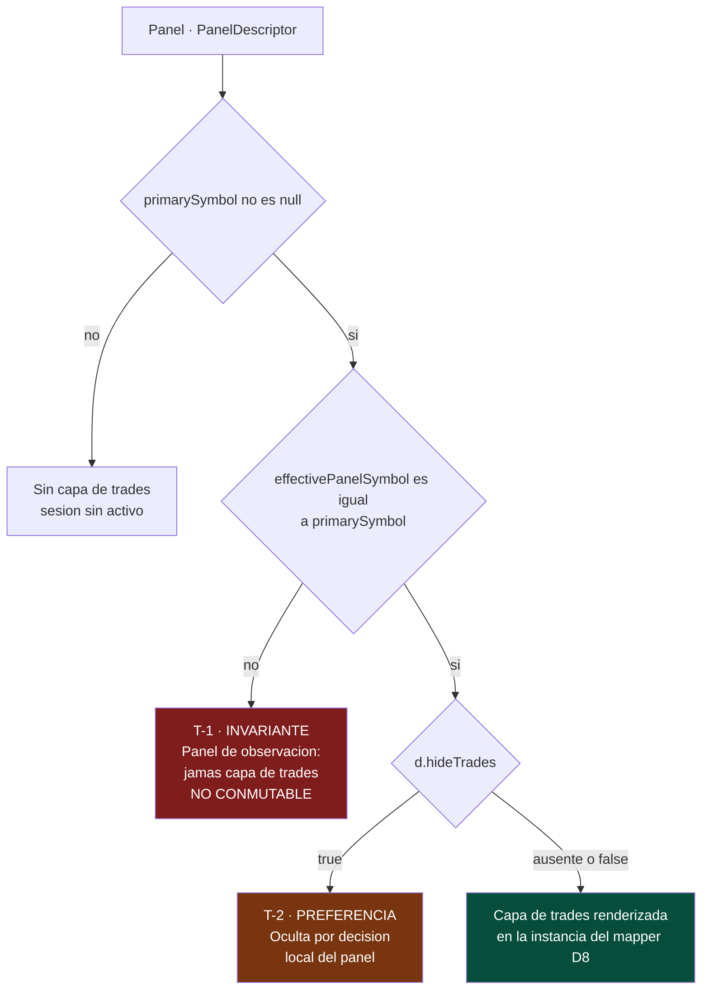
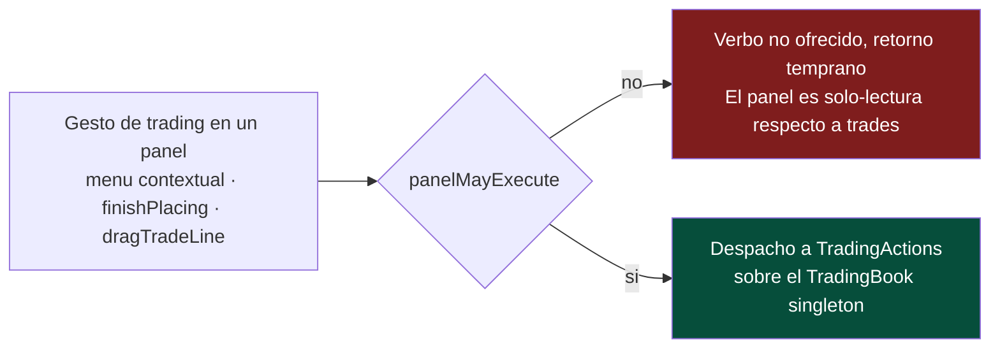

# RFC-018: Refinamiento de la Visibilidad de Trades por Panel

| Campo | Valor |
| :--- | :--- |
| **Estado** | Diseño aprobado — implementación pendiente |
| **Fecha** | 2026-07-26 |
| **Bloque** | Mastery Block — Fase 4 (continuación de RFC-017) |
| **Documentos Rectores** | [DOMAIN_MODEL.md](../DOMAIN_MODEL.md), [EXPERIENCE_DOMAINS.md](../EXPERIENCE_DOMAINS.md), [TEDS_GRAMMAR.md](../TEDS_GRAMMAR.md) |
| **Supersede parcialmente** | RFC-017 §5.1 (cláusula de grupo), D17.K (membresía de la familia de composición), D17.I (defaults de `syncTrades`) |
| **Especificaciones compañeras** | `docs/superpowers/plans/2026-07-26-rfc-018-implementation-plan.md` (plan de implementación), `docs/superpowers/teds-plan-amendments.md` (enmiendas al plan TEDS) |
| **Decisiones** | D18.A – D18.D (D18.E registrada pero **excluida de alcance**, ver §6) |

---

## 1. Filosofía de producto

Este emulador sigue siendo un instrumento de práctica deliberada, no una plataforma
de ejecución. Este RFC no añade ninguna capacidad nueva al trader: **corrige un error
de modelado** que RFC-017 introdujo de buena fe y que, de implementarse tal cual,
habría fijado en el código una afinidad entre trades y paneles que el dominio no
tiene.

Además cierra un hueco de **fidelidad de ejecución** (§5, T-3) que hoy está latente
y que se volvería un defecto real en el momento en que se habilite el selector de
símbolo por panel que el propio RFC-017 §5.1 bendice.

---

## 2. Motivación — por qué `syncTrades` como canal de grupo es incorrecto

RFC-017 §5 clasificó `syncTrades` dentro de la familia de **composición**, junto a
`syncDrawings`, describiéndola como «estado compartido por construcción: dos paneles
que resuelven el mismo grupo componen la misma capa desde el mismo snapshot del
store».

Para `syncDrawings` esa descripción es literalmente cierta: el grupo **es** un espacio
de nombres de propiedad (`owner: { type: 'group', id }`), y pertenecer al grupo cambia
*qué datos existen* en la capa del panel.

Para `syncTrades` no lo es, y no puede serlo:

1. Existe **exactamente un `TradingBook` por sesión** (D1), sin parametrizar por panel,
   símbolo ni timeframe (`DOMAIN_MODEL.md` §3.1, «Scope rule (D1)»).
2. No existe `owner: { type: 'group' }` para un trade. No hay espacio de nombres que
   resolver.
3. Todo panel cuyo símbolo coincide con `primarySymbol` ya compone **exactamente el
   mismo conjunto**.

Por lo tanto `syncTrades` nunca compuso nada: solo podía **sustraer** de una capa ya
idéntica. El propio RFC-017 lo admite en §5.1 («`syncTrades` es un resolutor de
visibilidad, no un canal de datos») y en el JSDoc del modelo, contradiciendo la tabla
de §5 dos secciones más arriba. Esta contradicción interna es el síntoma; la causa es
la clasificación.

### 2.1 «Sincronizar» es el verbo equivocado para un singleton

| Canal | ¿Es realmente de grupo? | Por qué |
| :--- | :--- | :--- |
| `syncCrosshair` | **Sí** | Enruta eventos *entre* miembros. Carece de sentido para un panel aislado. |
| `syncTimeRange` | **Sí** | Ídem. |
| `syncDrawings` | **Sí** | Define un espacio de nombres de propiedad compartido — un hecho de datos real. |
| `syncTrades` | **No** | No enruta nada, no define ningún espacio de nombres, y sus datos ya son idénticos en todos los miembros. |

Preguntar «¿deben sincronizarse los trades entre el panel A y el B?» cuando A y B ya
muestran datos idénticos es una pregunta sin respuesta. **La capa de trades no se
sincroniza: es universal.**

### 2.2 El acoplamiento que el modelo de grupo impone al usuario

La historia de usuario real que `syncTrades` intentaba servir es:

> «Quiero que mi panel de contexto H4 esté limpio de tinta de trades, pero que siga
> sincronizado en crosshair y rango con mis paneles de ejecución.»

Bajo el modelo de grupo esa historia es **imposible sin romper la sincronización**: el
trader debe salir del grupo (perdiendo crosshair y rango) o partirlo en dos. El flag
acopla dos preferencias sin relación entre sí: *«estos paneles se mueven juntos»* y
*«este panel muestra tinta de trades»*.

### 2.3 El error de modelado en el predicado §5.1

El predicado de RFC-017 §5.1 mezcla dos cláusulas de naturaleza distinta en una sola
expresión:

```
panel.symbol === primarySymbol  ∧  (sin grupo  ∨  group.syncTrades)
└────────── invariante ──────────┘  └────────── preferencia ──────────┘
```

La cláusula de símbolo **no es una preferencia de visibilidad**: pintar los niveles de
US30 sobre el eje de precio de NASDAQ es una **afirmación falsa sobre el mercado**.
Debe vivir donde no se pueda apagar. Fundirla en la misma expresión que un flag
conmutable fue lo que hizo que ambas cláusulas parecieran del mismo tipo.

### 2.4 Estado actual verificado en el repositorio

| # | Hecho | Evidencia |
| :--- | :--- | :--- |
| F1 | `primarySymbol` no existe como campo: es `selectCurrentAsset` (`workspacesFeature.selectCurrent`) | `state/selectors.ts` |
| F2 | Todo panel creable hoy nace con `symbol: ''`; no hay selector de símbolo por panel | `workspace-viewport.component.ts`, `layout.models.ts` |
| F3 | `selectTradeMarkers` / `selectTradeBoxes` se derivan de `selectActiveCandles` (TF **global**), no del TF del panel | `state/selectors.ts` |
| F4 | No existe ninguna guardia de ejecución: el menú contextual ofrece órdenes en todo panel | `chart/chart.component.ts` |
| F5 | `syncTrades` tiene un checkbox «Trades» vivo en la UI que no lee nadie | `link-groups-menu.component.ts` |
| F6 | `focusedPanelId` vive en `LayoutState` pero está **excluido** del snapshot persistido | `selectors.ts`, `layout.reducer.ts` |
| F7 | `PanelDescriptor` se persiste íntegro: cualquier campo añadido entra a `SessionPayloadV3` | `selectWorkspaceMetaSnapshot` |

F2 reencuadra el problema: hoy la cláusula de símbolo es un no-op, de modo que
`syncTrades` sería el **único** discriminador — discriminando entre paneles que
muestran el mismo símbolo y los mismos trades, y que solo difieren en timeframe.

### 2.5 El concepto de «panel de ejecución» queda rechazado

La revisión arquitectónica (Opus 5, 2026-07-26) evaluó cinco candidatos
(`executionPanelId` persistido, `tradingOriginPanelId` efímero,
`preferredTradingPanelId` en settings, derivación de `focusedPanelId`, y toggle
per-panel) y determinó que los cuatro primeros existen únicamente para responder a una
pregunta que el encuadre de *propagación* inventa:

> La propagación presupone una fuente. **No hay fuente.** Ningún panel origina la capa
> de trades; todos la derivan de forma independiente e idéntica del `TradingBook`
> singleton. Para que «propagación» sea coherente hay que **inventar** un origen — y ese
> invento *es* `executionPanelId`, ofrecido después como solución al problema que el
> invento creó.

Derivación desde primeros principios:

1. La identidad de un trade no contiene panel, símbolo ni timeframe (`trading.models.ts`),
   y D1 prohíbe añadirlos.
2. Su geometría queda totalmente determinada por `(precio, tiempo)`. El precio es de
   ámbito símbolo; el tiempo es el reloj de replay global. Ninguno es de ámbito panel
   ni timeframe.
3. **⇒ Un trade es renderizable, sin pérdida, en cualquier panel cuyo símbolo coincida
   con el del libro, a cualquier timeframe.**

La capa de trades **no tiene afinidad de panel**. Cualquier modelo que conceda a un
panel la propiedad de los trades inventa una afinidad inexistente — exactamente la
mutación implícita de propiedad que el Invariante 1 de RFC-017 prohíbe del lado de los
dibujos.

Cardinalidad: el conjunto de paneles desde los que la ejecución es legítima es
`{p : symbol(p) === primarySymbol}` — hoy (F2) **todos**. Cero, uno o muchos son
estados válidos. Un invariante que exigiera «exactamente uno» sería **falso**: con
cuatro paneles del símbolo primario a cuatro timeframes, los cuatro son superficies de
ejecución igualmente legítimas.

---

## 3. Invariantes (Definition of Done)

Por `PHILOSOPHY.md` §2.7, todo invariante viaja con su detector.

| Id | Invariante | Naturaleza | Detector |
| :--- | :--- | :--- | :--- |
| **T-1** | Un panel renderiza la capa de trades **solo si** su símbolo efectivo es el del libro (`primarySymbol`). **No conmutable.** | Invariante de corrección (Presentación, derivado de Trading/D1) | Test unitario de `panelRendersTrades`; invariante-grep: ningún sitio de render de la capa de trades la consume sin pasar por el predicado |
| **T-2** | Que un panel que cumple T-1 *efectivamente* la pinte es una **preferencia local de panel** (`hideTrades`). Ningún grupo ni flag global la gatea. | Preferencia (Presentación) | Invariante-grep: cero sitios de lectura de cualquier flag de trades de ámbito grupo; test del reducer con el idioma D17.H |
| **T-3** | Un verbo de trading solo puede originarse en un panel que cumple T-1. | Invariante de corrección (frontera de comandos) | Test de componente: un panel con `symbol ≠ primarySymbol` no ofrece verbos de orden y no despacha `placeOrder` / `modifyPosition` / `modifyOrder` |
| **T-4** | El origen de selección es estado del dominio **Conversation**: 0..1 por workspace, **jamás persistido**. No es un panel de ejecución. | Registrado aquí, **implementado por TEDS** (§6) | Revisión de esquema (X-1 / INV-12): ausente de `selectWorkspaceMetaSnapshot` y de `SessionPayloadV3` |

T-4 se registra en este RFC aunque su implementación quede fuera de alcance: es el
mojón que impide que alguien vuelva a inventar un panel de ejecución para resolver una
necesidad que **sí** existe (TEDS-D18) pero que pertenece a otro dominio.

---

## 4. El modelo — dos cláusulas, cero estado global nuevo

```typescript
// state/layout/layout.models.ts — junto a effectivePanelSymbol

export interface PanelDescriptor {
  id: string;
  symbol: string;
  timeframe: Timeframe;
  linkGroupId: string | null;
  hideSharedDrawings?: boolean;
  /** T-2: retira la capa de trades SOLO de este panel. Ausente = false; nunca persistido como `false` explícito. */
  hideTrades?: boolean;
}

/** T-1 (invariante) ∧ T-2 (preferencia). Dónde puede hablar el dominio Trade. */
export function panelRendersTrades(
  d: PanelDescriptor,
  primarySymbol: string | null,
): boolean {
  if (primarySymbol == null) return false;
  if (effectivePanelSymbol(d, primarySymbol) !== primarySymbol) return false; // T-1
  return !d.hideTrades;                                                       // T-2
}

/** T-3 (invariante). ¿Puede originarse un verbo de trading en este panel? */
export function panelMayExecute(
  d: PanelDescriptor,
  primarySymbol: string | null,
): boolean {
  return primarySymbol != null && effectivePanelSymbol(d, primarySymbol) === primarySymbol;
}
```

Sin `LinkGroup`. Sin `executionPanelId`. **Estructuralmente idéntico a
`composePanelDrawings`**: un filtro de símbolo (corrección) más una exclusión local del
panel (preferencia). Un solo modelo mental cubre ambas capas — quien entiende la capa
de dibujos ya entiende la de trades.

### 4.1 Diagrama del modelo de visibilidad



### 4.2 Diagrama de la frontera de comandos (T-3)



Nótese que `panelMayExecute` **ignora deliberadamente `hideTrades`** a nivel de
dominio: ocultar la capa es una preferencia visual, no un bloqueo de trading. La
decisión de producto de retirar además los verbos del menú en un panel con la capa
oculta se registra en §7.3 como regla de UI, no como invariante.

### 4.3 Coste bajo D8

El predicado vive en la instancia del `ChartModelMapper` (nunca en el store, nunca en
el motor). Tamaño de la clave de memoización, por panel:

| Modelo | Entradas del store |
| :--- | :--- |
| Hoy | 1 (`selectTradeChartView`) |
| **Este RFC** | **3** (`+ descriptor`, `+ currentAsset` — ambos ya suscritos por `panelDrawings$`) |
| Predicado exploratorio (grupo + panel de ejecución) | 5 (`+ groups`, `+ executionPanelId`) |

`groups` es el record completo: bajo el predicado exploratorio, **cambiar el color de
cualquier grupo invalidaría la capa de trades de todos los paneles**. La propia regla
de RFC-017 §4 — *«cero asignaciones en el camino sin cambios»* — argumenta contra el
modelo de grupo en sus propios términos.

---

## 5. Decisiones registradas

| Id | Decisión |
| :--- | :--- |
| **D18.A** | **`syncTrades` se retira como canal de `LinkGroup`**: campo, acción `Set Sync Trades`, caso del reducer, default de normalización y toggle «Trades» de la UI. El wire **tolera la clave legacy** (parse-and-trust-nothing: se ignora y no se propaga). **Sin bump de `schemaVersion`.** |
| **D18.B** | **`PanelDescriptor.hideTrades?: boolean`** (idioma D17.H: ausente = false, nunca persistido como `false` explícito) + acción `Set Panel Hide Trades`. Se añaden `panelRendersTrades` y `panelMayExecute` como funciones puras exportadas desde `layout.models.ts`, junto a `effectivePanelSymbol`. |
| **D18.C** | **RFC-017 §5.1 se enmienda**: la cláusula de grupo (`sin grupo ∨ group.syncTrades`) se reemplaza por T-2 (`!d.hideTrades`). La cláusula de símbolo sobrevive **verbatim** como T-1, elevada explícitamente a invariante **no conmutable**. |
| **D18.D** | **Se añade T-3**: los verbos de trading originados en el pane (menú contextual, `finishPlacing`, `dragTradeLine`) se guardan con `panelMayExecute`. RFC-017 §5.1 ya *declaraba* que no existe colocación de órdenes en un panel de otro símbolo; nada lo hacía cumplir (F4). Este es el cambio de mayor valor del RFC. |
| **D18.E** | **Origen de selección (TEDS-D18) — EXCLUIDO de este RFC.** Ver §6. |

### 5.1 Actualización de D17.K

D17.K se mantiene íntegro en su tesis (dos familias mecánicamente distintas), y se
corrige en su membresía:

| Familia | Canales | Mecanismo |
| :--- | :--- | :--- |
| **Eventos** | `syncCrosshair`, `syncTimeRange` | `ChartSyncBus` → `ChartSyncRouter`. Sin cambios. |
| **Composición** | `syncDrawings` **(único miembro)** | Espacio de nombres de propiedad compartido, resuelto por panel. Sin cambios. |
| ~~Composición~~ | ~~`syncTrades`~~ | **Retirado.** Nunca compuso: solo podía sustraer de una capa ya idéntica. Su preocupación pasa a `PanelDescriptor.hideTrades` (T-2). |

### 5.2 Actualización de D17.I

Los defaults de migración de `syncDrawings` (`false` en grupos migrados, `true` en
grupos nuevos) se mantienen sin cambio. El default de `syncTrades` (`true` en ambos
casos) **desaparece con el campo**. La preservación de comportamiento se conserva de
forma trivial y exacta: `hideTrades` ausente = capa visible = exactamente lo que hacía
`syncTrades: true`, que era el default en los dos caminos.

---

## 6. D18.E — por qué el origen de selección queda fuera de alcance

TEDS-D18 («eco multi-panel: origen + testigo») e INV-11 leído como global (Q2 de
`TEDS_INTERACTION.md` §1) **sí** requieren un singleton por workspace que diga «en qué
panel ocurrió el gesto». Ese concepto existe y es legítimo:

```typescript
// Dominio Conversation — efímero, JAMÁS persistido (X-1, INV-12)
interface TradeSelection { tradeId: string; originPanelId: string; } // | null
```

Pero **no es un panel de ejecución**:

- Es sobre **selección**, no sobre ejecución.
- Cambia solo con gestos de selección — nunca al dibujar (el defecto de derivar de
  `focusedPanelId`), nunca al colocar una orden (el defecto de `tradingOriginPanelId`).
- Su coste de pérdida es **cero** y su ceremonia **ninguna** (`EXPERIENCE_DOMAINS.md`
  §3): es Conversation, no Presentación ni Trading.

Queda **excluido de RFC-018** por tres razones:

1. **Frontera de dominio.** Este RFC opera sobre Presentación (visibilidad de capa) y
   la frontera de comandos de Trading. La Conversation es dominio de TEDS.
2. **Frontera de persistencia.** `PanelDescriptor` se persiste íntegro (F7). Alojar ahí
   el origen de selección violaría X-1 / INV-12 por construcción. Necesita un slice
   efímero propio, excluido explícitamente de `selectWorkspaceMetaSnapshot` — trabajo
   que pertenece al plan TEDS junto al resto de su máquina de estados.
3. **Sin acoplamiento.** Bajo este RFC el conjunto de testigos de TEDS-D18 es
   `{p : panelRendersTrades(p)} \ {origen}` — expresable **sin estado nuevo**. RFC-018
   no bloquea a TEDS; lo simplifica.

---

## 7. Alcance paralelo: F3 — geometría de trades por panel

### 7.1 El defecto

`selectTradeMarkers` y `selectTradeBoxes` derivan de `selectActiveCandles`, que es la
serie del **timeframe global activo**, no la del panel. Consecuencia hoy, sin necesidad
de paneles de observación: **un panel en H1 recibe marcadores encajados a la rejilla
del TF global** (típicamente M1). La geometría de la capa de trades es incorrecta por
panel, hoy, en producción.

### 7.2 Por qué es tarea paralela y no parte del predicado

El gating decide **si** un panel pinta trades. F3 decide **dónde** los pinta. Son
ortogonales: arreglar uno no arregla el otro, y F3 es un defecto preexistente
independiente de `syncTrades`. Se aborda en la misma rama como tarea separada porque
comparte archivo (`chart-model-mapper.service.ts`) y porque **el render TEDS por panel
no puede ser correcto sin ella** (ver `teds-plan-amendments.md`).

### 7.3 Dirección

La derivación de marcadores y cajas se mueve del store a la instancia del mapper,
parametrizada por las velas del panel (`panelChartView$`), con la misma disciplina de
memoización por referencias que `panelDrawings$`. Los selectores globales se conservan
mientras existan consumidores no-panel (p. ej. `selectClosedTradeBoxes` para el
dropdown del toolbar), pero dejan de alimentar el render del pane.

---

## 8. Reglas de UI — el ojo del panel pasa a popover

`hideSharedDrawings` (D17.H) y `hideTrades` (D18.B) son dos preferencias locales de
visibilidad de capa. Exponerlas como dos botones sueltos en la cabecera del panel
gastaría presupuesto de atención en un chrome que `PRODUCT_PRINCIPLES.md` §1 manda
minimizar. Se unifican bajo un solo control:

- El botón del **ojo deja de ser condicional** (hoy: `@if (linkGroupId !== null)`) y
  **está siempre presente**.
- El ojo **abre un popover**, ya no togglea directamente. El popover sigue el patrón
  exacto de `link-chip-menu` (RFC-013 Task 4): `position: absolute; top: calc(100% +
  4px); left: 0; z-index: 20`, cierre por click fuera y por `Escape`, sin CDK y sin
  dependencias nuevas.
- El popover contiene dos filas independientes:
  - **`Dibujos compartidos`** — activa **solo** si `linkGroupId !== null` **y**
    `group.syncDrawings === true`. Inactiva se muestra atenuada, con tooltip
    *«Vincula el panel a un grupo para compartir dibujos»*.
  - **`Trades`** — **siempre** activa y conmutable (T-2 no depende de ningún grupo).
- El ojo de la cabecera actúa como **indicador de estado combinado**: normal cuando
  todo es visible, atenuado cuando alguna capa está oculta.

**Regla de producto (registrada, revocable):** un panel con `hideTrades: true` tampoco
ofrece los verbos de orden en su menú contextual. Un pane que el trader pidió mantener
limpio no es una superficie de entrada de órdenes, y colocar una orden que después no
se ve contradice FP-2 (*«ningún dato de trade sin ancla en el chart»*). El Dock lateral
sigue disponible y es panel-agnóstico. Esta regla es de UI, no un invariante: T-3 sigue
definido solo por el símbolo.

---

## 9. Compatibilidad

| Dimensión | Resultado |
| :--- | :--- |
| **RFC-017 D8 (ban de factory-selectors)** | **Mejorado.** 3 referencias de memo frente a 5 del predicado exploratorio; ningún selector parametrizado. |
| **RFC-017 D17.K** | Enmendado en membresía, intacto en tesis (§5.1 de este RFC). |
| **RFC-017 D17.I** | El default de `syncTrades` desaparece con el campo; el de `syncDrawings` no cambia. Preservación de comportamiento exacta (§5.2). |
| **RFC-017 D17.L (cascada de borrado de grupo)** | **Se simplifica**: borrar un grupo ya no necesita razonar sobre trades en absoluto. |
| **RFC-017 §5.1** | Enmendado y **reforzado**: la cláusula de símbolo se eleva a invariante no conmutable y por primera vez se hace cumplir del lado de comandos (T-3). |
| **TEDS INV-11 / TEDS-D18** | Compatible y aclarado. El conjunto de testigos es `{p : panelRendersTrades(p)} \ {origen}`, sin estado nuevo. |
| **TEDS INV-12 / X-1** | Se sostiene por construcción: el único campo persistido nuevo es una preferencia (`hideTrades`); no se introduce estado de Conversation. |
| **TEDS INV-02** | Sin conflicto — «una posición autoritativa **por estado de panel**» ya admite N paneles mostrando un trade. |
| **TEDS INV-09 / §10** | El predicado de gating sobrevive al cambio de motor de render (`TradeBoxes → TradeObjectPrimitive`) exactamente como `TEDS_GRAMMAR.md` §10 afirma. |
| **Multi-panel (simetría)** | **Preservada de forma absoluta.** Ningún panel queda privilegiado por posición ni por designación. |
| **Multi-símbolo (paneles de observación)** | T-1 es la aplicación del lado render; T-3 cierra el hueco del lado comando. Si algún día se revoca D1, el predicado generaliza de forma natural: el símbolo del panel selecciona el libro. |
| **Layout (grid no destructivo)** | Nada queda anclado a la posición en la rejilla. Aparcar, encoger plantilla, apilar y mover son no-ops para `hideTrades`, que viaja con la identidad del panel. |
| **Workspace / persistencia** | Un campo opcional aditivo en `PanelDescriptor` — misma forma de cambio que D17.H. **Sin bump de esquema.** |
| **Dock (entrada de órdenes)** | Sin cambios, y correctamente panel-agnóstico: la ejecución apunta al **libro** (símbolo), nunca a un panel. Bajo un modelo de panel de ejecución el Dock se volvería una anomalía que explicar. |
| **Hotkeys (TPL-D8 / TEDS-D19)** | El roster de `Tab` es `focusedPanelId` (existente) ∩ `panelRendersTrades` (nuevo). Composición de dos conceptos existentes; no aparece un tercero. |
| **Replay automation (futuro)** | El enrutado es `primarySymbol`, punto. La automatización no se origina en ningún panel, de modo que un panel de ejecución habría planteado un «¿cuál panel?» sin respuesta justo cuando importa. |
| **Floating panels (futuro)** | Un panel flotante es un `PanelDescriptor` con símbolo: el predicado aplica sin cambios. Un panel de ejecución habría exigido una resolución nueva por topología. |
| **`assertNoCandles`** | Intacto. `hideTrades` es un booleano; la capa de trades sigue siendo candle-free. |
| **Sin dependencias runtime nuevas** | El popover reutiliza el patrón `link-chip-menu` (DOM plano, sin CDK). |

---

## 10. Migración y persistencia

- **Sin bump de `schemaVersion`.** `SessionPayloadV3` sigue siendo V3.
- **`hideTrades`** entra al payload por construcción (F7: `selectWorkspaceMetaSnapshot`
  persiste `panels` íntegro), como campo opcional aditivo — igual que
  `hideSharedDrawings` en D17.H. Sesiones antiguas simplemente no lo traen: ausente =
  capa visible = comportamiento previo.
- **`syncTrades` legacy en el wire.** Las sesiones ya persistidas (V3 en IndexedDB y en
  la nube) contienen `syncTrades` en sus `linkGroups`. `LinkGroupWire` lo mantiene como
  opcional para tolerancia de lectura, pero `normalizeLinkGroup` pasa a **construir el
  grupo campo por campo** en lugar de propagar por spread: así una clave legacy se
  ignora en lectura y **no vuelve a escribirse** en el siguiente ciclo LWW. El payload
  se autolimpia sin migración explícita.
- **Riesgo declarado:** ninguna sesión cambia de comportamiento observable, porque
  `syncTrades` tenía cero sitios de lectura en producción (F5).

---

## 11. No-goals de este RFC

- Panel de ejecución en cualquiera de sus formas (persistido, efímero, o derivado).
- Origen de selección / eco multi-panel (D18.E — pertenece a TEDS).
- Trading multi-símbolo operable (sigue siendo no-goal congelado de 008-012; D1 intacto).
- Rediseño del motor de replay, del fill engine, o de la gramática TEDS.
- Toggles masivos de visibilidad a nivel de grupo. Si algún día se quiere «ocultar
  trades en todos los miembros del grupo», eso es una **acción de UI en bloque** que
  escribe N flags de panel — nunca un flag de grupo que los posea.
- Reordenado, agrupación o filtrado de la capa de trades por criterios distintos del
  símbolo y la preferencia del panel.

---

## 12. Referencias

- `docs/architecture/rfcs/017-compositional-panel-sync.md` — §5, §5.1, §13; D17.H, D17.I, D17.K, D17.L.
- `docs/architecture/TEDS_GRAMMAR.md` — INV-02, INV-09, INV-11, INV-12; §10 (supersesiones).
- `docs/architecture/TEDS_INTERACTION.md` — §3.7 (TEDS-D18), §7.
- `docs/architecture/EXPERIENCE_DOMAINS.md` — X-1, X-2, §3 (dominio Conversation), §7.
- `docs/architecture/DOMAIN_MODEL.md` — §3.1 (TradingBook, scope rule D1), §3.2 (Session).
- `docs/engineering/domain/workspace-panels.md` — modelo de panel, dos familias de sync.
- `docs/superpowers/plans/2026-07-26-rfc-018-implementation-plan.md` — plan de implementación.
- `docs/superpowers/teds-plan-amendments.md` — enmiendas al plan TEDS.
- `.superpowers/rfc-018/dev-log.md` — bitácora de decisiones del run.
