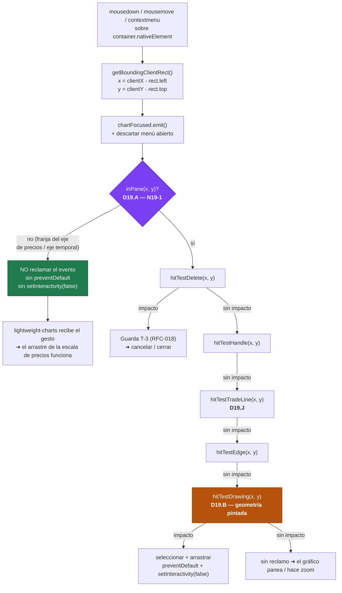
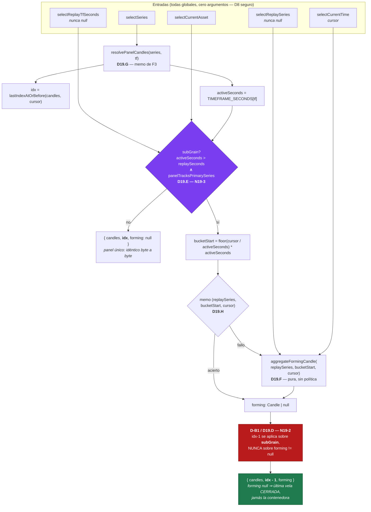

# RFC-019: Guarda de Espacio-Pane y Vela en Formación Cross-Timeframe

| Campo | Valor |
| :--- | :--- |
| **Estado** | Diseño aprobado — implementación pendiente |
| **Fecha** | 2026-07-27 |
| **Bloque** | Mastery Block — Fase 4 (continuación de RFC-018) |
| **Documentos Rectores** | [DOMAIN_MODEL.md](../DOMAIN_MODEL.md), [EXPERIENCE_DOMAINS.md](../EXPERIENCE_DOMAINS.md), [TEDS_GRAMMAR.md](../TEDS_GRAMMAR.md), [PHILOSOPHY.md](../../engineering/PHILOSOPHY.md) |
| **Extiende** | RFC-018 T-1 (cláusula de símbolo), RFC-018 F3 (`resolvePanelCandles`), RFC-014 §1 (fidelidad de revelación) |
| **Especificaciones compañeras** | `docs/superpowers/plans/2026-07-27-rfc-019-implementation-plan.md` (plan), `docs/superpowers/plans/2026-07-27-rfc-019-sdd-prompt.md` (orquestación) |
| **Decisiones** | D19.A – D19.J |
| **Rama / base** | `feature/rfc-019-pane-guard-cross-tf-forming` (desde `develop` @ `0e66392`, el merge de PR #46) |

---

## 1. Filosofía de producto

Este RFC **no añade ninguna capacidad al trader**. Corrige dos defectos descubiertos
durante backtesting en vivo, uno de los cuales resultó ser —tras el diagnóstico— de una
clase mucho más grave que la reportada.

La distinción importa porque determina el modo de resolución. PHILOSOPHY §3.1 fija la
jerarquía de autoridad: un defecto de **fidelidad** se corrige con un invariante, nunca
con una preferencia; un defecto de **fricción** se corrige con la intervención más
pequeña que elimine su causa raíz.

- **Bug A (fricción):** un rectángulo dibujado intercepta gestos destinados al eje de
  precios. Reportado como problema de hit-test; **es un problema de espacio de
  coordenadas**.
- **Bug B (fidelidad):** un panel de temporalidad superior pinta la vela **futura
  completa** durante el replay. Reportado como «el panel se congela»; **es sesgo de
  anticipación (*lookahead bias*)**.

---

## 2. Origen de las decisiones

Se comisionó una revisión arquitectónica (Opus 5, 2026-07-27) sobre ambos defectos,
explícitamente autorizada a **rechazar el encuadre propuesto**. Lo hizo en los dos casos.
Sus dos hallazgos centrales se adoptan aquí como premisas:

> **Sobre Bug A:** «El robo no lo causa la *forma* del hit-test del rectángulo. Lo causa
> que `handleMouseDown` trate coordenadas del **contenedor** como coordenadas del
> **pane**. Todo hit-test de la cadena —incluido uno que ignora `x` por completo— seguirá
> robando gestos del eje de precios después de que aterrice el hit-test edge-only.»

> **Sobre Bug B:** «Su panel H1 no está congelado — está pintando una vela futura
> completa. `renderWindow` corta `[winStart, idx]` **inclusive**, e
> `idx = lastIndexAtOrBefore(candles, currentTime)` resuelve a la vela H1 que **contiene**
> el cursor. A las 10:05 el panel H1 muestra la barra completa de 10:00–11:00, máximo,
> mínimo y cierre incluidos.»

Toda decisión de §5 se deriva de descartar los encuadres originales.

---

## 3. Bug A — diagnóstico: espacio de coordenadas, no forma de hit-test

### 3.1 La causa raíz

`chart.component.ts:1408-1410` (verificado en `0e66392`):

```ts
const rect = this.container.nativeElement.getBoundingClientRect();
const x = e.clientX - rect.left;
const y = e.clientY - rect.top;
```

`container.nativeElement` envuelve el widget de lightweight-charts **completo**: pane de
trazado **más** la escala de precios derecha **más** el eje temporal inferior. Pero
`series.priceToCoordinate()` y `xForTime()` devuelven coordenadas del **pane**. El borde
derecho del pane está en `chart.timeScale().width()`, unos 60–70 px por dentro del ancho
del contenedor.

**Cada píxel de la franja del eje de precios es una coordenada del contenedor que los
cuatro hit-tests aceptan en silencio como si fuera del pane.**

### 3.2 Mecanismo del robo (confirmado en el código)

1. El hit-test reclama el gesto.
2. `chart.component.ts:1495` → `e.preventDefault()`.
3. `chart.component.ts:1494` → `this.engine?.setInteractivity(false)`.
4. `chart-engine.ts:216` → `applyOptions({ handleScroll: false, handleScale: false })`
   sobre **todo** el gráfico.
5. El arrastre de la escala de precios queda muerto mientras dure el drag.

### 3.3 Por qué el hit-test edge-only **no** cierra el defecto

Tres pruebas independientes:

**(a) El repro reportado es un impacto de borde.** «un rectángulo cuyo *límite inferior*
está sobre 48940, y el usuario hace clic cerca de ese nivel en el eje de precios». Eso es
el borde inferior. Un hit-test edge-only también lo devuelve: el borde inferior es el
segmento `(min(x1,x2), yInf) → (max(x1,x2), yInf)` y `xForTime` **extrapola sin
recortar** (`time-coordinates.ts`, `timeToLogical`) — una zona dibujada hacia adelante
hasta o más allá de la última barra tiene `x2 ≥ paneWidth`, con lo que sus bordes
horizontales atraviesan la franja del eje.

**(b) Existe un hermano peor que es completamente agnóstico a `x`.**
`trading-capability.ts:220` (verificado):

```ts
public hitTestTradeLine(y: number): TradeLine | null {
```

Sin parámetro `x`, y se ejecuta en `chart.component.ts:1447` — **antes** del hit-test de
dibujos. Un clic en el eje de precios a la altura de un SL/TP/entrada roba el gesto con
100 % de fiabilidad e inicia un `lineDrag`. Ninguna variante de hit-test toca esto.
**Es además un bypass de clase T-3**: un gesto sobre el eje mutando el `TradingBook` es
exactamente el tipo de origen que RFC-018 dedicó una resolución entera a cerrar.

**(c) No existe un «handler del eje de precios» al que reordenar.** La escala de precios
es interna a lightweight-charts. Nuestra única palanca es **no reclamar el evento**. Por
tanto toda propuesta de reordenamiento de prioridad colapsa en la guarda de pane.

### 3.4 El patrón ya existe en el repositorio

`chart.timeScale().width()` ya se usa exactamente con este propósito de recorte en dos
sitios verificados:

- `trade-boxes-primitive.ts:193` — `const paneWidth = chart.timeScale().width();`
- `trade-buttons-primitive.ts:145` — ídem.

No hace falta API nueva, ni dependencia nueva, ni cruzar el límite del motor.

---

## 4. Bug B — diagnóstico: sesgo de anticipación, no un interruptor ausente

### 4.1 Qué se pinta hoy

`chart.component.ts:838` (verificado):

```ts
const slice = idx >= 0 ? this.renderedCandles.slice(winStart, idx + 1) : [];
```

El corte es **inclusive** en `idx`, e `idx = lastIndexAtOrBefore(candles, currentTime)`
sobre la temporalidad **propia** del panel. Para un panel H1 con el cursor en 10:05,
`idx` es el índice de la vela de 10:00 — pintada **completa**, con máximo, mínimo y
cierre derivados de acción de precio entre 10:05 y 11:00 que el trader **aún no ha
vivido**.

Eso no es «congelado». Es el emulador mostrando al trader el rango de la hora siguiente
mientras decide. Para una herramienta de práctica deliberada cuya propuesta de valor
entera es la fidelidad de la decisión, es la clase de defecto más severa del producto —
y hoy se envía en **toda** disposición multi-timeframe, que es la funcionalidad estrella
de RFC-008–013.

El usuario percibe «congelado» porque la vela no cambia. No cambia porque ya terminó.

### 4.2 La causa raíz: una conflación

`resolutionMinutes` significa **dos cosas distintas**:

| # | Concepto | ¿Nullable? |
| :--- | :--- | :--- |
| 1 | **Grano de avance del replay** — `resolutionMinutes ?? activeTfSeconds` | Nunca |
| 2 | **Opt-in del usuario al modo sub-TF** | Sí |

El render debe leer (1). `chart-model-mapper.service.ts:360-370` lee (2).

### 4.3 La solución ya existe en el código, sin conectar

`selectors.ts` ya define ambos conceptos efectivos, y el motor de fills ya los usa:

```ts
selectReplayTfSeconds = minutes != null ? minutes * 60 : activeSeconds   // selectors.ts:621 — nunca null
selectReplaySeries    = resolution ?? activeCandles                      // selectors.ts:607 — nunca null
```

Alimentando esos dos, la guarda **ya existente** `minutes * 60 >= activeSeconds → null`
(`chart-model-mapper.service.ts:64`) hace toda la discriminación correctamente, sin
ramificación nueva:

| TF del panel vs. grano de replay | Resultado |
| :--- | :--- |
| **igual** (panel único, hoy) | `forming = null` → **idéntico byte a byte al comportamiento actual** |
| **TF panel > grano** (panel H1, avance M5) | forming pintado, `idx-1` → bug corregido, lookahead cerrado |
| **TF panel < grano** (panel M1, avance H1) | `forming = null`, `idx` = vela M1 del cursor → ya correcto |

**El modelo más simple que se nos había escapado: el «grano de replay» ya es un concepto
de primera clase y nunca-null. El render simplemente lee el equivocado.**

---

## 5. Decisiones — D19.A a D19.J

### D19.A — Guarda de rect-pane (`ChartEngine.paneRect()` + 3 handlers)

**Decisión.** Añadir un accesor de geometría de solo lectura `ChartEngine.paneRect()` y
un helper `inPane(x, y)` en `ChartComponent`. Guardar la entrada de `handleMouseDown`,
`handleHoverFeedback` y `handleContextMenu`.

**Justificación.** Es el fix real de Bug A (§3.1–3.3). ~8 líneas más un accesor; el
patrón existe en dos sitios (§3.4).

**Ubicación.** El accesor va en el motor, no en el componente. Esto **no** viola el
invariante de núcleo 2 («el núcleo está cerrado a modificación; comportamiento nuevo =
`Capability` nueva»): `paneRect()` no añade comportamiento, es el motor respondiendo una
pregunta sobre su propia geometría. Además entrega a TEDS Fase 2 el predicado reutilizable
«¿este gesto está dentro del trazado?» que su capa de interacción necesitará.

**Colocación exacta de la guarda en `handleMouseDown`:** *después* de
`chartFocused.emit()` y del descarte del menú (hacer clic en el eje de un panel debe
seguir enfocando ese panel y cerrando menús), *antes* de la rama del botón central
(quick-ruler) y *antes* de `hitTestDelete`.

**No afecta la ruta del bus.** `handleClick` consume `param.point`, que lightweight-charts
solo puebla para eventos in-pane. La corrección se confina a la ruta de listeners DOM.

### D19.B — Hit-test de geometría pintada

**Decisión.** Hit-testear exactamente los trazos que dibuja el renderer:
`rect` = 4 bordes (segmentos); `fib` = las 7 líneas de nivel. Compartir la fórmula
`y1 + (y2 - y1) * level` con `drawFib` (`drawings-primitive.ts:123`).

**Justificación.** Una regla, no un menú por-clase. Resuelve la inconsistencia rect/fib
**en lugar de crearla**. `FIB_LEVELS` ya está exportado en el mismo archivo (línea 12).

**Corrección al encuadre original.** Esto **no es paridad con TradingView**: la regla de
TradingView depende del relleno (un rectángulo con fondo *sí* es seleccionable por su
interior), y el rectángulo de este repositorio siempre está relleno al 16 % de alfa
(`drawings-primitive.ts:75`). Es una **divergencia deliberada**, justificada por la
lectura de acción de precio *bajo* la zona, no por una paridad que no se sostiene.

**Dos riesgos listados en el encuadre original se invierten:**

- *«Los rectángulos pequeños serán difíciles de agarrar»* — **falso**. Un rect de 2 px de
  alto tiene ambos bordes horizontales dentro de la tolerancia de 6 px; la figura entera
  sigue siendo agarrable. Es el hit-test de área el que degrada en figuras finas, porque
  su interior es más pequeño que la tolerancia.
- *«Un dibujo totalmente debajo de otro será inalcanzable»* — **mejora**. Con hit-test de
  área la caja del rect superior se traga todo lo que hay debajo. Con bordes, la figura
  inferior es alcanzable donde sus bordes no coincidan.

**Estatus.** Cambio de UX **independiente**. No es el fix de Bug A y no debe presentarse
como tal.

### D19.C — Intercambio de entradas en `chartView$`

**Decisión.** `selectResolutionMinutes` / `selectResolutionSeries` →
`selectReplayTfSeconds` / `selectReplaySeries` / `selectCurrentAsset`.

**Justificación.** Es el fix real de Bug B (§4.2–4.3). Usa el grano efectivo nunca-null
que ya existe. **Elimina una conflación en lugar de añadir un modo.**

### D19.D — D-B1: `idx - 1` sobre `subGrain`, no sobre `forming != null`

**Decisión.**

> **Cuando la barra parcial honesta no se puede calcular, mostrar la última vela
> **cerrada**, nunca la contenedora.**

```ts
const subGrain = activeSeconds > replaySeconds && <gate de símbolo>;
if (subGrain && idx >= 0) return { tf, candles, idx: idx - 1, utcOffset, forming, countdown };
return { tf, candles, idx, utcOffset, forming: null, countdown };
```

**Justificación.** El código actual condiciona a `resolutionMinutes != null && forming
!= null && idx >= 0`. Cuando la vela en formación es **incalculable** (hueco en la serie
de grano, `hi < lo`), cae a `idx` inclusive — es decir, **pinta la vela futura**. Ese es
el modo de fallo equivocado.

**Cambio de comportamiento declarado.** Esto también altera el modo sub-TF actual (hoy,
un `forming` nulo allí vuelve a exponer la vela de display completa). Es deliberado, va
en la dirección correcta de fidelidad, y **requiere su propio spec**.

### D19.E — Gate de símbolo (cláusula T-1) — **enmendado respecto del encargo**

**Decisión.** La vela en formación se calcula solo para paneles cuyo
`effectivePanelSymbol(descriptor, currentAsset) === currentAsset`.

**Justificación.** `MarketState.series` es un único `Partial<Record<Timeframe, Candle[]>>`
agnóstico al símbolo (`market.reducer.ts:8`) — mono-símbolo, D1. Un panel de observación
sobre símbolo foráneo recibiría una vela en formación agregada de la serie de replay del
símbolo **primario**: exactamente la clase de afirmación falsa que RFC-018 cerró para
trades (T-1).

**ENMIENDA VINCULANTE.** El encargo indicaba «reusar `panelRendersTrades`». **Eso es
incorrecto y reintroduciría lookahead.** `panelRendersTrades`
(`layout.models.ts:48-55`) es `símbolo coincide **∧** !hideTrades`. Un panel con
`hideTrades: true` perdería entonces su vela en formación y **caería de vuelta a `idx`
inclusive — es decir, volvería a pintar la vela futura**. `hideTrades` es una preferencia
de tinta de trades; **no puede gobernar la fidelidad de las velas**.

**Resolución adoptada.** Extraer la cláusula T-1 a un predicado nombrado propio y
reexpresar los dos existentes en sus términos (refactor puro, sin cambio de
comportamiento, demostrable por sustitución):

```ts
/** Cláusula T-1 aislada: ¿este panel muestra la serie del símbolo primario? */
export function panelTracksPrimarySeries(d: PanelDescriptor, primarySymbol: string | null): boolean {
  return primarySymbol != null && effectivePanelSymbol(d, primarySymbol) === primarySymbol;
}
```

`panelMayExecute` (`layout.models.ts:63-71`) es hoy **literalmente** este predicado, pero
su nombre habla de verbos de trading; reutilizarlo para fidelidad de velas sería una
mentira de nomenclatura. T-1 pasa a tener una definición única y nombrada.

### D19.F — Colapsar las dos implementaciones de vela en formación

**Decisión.** `selectFormingCandle` (`selectors.ts:521`) y `computeFormingCandle`
(`chart-model-mapper.service.ts:57`) se colapsan en una función pura exportada:

```ts
export function aggregateFormingCandle(
  resSeries: Candle[] | null,
  bucketStart: number,
  cursor: number,
): Candle | null
```

**Sin política, sin minutos.** La función solo agrega. Cada llamante decide *si* llamar.

**Justificación.** Las dos implementaciones son casi idénticas pero **solo la del mapper
lleva la guarda `minutes * 60 >= activeSeconds`**; la del selector es segura únicamente
por construcción (`selectAvailableResolutions` no puede ofrecer una resolución más
gruesa). Duplicación que puede divergir. Además, tomar **segundos** (o mejor: no tomar
duración en absoluto, solo `bucketStart`) elimina el viaje de ida y vuelta `/60`, un
peligro latente en cuanto aparezca una temporalidad sub-minuto.

### D19.G — Rutear `chartView$` por `resolvePanelCandles`

**Decisión.** Sustituir la llamada inline a `generateCustomSeries`
(`chart-model-mapper.service.ts:352-358`) por `this.resolvePanelCandles(series, tf)`.
`activeSeconds` pasa a ser `TIMEFRAME_SECONDS[tf]` incondicionalmente.

**Justificación — defecto de rendimiento vivo.** RFC-018 F3 construyó
`resolvePanelCandles` (`:431-449`) exactamente para esto y consolidó `panelChartView$` y
`tradeChartView$` sobre él — pero **dejó `chartView$`, el flujo que realmente dirige el
render, en su propia ruta sin caché**. Para cualquier panel cuya TF no tenga serie
cargada, `generateCustomSeries` (una agregación O(n) sobre la serie base) corre en **cada
tick de replay** y devuelve una referencia de array nueva cada vez.

`descriptor.timeframe` está tipado como `Timeframe`, de modo que `TIMEFRAME_SECONDS[tf]`
siempre está definido (`models.ts:28-49`) y el recálculo local de `activeSeconds` es
código muerto.

### D19.H — Slot de memo para la vela en formación

**Decisión.** Añadir un slot por-instancia con clave `(replaySeries, bucketStart, cursor)`
→ `Candle | null`, misma disciplina que `lastCandlesInputs` / `lastCandlesOutput`.

**Justificación.** `chartView$` recalcula ante **cualquiera** de sus entradas de
`combineLatest` (7, pronto 8), no solo el cursor. El coste peor caso realista (panel D1 a
grano M1 → ~1440 iteraciones de min/máx) es pequeño pero no debe pagarse por emisión
irrelevante.

**Se conserva la forma O(bucket), no una incremental O(1).** La incremental solo es válida
bajo avance monótono y se rompe con saltos y rebobinado.

### D19.I — Invariante de test `assertNoLookahead`

**Decisión.** Añadir un helper de test —espejo de `assertNoCandles`— que codifique:

> **Ninguna vela cuyo cierre exceda el cursor de replay puede llegar al render model, en
> ningún panel, en ninguna temporalidad.**

**Justificación.** Hoy **nada** en la suite lo afirma, y por eso un emulador
multi-timeframe lleva mostrando el futuro toda la vida de la funcionalidad multi-panel.
El artefacto duradero de este RFC es el invariante, no el parche.

**Ubicación obligatoria.** `*.spec-util.ts` o `*.spec.ts` — **nunca** importado desde
código de app (invariante de núcleo 7: un import de spec-util embarca vitest en el bundle
de producción). Precedente vigente: `layout-invariants.spec-util.ts`.

### D19.J — `hitTestTradeLine(x, y)`

**Decisión.** Añadir el parámetro `x` a `hitTestTradeLine` para que acepte ambas
coordenadas.

**Prioridad: baja.** La guarda de pane de D19.A ya protege el caso reportado. Se conserva
como defensa en profundidad y para cerrar la firma engañosa (§3.3-b). Puede diferirse sin
reabrir el defecto.

---

## 6. Invariantes nuevos

| # | Invariante | Dónde se hace cumplir |
| :--- | :--- | :--- |
| **N19-1** | Solo el pane de trazado recibe gestos del pane. Ningún hit-test se ejecuta sobre coordenadas fuera de `paneRect()`. | `chart.component.ts` — guarda en los 3 handlers DOM (D19.A) |
| **N19-2** | **D-B1.** Cuando la barra parcial honesta no se puede calcular, se muestra la última vela **cerrada**, nunca la contenedora. | `chartView$` — `idx-1` sobre `subGrain` (D19.D) |
| **N19-3** | La vela en formación de un panel solo se agrega desde la serie de replay del símbolo **primario**, y solo si el panel muestra ese símbolo (cláusula T-1 aislada). | `panelTracksPrimarySeries` (D19.E) |
| **N19-4** | **`assertNoLookahead`.** Ninguna vela cuyo cierre exceda el cursor llega al render model. | Capa de test (D19.I) |
| **N19-5** | El hit-test de un dibujo coincide exactamente con su geometría pintada. Renderer y hit-test comparten la fórmula de nivel. | `drawings-primitive.ts` (D19.B) |

---

## 7. Desviaciones respecto del estado actual

| # | Estado actual | Tras RFC-019 | Clase |
| :--- | :--- | :--- | :--- |
| V1 | Clic en el eje de precios sobre un dibujo/línea de trade → roba el gesto, congela `handleScroll`/`handleScale` | El gesto pasa a lightweight-charts | **Corrección de defecto** |
| V2 | `rect`/`fib` seleccionables por toda su caja envolvente | `rect` por sus 4 bordes; `fib` por sus 7 niveles | **Cambio de UX deliberado** |
| V3 | Panel de TF superior pinta la vela **futura completa** durante el replay | Pinta hasta la última cerrada + barra en formación honesta | **Corrección de fidelidad** |
| V4 | Modo sub-TF con `forming` incalculable → re-expone la vela de display completa | Muestra la última cerrada | **Cambio de comportamiento declarado (D-B1)** |
| V5 | `generateCustomSeries` inline en `chartView$`, O(n) por tick | Memoizado vía `resolvePanelCandles` | **Corrección de rendimiento** |
| V6 | Dos implementaciones casi idénticas de la vela en formación, con guardas distintas | Una función pura compartida | **Consolidación** |
| V7 | `hitTestTradeLine(y)` sin `x` | `hitTestTradeLine(x, y)` | **Endurecimiento de firma (D19.J, opcional)** |
| V8 | La cláusula T-1 vive duplicada dentro de `panelRendersTrades` y `panelMayExecute` | `panelTracksPrimarySeries` — definición única | **Refactor puro (D19.E)** |

**Comportamiento de panel único: idéntico byte a byte.** Con un solo panel, TF del panel
== TF activa == grano de replay, luego `activeSeconds > replaySeconds` es falso, `subGrain`
es falso, y la rama devuelta es exactamente la actual. Esto es verificable por
construcción y **debe** cubrirse con un spec dedicado.

---

## 8. Compatibilidad verificada

| Dimensión | Veredicto |
| :--- | :--- |
| **D8 — prohibición de factory-selectors** | ✅ `selectReplaySeries` / `selectReplayTfSeconds` son globales **de cero argumentos**: un solo slot de memo NgRx con 100 % de aciertos entre N paneles, sin thrashing. Todo el trabajo por-panel sigue en la instancia del mapper. ⚠️ **Queda explícitamente prohibido** introducir `selectFormingCandle(panelTf)` — *eso* sí sería la patología de D8. |
| **RFC-018 D18.A–D / T-1..T-4** | ✅ mejorado. La guarda de pane se sitúa **por encima** de `hitTestDelete`, luego T-3 queda intacto aguas abajo — y cierra el hueco `hitTestTradeLine(y)`, un bypass adyacente a T-3 que RFC-018 no cubrió. El gate de forming reutiliza la cláusula T-1 aislada (D19.E). |
| **RFC-018 F3 — geometría de trades por panel** | ✅ compatible y reparado. Los marcadores se ajustan vía `resolvePanelCandles` sobre el array **completo**, con independencia de `idx`. Un marcador sobre la `candles[idx]` ahora oculta se renderiza en `bucketStart === forming.time` — la ranura de la propia barra en formación. Consistente. Además D19.G pone por fin a `chartView$` sobre la caché compartida de F3. |
| **Invariante de núcleo 1 — motor ⊥ Angular/NgRx** | ✅ El cambio de hit-test vive en `DrawingsPrimitive` (TS vanilla). La guarda vive en `ChartComponent` + un accesor de solo lectura en `ChartEngine`. Ningún import de Angular/NgRx cruza. |
| **Invariante de núcleo 2 — núcleo cerrado** | ✅ `paneRect()` no añade comportamiento: reporta geometría. No requiere `Capability` nueva. |
| **Invariante de núcleo 3 — Market Data ⊥ Workspace** | ✅ La vela en formación es dato de mercado derivado que ya cruza como `Candle` en `chartView$`. Ninguna fuga nueva. El gate T-1 (N19-3) *refuerza* la separación. |
| **Invariante de núcleo 4 — payloads sin velas** | ✅ La vela en formación se deriva por tick y **nunca se persiste**. `assertNoCandles` intacto. |
| **Invariante de núcleo 7 — sin vitest en código de app** | ✅ `assertNoLookahead` es helper de test exclusivamente (D19.I). Se verifica con grep en el DoD. |
| **Invariante de núcleo 8 — sin dependencias nuevas** | ✅ Cero. |
| **No-objetivos congelados de 008-012** | ✅ Ninguno tocado: sigue siendo sesión mono-símbolo, rejilla de un nivel, sin paneles flotantes, sin web workers, `syncPriceScale` sin implementar, dibujos con alcance de sesión. |
| **Multi-panel / apilados / 3+** | ✅ Por-panel por construcción. Los paneles ocultos ya están cerrados por la puerta de actualización: `chartView$` lleva `.gated()` (`chart-model-mapper.service.ts:373`, RFC-009 D6) — **el riesgo de «los paneles aparcados desperdician cómputo» del encuadre original ya era falso**. |
| **Undo / redo** | ✅ Sin acoplamiento. La vela en formación es derivada, nunca una entidad, nunca despachada. El cambio de hit-test afecta solo la frecuencia de `DrawingsActions.selectDrawing` — estrictamente menos selecciones espurias. |
| **Bus de eventos** | ✅ Intacto. `ChartClicked` ya transporta `param.point` en espacio de pane; la corrección se confina a la ruta de listeners DOM. |
| **Propiedad de dibujos** | ✅ Intacta. `composePanelDrawings` está aguas arriba del hit-test. |
| **Dibujos bloqueados (`locked`)** | ✅ Preservado literalmente. D19.B cambia *qué* dibujo se impacta, no qué ocurre después (`chart.component.ts:1487`). |
| **TEDS Fase 2** | ✅ Ambos ayudan. La vela en formación da a los paneles de TF superior un anclaje veraz en el borde derecho; `paneRect()` es el predicado de acotación de gestos que la interacción TEDS necesitará. Se expone reutilizable, no inline. |

---

## 9. Diagramas

### 9.1 Flujo de eventos — dónde entra la guarda de pane



### 9.2 Flujo de la vela en formación — D19.C + D-B1



### 9.3 Árbol de decisión

```mermaid
flowchart TD
    A["<b>Bug A — gestos</b>"] --> A1["Causa raíz:<br/>coordenadas container ≠ pane"]
    A1 --> A1F["<b>D19.A</b> — guarda de rect-pane<br/>ChartEngine.paneRect() + 3 handlers"]
    A --> A2["Agravante:<br/>hitTestTradeLine sin parámetro x"]
    A2 --> A2F["<b>D19.J</b> — añadir x<br/><i>opcional, cubierto por D19.A</i>"]
    A --> A3["Mejora UX:<br/>hit-test de área incorrecto<br/>para rectángulos rellenos"]
    A3 --> A3F["<b>D19.B</b> — geometría pintada<br/>rect = bordes, fib = niveles"]

    B["<b>Bug B — sesgo de anticipación</b>"] --> B1["Causa raíz: conflación de<br/>resolutionMinutes (grano vs. opt-in)"]
    B1 --> B1F["<b>D19.C</b> — swap a selectReplayTfSeconds /<br/>ReplaySeries / CurrentAsset"]
    B --> B2["Corrección de índice"]
    B2 --> B2F["<b>D19.D</b> — D-B1: idx-1 sobre subGrain,<br/>no sobre forming != null"]
    B --> B3["Gate de símbolo"]
    B3 --> B3F["<b>D19.E</b> — panelTracksPrimarySeries<br/><i>T-1 aislada — NO panelRendersTrades</i>"]
    B --> B4["Consolidación de duplicados"]
    B4 --> B4F["<b>D19.F</b> — colapsar las dos<br/>implementaciones de forming"]
    B4 --> B4G["<b>D19.G</b> — rutear el flujo chartView<br/>por resolvePanelCandles"]
    B --> B5["Rendimiento"]
    B5 --> B5F["<b>D19.H</b> — slot de memo<br/>(series, bucket, cursor)"]
    B --> B6["Prevención futura"]
    B6 --> B6F["<b>D19.I</b> — assertNoLookahead"]

    style A fill:#b45309,stroke:#7c3a06,color:#fff
    style B fill:#b91c1c,stroke:#7f1d1d,color:#fff
    style B6F fill:#1f7a4d,stroke:#0d4a2c,color:#fff
```



---

## 10. Alcance y no-objetivos

**Dentro de alcance:** D19.A – D19.J.

**Fuera de alcance, registrado deliberadamente:**

| # | Asunto | Por qué se difiere |
| :--- | :--- | :--- |
| F19-1 | **Resolución de replay por panel.** Que cada panel controle su propio grano. | Funcionalidad real, ortogonal, mucho mayor, y entra en conflicto con el cursor global de replay. Merece su propio RFC si los traders realmente la piden. |
| F19-2 | **Velas de símbolo foráneo.** Hoy un panel de observación con símbolo distinto renderiza las velas del símbolo **primario** bajo una etiqueta foránea (`market.reducer.ts:8`, mono-símbolo D1). | Defecto **preexistente** descubierto de paso. N19-3 impide que RFC-019 lo **empeore** (no le da forming falso), pero no lo corrige. Debe abrirse como asunto propio. |
| F19-3 | **Hit-test táctil / móvil.** | El emulador es desktop-first. D19.B mejora las figuras finas, que era el riesgo táctil real. |
| F19-4 | **Selección por z-order al pasar el cursor sobre dibujos apilados.** | D19.B ya mejora la alcanzabilidad (§5, D19.B). Una interacción de hover con desambiguación pertenece a TEDS Fase 3. |

---

## 11. Definición de hecho

1. Las cinco tareas del plan compañero completas, cada una con commit propio.
2. Las cuatro puertas de verificación en verde con salida **fresca y cruda** desde
   `emulador/`: `tsc -p tsconfig.app.json`, `tsc -p tsconfig.spec.json`,
   `npx ng test --watch=false`, `npm run lint` (0 problemas). `npm run build` en la
   finalización de rama.
3. **`assertNoLookahead` pasa** en la matriz de escenarios del plan (N19-4).
4. **Spec de identidad de panel único**: con un solo panel el `chartView$` emitido es
   equivalente al actual (§7).
5. Grep de invariantes: sin factory-selectors nuevos; sin dependencias nuevas; ningún
   import de `*.spec-util.ts` desde código de app.
6. Auditoría Opus de rama completa en PASS (cero Critical/High/Medium).
7. PR a **`develop`** (pista arquitectónica/RFC — `CLAUDE.md` §Git; nunca un RFC
   individual a `main`).
