# RFC-020: Lotaje — Position Sizer, catálogo de activos y vista framework-free

| Campo | Valor |
| :--- | :--- |
| **Estado** | Diseño aprobado tras Design Review — implementación pendiente |
| **Fecha** | 2026-08-02 |
| **Bloque** | Producto (product-track) — fuera de la secuencia Mastery Block |
| **Documentos Rectores** | [PHILOSOPHY.md](../../engineering/PHILOSOPHY.md), [DOMAIN_MODEL.md](../DOMAIN_MODEL.md) §5 I-1, [ARCHITECTURE_VISION.md](../ARCHITECTURE_VISION.md) §3.2-3.3, [DESIGN.md](../../../DESIGN.md), [PRODUCT.md](../../../PRODUCT.md) |
| **Reemplaza** | Calculadora v1 (`docs/superpowers/specs/2026-08-01-calculadora-riesgo-design.md`, PR #53) |
| **Especificaciones fuente** | Los cuatro specs `2026-08-02-*` en `docs/superpowers/specs/` (commiteados junto a este RFC) |
| **Decisiones** | D.20.1 – D.20.6 (veredicto), P1 – P8 (producto), T1 – T4 (disparadores de extracción) |
| **Rama / base** | `claude/lotaje-v2-core` (desde `origin/main` @ `ad80b9f`, el merge de PR #53) |
| **Baseline de tests** | 78 archivos / **1046 tests** (verificado con `ng test` en `ad80b9f`) |

---

## 1. Veredicto del Design Review

Este RFC **no adopta las decisiones preliminares verbatim**. Fueron auditadas contra el código
real; tres cambiaron. El veredicto es la parte normativa de este documento: lo que sigue
implementa el veredicto, no la propuesta original.

| ID | Decisión preliminar | Veredicto | Resumen del motivo |
| :--- | :--- | :--- | :--- |
| **D.20.1** | Vista vanilla para toda la superficie | **AMEND** | Correcta, pero **condicionada al spike**: su única justificación es el segundo montaje, y el segundo montaje está gated. El spike sube a Wave 0 |
| **D.20.2** | `localStorage` sin cifrar + sync por evento `storage` | **AMEND** | Sin cifrado: correcto y demostrable. **La sincronización por evento `storage` sale de alcance** (maquinaria sin consumidor verificado) |
| **D.20.3** | Toggle de unidad pips/puntos clickeable | **REJECT** | `pipSizeFor` devuelve `null` para **los cuatro símbolos curados**: el toggle no tiene segundo estado válido en todo el catálogo |
| **D.20.4** | Registro curado `US30, nasdaq, sp500, XAUUSD` | **AMEND** | `nasdaq` y `sp500` **no son símbolos MT5 de este bróker**. La lista canónica ya existe en el pipeline |
| **D.20.5** | Git product-track (una rama → `main`) | **KEEP, riesgo corregido** | La decisión es del owner (PHILOSOPHY §3.1 nivel 1). Su riesgo declarado estaba **subestimado** por un orden de magnitud |
| **D.20.6** | UX P1–P8 | **KEEP salvo P7 y P8** | P8 cae con D.20.3. P7 se enmienda: restringir `Enter` a la ventana rompe la métrica del propio diseño |

### 1.1 D.20.1 — La vista framework-free es correcta, pero su orden estaba invertido

**Desafío:** ¿es una vista sin framework *overkill* para ~6 campos y una cifra, cuando el host
Angular ya regala DI, detección de cambios y NgRx?

**Cadena de razonamiento, verificada en código:**

1. El único argumento real a favor es el **segundo montaje** (ventana acompañante).
2. Ese segundo montaje **no puede ser una ruta**: cargar la SPA en un segundo documento dispara
   `ROOT_EFFECTS_INIT`, y con él `AuthEffects.init$`
   ([auth.effects.ts:24](../../../emulador/src/app/state/auth/auth.effects.ts)),
   `WorkspacesEffects.init$`
   ([workspaces.effects.ts:54](../../../emulador/src/app/state/workspaces/workspaces.effects.ts))
   y, encadenado a `AuthActions.sessionResolved`, `SessionSyncEffects`
   ([session-sync.effects.ts:50](../../../emulador/src/app/state/sync/session-sync.effects.ts)).
   Eso es **un segundo actor de sincronización LWW vivo**, y este repo ya pagó una vez por un bug
   de soberanía (PHILOSOPHY §4.3).
3. Un segundo *entry point* Angular queda descartado por el estudio de reusabilidad (Angular CLI
   no soporta múltiples entry points de aplicación; proyectos separados duplican el runtime).
4. Luego: **ventana ⇒ no Angular en la ventana ⇒ vista framework-free.**

**Pero el paso 4 depende enteramente de que la ventana exista**, y la ventana está condicionada a
un spike sin resolver (el portapapeles dentro de una ventana PiP; ninguna fuente autoritativa
resuelve la composición). Sin ventana, Angular gana en la página: reutiliza `[appInput]`,
`ui-dropdown`, `TestBed` y toda la infraestructura de test del repo.

**Enmienda:** el spike sube a **Wave 0**, en paralelo con el kernel y el registro (que no dependen
de él). La vista framework-free se construye en Wave 3 **solo si el spike pasa**. Si falla, la
ventana no se implementa, la vista permanece Angular y **solo `domain/sizing/` es framework-free**
— que es lo no negociable de todos modos, porque es el Shared Kernel.

**Coste declarado de la enmienda:** cero. El spike no toca código de producción y las Waves 1–2
(kernel + registro + cutover) son incondicionalmente valiosas. **Coste de no enmendarla:**
construir ~250 LOC de vista sin framework, con reactividad y binding a mano, para un montaje que
puede no existir nunca — y hacerlo en la wave de mayor riesgo del run.

### 1.2 D.20.2 — Sin cifrado (demostrado), sin sincronización (por ahora)

**(a) Sensibilidad.** Se persiste solo contexto: cuenta, riesgo %, símbolo, método. **Nunca**
credenciales, **nunca** el JWT, **nunca** la distancia tecleada (la pregunta cambia cada operación;
el arranque en frío es P2).

**(b) Amenaza.** El cliente de Supabase ya usa `persistSession: true`
([supabase.service.ts:14](../../../emulador/src/app/auth/supabase.service.ts)) — **el JWT ya vive
en `localStorage` de este origen**. Nuestra clave se sienta al lado. Consecuencias:

- Añadirla **no amplía la superficie de amenaza**: un XSS capaz de leer nuestra clave ya puede
  leer el token de sesión.
- Cifrar con una clave del mismo origen **no añade seguridad**: la clave se roba junto al dato.
- El vector real es XSS, y se mitiga en el origen, no en el almacenamiento.

**Veredicto: sin cifrado, y la ausencia queda justificada por escrito** para que no se re-litigue.

**(c) Fallo.** Cuota llena, modo privado, storage deshabilitado → **degradación silenciosa**,
reutilizando el patrón ya auditado del repo: `try/catch` con vuelta a defaults
([settings.reducer.ts:54](../../../emulador/src/app/state/settings/settings.reducer.ts) y
[:78](../../../emulador/src/app/state/settings/settings.reducer.ts)), idéntico al de
[draggable.directive.ts:116](../../../emulador/src/app/components/ui/draggable.directive.ts).

**Contrato de la clave:** `emulador.calculadora`, siguiendo la convención existente
(`emulador.settings` en [settings.reducer.ts:16](../../../emulador/src/app/state/settings/settings.reducer.ts),
`emulador.currentAsset` en `workspaces.effects.ts:33`). Guarda de forma **campo a campo con
fallback por campo** — el patrón de `loadInitialState`, más robusto que un número de versión —
más un campo `v` **reservado sin sitios de lectura** para una migración futura
(PHILOSOPHY §2.6). Escritura por efecto en cada cambio, calcado de
[settings.effects.ts:12](../../../emulador/src/app/state/settings/settings.effects.ts).

**Enmienda — fuera de alcance la sincronización por evento `storage`.** El repo no escucha ese
evento en ningún sitio hoy: sería maquinaria nueva. Y su consumidor no está verificado: **si la
página y el acompañante nunca están abiertos a la vez, no hay nada que sincronizar** (persistir y
releer al montar basta). Esa pregunta era del owner (§7 Q2) y **fue respondida: no**. La escucha
queda por tanto **retirada por Q2: no reservada, no implementada, sin campo ni interfaz** — si
alguna vez hiciera falta, reentra como decisión propia con su racional. Autoridad y alcance exacto
de la retirada: `.superpowers/rfc-020/dev-log.md` §6.3, que distingue esta retirada de las dos
reservas que **sí siguen vigentes** (el campo `v` de versión de esquema y el esquema de perfiles de
cuenta, ambos con cero sitios de lectura).

### 1.3 D.20.3 — El toggle de unidad se rechaza sobre un hecho del código

`pipSizeFor` ([risk-calculator.ts:24](../../../emulador/src/app/domain/risk/risk-calculator.ts))
evalúa en este orden: metales `XAU*`/`XAG*` → `null`; seis letras con JPY → `0.01`; resto de seis
letras → `0.0001`; **cualquier otro símbolo → `null`**.

Aplicado al catálogo curado:

| Símbolo | Ruta de evaluación | `pipSize` | Unidad derivada |
| :--- | :--- | :--- | :--- |
| `US30` | no es de seis letras | `null` | **puntos** |
| `NAS100` | no es de seis letras | `null` | **puntos** |
| `SP500` | no es de seis letras | `null` | **puntos** |
| `XAUUSD` | empieza por `XAU` | `null` | **puntos** |

**Los cuatro símbolos del registro son de puntos. Ninguno tiene pips.** Un conmutador cuyo segundo
estado es inválido para el catálogo entero no es una comodidad: es una invitación al error de ×10
que el propio diseño identifica como la dirección peligrosa
(`2026-08-02-position-sizer-product-design.md` §4.1).

**Decisión: el sufijo de unidad es una etiqueta derivada, no un control.** Con ello desaparecen de
golpe las tres preguntas abiertas del diseño preliminar:

- **Semántica** (reinterpretar vs. convertir): no aplica, no hay toggle.
- **Validación:** intacta. F1 (`type="text" inputmode="decimal"`, señales de texto crudo, sin
  reescritura mientras se edita) y F3 (coma decimal normalizada, `Number` sobre la cadena completa
  o `NaN`) siguen siendo el contrato, sin un evento nuevo que revalide.
- **Persistencia:** la unidad **no** es preferencia de usuario; se deriva por símbolo. Si algún día
  hace falta anularla, su sitio es la **Ficha del activo** — una superficie deliberada y de baja
  frecuencia — nunca a un clic de la cifra.

Cuando un símbolo de texto libre cae a la heurística y resuelve a FX, la etiqueta dice «pips» y la
Ficha declara la procedencia heurística. La regla de precisión sigue vigente y documentada: en FX
de 5 dígitos **1 pip = 10 puntos MT5**.

### 1.4 D.20.4 — La lista curada estaba mal escrita, y su fuente ya existe

La lista propuesta era `US30, nasdaq, sp500, XAUUSD`. La lista canónica del sistema es
`US30,NAS100,SP500,XAUUSD`, y aparece dos veces como valor por defecto de `HARVEST_SYMBOLS`:
[fill_r2.py:54](../../../pipeline/fill_r2.py) y [update_r2.py:302](../../../pipeline/update_r2.py).
`nasdaq` y `sp500` **no son nombres de símbolo MT5 en este bróker**: `mt5.symbol_info("nasdaq")`
devolvería `None` y el generador emitiría un registro parcial.

**Enmienda triple:**

1. La lista correcta es `US30,NAS100,SP500,XAUUSD`.
2. `export_symbols.py` **lee la misma variable `HARVEST_SYMBOLS`** con el mismo valor por defecto,
   de modo que el registro y las velas de R2 **no puedan divergir por construcción**. Una sola
   fuente de verdad para «qué instrumentos conoce este sistema».
3. El generador **falla ruidosamente** si `symbol_info()` devuelve `None` para un símbolo pedido.
   Es la postura que el pipeline ya tiene: `HistorialTruncado` se lanza en vez de subir un
   historial corto en silencio ([mt5_common.py:41](../../../pipeline/mt5_common.py)).

**Curado vs. barrido completo: curado, con un motivo mejor que el original.** La lista curada *es*
el conjunto de instrumentos con datos en R2; registro y datos quedan idénticos por construcción. Un
barrido emitiría cientos de instrumentos que el emulador no puede graficar, engordando el bundle
sin ganancia.

---

## 2. Motivación

### 2.1 El problema con la v1

La calculadora v1 (`emulador/src/app/pages/calculadora/calculadora-page.component.{ts,html,css}`,
459 LOC de spec) es correcta y genérica. Sus tres defectos son de producto, no de cálculo:

1. **Tres paneles del mismo peso** — `<section class="panel">` en las líneas 13, 100 y 147 del
   template: «Datos de la operación», «Dimensionado», «Desde lotes». Presenta cuatro entradas como
   si cambiaran con la misma frecuencia, cuando tres son **contexto** (cambian casi nunca) y una es
   **la pregunta** (cambia cada operación).
2. **Solo método de precios.** Con índices de cinco dígitos, cada operación exige teclear dos
   números de cinco dígitos (~10 pulsaciones) donde la distancia son dos.
3. **Sin persistencia.** Cada apertura empieza en frío con el caso de aceptación del owner
   precargado (`5000 / 1 / US30 / 40000 / 39950`, `calculadora-page.component.ts:106-111`).

Y un defecto de corrección heredado del emulador: `contractSizeFor`
([trading.models.ts:190](../../../emulador/src/app/state/trading/trading.models.ts)) decide por la
**forma del nombre**. `contractSizeFor('BTCUSD')` coincide con `/^[A-Z]{6}$/` y devuelve `100000`
— un error de cinco órdenes de magnitud en una herramienta de dinero real. Hoy degrada de forma
ruidosa (el lote cae al suelo de 0.01 y salta el aviso), pero eso es suerte, no diseño.

### 2.2 Qué NO es este trabajo

El emulador **ya resuelve el dimensionado dentro del replay**: click derecho sobre el gráfico →
marcar el SL → el lotaje aparece en vivo (`chart.component.ts:958`, confirmado en `:1126`), con el
riesgo gobernado por el slider del dock. Ese flujo es manipulación directa y **no se toca**. Este
RFC no mejora el emulador: construye la herramienta para operar **fuera** de él (MT5, TradingView),
donde no hay gráfico que arrastrar.

El único efecto visible en el emulador es de **corrección**: `contractSizeFor` pasa a estar
respaldado por el registro.

---

## 3. Decisiones de producto congeladas (P1 – P8)

| ID | Decisión | Estado |
| :--- | :--- | :--- |
| **P1** | Persistir solo contexto en `emulador.calculadora`; nunca la distancia | KEEP (ver D.20.2) |
| **P2** | Arranque en frío: `10 000 / 1 % / sin símbolo`, foco en **Cuenta** | KEEP |
| **P3** | Eliminar la tarjeta inversa «Desde lotes» | KEEP — borrado explícito de código entregado y testeado |
| **P4** | Método B (distancia) por defecto en **ambos** hosts; Método A a una tecla; cambiar de método **convierte, nunca reinicia** | KEEP |
| **P5** | Título de producto «Lotaje»; la ruta sigue siendo `/calculadora` ([app.routes.ts:40](../../../emulador/src/app/app.routes.ts)) | KEEP |
| **P6** | Avisos con `--warning` / `--warning-subtle`; **nunca** `--down`, reservado a dirección de mercado | KEEP |
| **P7** | Atajos context-aware | **AMEND** — ver §3.1 |
| **P8** | Toggle de unidad clickeable | **REJECT** — sustituido por D.20.3 |

### 3.1 P7 enmendado — `Enter` no puede ser exclusivo de la ventana

La propuesta restringía los atajos completos a la ventana acompañante y dejaba en la página solo
`↑`/`↓` y `Esc`. Eso **rompe la métrica central del propio documento de diseño** (§0: «1 campo + 1
tecla», el caso canónico se resuelve en `4`, `5`, `Enter`) precisamente en el host que, bajo
D.20.1, podría ser el único que llegue a existir.

**Reparto enmendado, con criterio:**

| Atajo | Página | Ventana | Motivo del reparto |
| :--- | :---: | :---: | :--- |
| `Enter` → copiar | ✔ | ✔ | Es la acción terminal y la métrica depende de ella |
| `Esc` → vaciar solo el stop | ✔ | ✔ | Sin colisión: no hay modal en la vista |
| `↑`/`↓`, `Shift+↑/↓` → paso | ✔ | ✔ | Alcance local al campo enfocado |
| `Alt+M` / `Alt+A` / `Alt+S` | ✘ | ✔ | En la página el shell de la SPA posee las teclas globales y las combinaciones `Alt` compiten con la barra de navegación y el navegador. En una ventana dedicada no hay shell |

---

## 4. El registro de activos

### 4.1 Flujo

```mermaid
flowchart TD
    subgraph OP["Host Windows del operador (offline, fuera de CI)"]
        MT5["Terminal MT5<br/>(FivePercentOnline)"]
        GEN["pipeline/export_symbols.py<br/>HARVEST_SYMBOLS = US30,NAS100,SP500,XAUUSD"]
        MT5 -->|"symbol_info(): trade_contract_size,<br/>trade_tick_size, volume_step, volume_min, digits"| GEN
    end

    GEN -->|"codegen — se COMMITEA"| REG["domain/sizing/asset-registry.generated.ts<br/>cabecera: mt5:&lt;broker&gt;@&lt;fecha&gt;"]

    subgraph KERNEL["domain/sizing/ — Shared Kernel (sin @angular, sin state, sin components)"]
        REG --> RESOLVE["resolveAsset(symbol)"]
        MAN["asset-registry.manual.ts<br/>source: 'manual'"] --> RESOLVE
        HEU["heurística de nombre<br/>source: 'heuristic'"] --> RESOLVE
        RESOLVE --> PS["position-sizing.ts<br/>contractSizeFor · pipSizeFor · lotsForRisk"]
    end

    PS -->|"re-export puro — CUTOVER"| TM["state/trading/trading.models.ts"]

    TM --> RED["trading.reducer.ts:86,107,154"]
    TM --> SEL["selectors.ts:245 selectContractSize"]
    TM --> CH["chart.component.ts:958,1126"]
    TM --> TP["trade-panel.component.ts:75"]
    PS --> PAGE["/calculadora — vista + Ficha del activo"]
    PS --> WIN["ventana acompañante (gated)"]

    style REG fill:#1f1f1f,stroke:#f0b90b
    style TM fill:#1f1f1f,stroke:#2962ff
    style KERNEL fill:#0a0a0a,stroke:#222
```

**Dónde vive la paridad:** en que `trading.models.ts` sea un **re-export puro**. El emulador y la
herramienta consumen la misma función; no pueden divergir. Ese es el punto de cutover marcado en
azul, y es el único sitio del trabajo que toca el dimensionado del emulador.

### 4.2 Orden de resolución y procedencia

`resolveAsset()` resuelve **generated → manual → heuristic** y **declara siempre** su procedencia
(`mt5:<broker>@<fecha>` · `manual` · `heuristic`). La Ficha del activo la muestra en el punto de
uso, de modo que la obsolescencia sea visible donde importa y no enterrada en la cabecera de un
archivo. Es el patrón *Published Language* que el repo ya usa entre `pipeline/` y el frontend con
`manifest.json` (ARCHITECTURE_VISION §3.2): ningún lado importa al otro.

### 4.3 La búsqueda debe seguir siendo síncrona

`contractSizeFor` se llama **dentro de un reducer NgRx**
([trading.reducer.ts:86,107,154](../../../emulador/src/app/state/trading/trading.reducer.ts)) y
dentro de un `createSelector` ([selectors.ts:245](../../../emulador/src/app/state/selectors.ts)).
Los reducers son funciones puras y síncronas. **Por tanto el registro es un módulo TypeScript
estático, disponible en tiempo de carga.** IndexedDB, SQLite-wasm o descarga en runtime quedan
descartados por arquitectura, no por preferencia: obligarían a un reducer asíncrono o a una fase de
hidratación que condicionaría el arranque del motor de trading para servir a una herramienta
acompañante.

---

## 5. Superficies: por qué la ventana no es una ruta

```mermaid
flowchart TD
    subgraph SPA["SPA Angular — una sola aplicación, un solo bootstrap"]
        PAGE["/calculadora<br/>host Angular delgado"]
        BTN["botón «Abrir ventana»<br/>(requiere gesto de usuario)"]
        PAGE --- BTN
    end

    BTN -->|"window.open('', ...) — mismo origen<br/>o documentPictureInPicture.requestWindow()"| WIN

    subgraph WIN["Documento acompañante (mismo origen, realm propio)"]
        MOUNT["mount(doc, win) — vista framework-free<br/>sin Angular, sin NgRx, sin zone.js"]
        CLIP["win.navigator.clipboard.writeText('2.22')"]
        MOUNT --- CLIP
    end

    LS[("localStorage<br/>emulador.calculadora")]
    PAGE -->|"escribe al cambiar"| LS
    LS -->|"lee al montar"| MOUNT
    LS -.->|"evento storage — RESERVADO,<br/>sin sitios de lectura (D.20.2)"| MOUNT

    MOUNT -->|"pagehide"| TEARDOWN["unmount(): listeners fuera"]

    ROUTE["✗ RUTA DESCARTADA<br/>iframe/ventana cargando /calculadora"]
    ROUTE ==>|"dispara ROOT_EFFECTS_INIT"| EFF
    subgraph EFF["Segundo bootstrap = actores de estado duplicados"]
        A["AuthEffects.init$ :24<br/>→ checkSession()"]
        W["WorkspacesEffects.init$ :54<br/>→ restaura activo desde IndexedDB"]
        S["SessionSyncEffects :50<br/>→ SEGUNDO actor LWW"]
        A --> S
    end

    style ROUTE fill:#1f1f1f,stroke:#ef5350
    style EFF fill:#1f1f1f,stroke:#ef5350
    style WIN fill:#0a0a0a,stroke:#26a69a
```

La rama roja es la razón de toda la decisión D.20.1: una ruta en un segundo documento no es una
vista, es una **segunda instancia de la aplicación**, con un segundo actor de sincronización LWW
contra Supabase.

---

## 6. Desviaciones declaradas

### 6.1 D.20.5 — Excepción product-track, con su riesgo corregido

`docs/engineering/git-workflow.md` manda el trabajo arquitectónico/RFC a `develop` y solo permite
`develop → main` como PR de release. **Este RFC se desvía por decisión explícita del owner**
(PHILOSOPHY §3.1, nivel 1): RFC y código viajan en una sola rama `claude/lotaje-v2-core` cortada de
`origin/main`, con PR a `main`.

**El riesgo declarado en la propuesta («back-merge obligatorio tras el merge del PR») estaba
subestimado.** Medición real de hoy, en este repo:

| Hecho | Valor medido |
| :--- | :--- |
| `git merge-base origin/develop origin/main` | `7b5e977` — **2026-06-30**, merge de PR #14 |
| Divergencia | develop **+400** commits · main **+33** commits |
| `git merge-tree` develop←main | **65 archivos en conflicto**: 45 `add/add`, 20 `content` |
| ¿La base contiene `emulador/src/app/domain/chart/chart-engine.ts`? | **No** |
| `git diff --shortstat origin/develop origin/main -- emulador/src` | 267 archivos · +2 000 · **−34 416** |
| RFCs en develop y no en main | **015, 016, 017, 018, 019** |

Lectura: las dos ramas no comparten ancestro reciente. `main` **no contiene** RFC-015..019 (~34 k
líneas). Un `git merge origin/main` sobre develop presenta 45 archivos como `add/add` **sin
ancestro común contra el que hacer merge a tres bandas** — incluidos `chart-engine.ts`,
`fill-engine.ts`, `session-sync.*` y sus specs. Resolverlos mal borra trabajo de RFC-015..019
**dejando las cuatro puertas en verde**, porque los specs correspondientes están en la misma lista
de conflictos y desaparecerían con su implementación.

**Por tanto: no es un back-merge de higiene; es una reunificación de historias.** Queda registrado
como tarea del owner (§7 Q4), no como paso mecánico, y **no se ejecuta dentro de este RFC**.

### 6.2 Borrado de código entregado

P3 elimina «Desde lotes» (`calculadora-page.component.html:147-185`) y sus specs asociadas, código
entregado y testeado en PR #53. Se declara aquí en lugar de aparecer como un diff silencioso.

### 6.3 Renombrado de identidad de decisiones

Las decisiones preliminares llamadas `D.1`–`D.9` en el spec de arquitectura se re-identifican como
**D.20.1–D.20.6** en este RFC para no colisionar con `D1`–`D9` del bloque 008-012 ni con `D19.A-J`.
Las decisiones de producto conservan sus identificadores `P1`–`P8`.

---

## 7. Decisiones congeladas y preguntas abiertas

### 7.1 Congelado por este RFC

1. El único producto de la herramienta es una cifra de lotaje. Lo que no cambia esa cifra, no entra.
2. El cálculo **jamás** se ramifica por prop firm, tipo de cuenta ni plataforma.
3. Modelo de riesgo: **cuenta + riesgo %**. Ni importe fijo, ni equity en vivo.
4. La búsqueda de instrumento es **síncrona, pura y disponible en carga** (§4.3).
5. **Un solo registro**, compartido por emulador y herramienta; procedencia siempre declarada.
6. La herramienta no depende de `state/trading`, `state/replay`, `state/layout`, `state/link-groups`
   ni `domain/chart`. Verificable por grep.
7. El flujo de dimensionado en replay del emulador **no se toca**; no se añade UI al gráfico, al
   dock ni al panel de operativa.
8. No-objetivos: R:R/TP, tarjeta inversa, redondeo a lotes «limpios», paquetes de copiado, shell
   nativo, atajo global, PWA, cuentas fuera de USD, órdenes que no sean a mercado, modo futuros,
   perfiles de cuenta (esquema reservado, cero lecturas).
9. La superficie acompañante es una **utilidad**, explícitamente exenta del no-goal «paneles
   flotantes / ventanas desacopladas» de 008-012, **que sigue vigente para paneles de gráfico**.
   La exención es verificable: la utilidad no porta `ChartEngine`, ni panel, ni reloj de replay, ni
   estado de sesión.

### 7.2 Preguntas del owner

Resueltas el 2026-08-03. El registro con su efecto operativo está en
`.superpowers/rfc-020/dev-log.md` §6.2, que es la autoridad sobre estas respuestas.

| # | Pregunta | Estado |
| :--- | :--- | :--- |
| **Q1** | Disciplina de tamaño del Shared Kernel — «solo matemática y datos de instrumento; nada de formateo, copy ni helpers de vista», aplicada por grep de auditoría | **RESPONDIDA: aceptada.** Invariante permanente de `domain/sizing/`, verificada en el barrido previo al reporte de cada tarea. Tarea A desbloqueada |
| **Q2** | ¿Se usan la página y el acompañante simultáneamente? | **RESPONDIDA: no.** El acompañante solo se usa para copiar. La escucha del evento `storage` no se construye y su reserva queda retirada (§1.2) |
| **Q4** | Reunificación `develop` ↔ `main` (§6.1) | **RESPONDIDA: delegada** a un run aparte con ledger propio. **Fuera del alcance de este RFC y de todo dispatch suyo**: ningún agente de RFC-020 toca `develop` |
| **Q5** | Protección de rama sobre `main` | **RESPONDIDA: tarea humana** de dashboard, la ejecuta el owner. Sin ruta MCP/CLI; no intentarlo |

**Abiertas — las únicas dos:**

| # | Pregunta | Cómo se cierra |
| :--- | :--- | :--- |
| **Q3** | ¿El campo de volumen de MT5 en Windows en español exige coma decimal? | La responde el spike **S-1.c**; determina el payload de copiado (Tarea D-3) |
| **Q6** | Si el spike da NO-GO: ¿se acepta el re-escopo de D-1 a vista Angular y la retirada de la Wave 4? | **Contingente y pre-aprobada.** El orquestador **no se detiene a preguntar**: registra el veredicto, re-escopa D-1, corta la Wave 4 y continúa |

---

## 8. Estado esperado

Las cuatro puertas en verde desde `emulador/`, en crudo y sin tuberías:
`npx tsc -p tsconfig.app.json --noEmit` · `npx tsc -p tsconfig.spec.json --noEmit` ·
`npx ng test --watch=false` · `npm run lint` (0 problemas), más `npm run build` al cerrar la rama.

Partiendo de **78 archivos / 1046 tests**, y con los greps de invariante en verde:

- `domain/sizing/` no importa `@angular/*`, `state/*`, `components/*` ni `domain/chart/*`.
- `risk-calculator.spec.ts` (45 LOC) y los 459 LOC de `calculadora-page.component.spec.ts` pasan
  **sin editarse** durante las Waves 1–2. Si uno necesita edición, es un cambio de comportamiento:
  **STOP y reportar** (PHILOSOPHY §5.7).
- Sin dependencias runtime nuevas: `git diff --stat` sobre `emulador/package.json` y
  `package-lock.json` vacío.
- Sin imports de `*.spec-util.ts` en código de aplicación.
