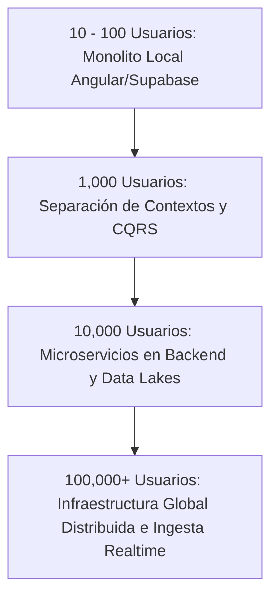

# Auditoría Estratégica, Arquitectónica y Comercial del Emulador de Trading

**Fecha:** 10 de julio de 2026  
**Comité de Auditoría:**
1. **Principal Software Architect:** Especialista en DDD, Clean Architecture y Arquitecturas Dirigidas por Eventos (EDA).
2. **Senior Product Manager:** Especialista en SaaS y herramientas financieras para traders profesionales.
3. **Trader Profesional:** Operador discrecional con +10 años de experiencia activa en plataformas líderes.
4. **UX Designer:** Diseñador especializado en interfaces de análisis financiero y terminales profesionales.
5. **CTO de Startup:** Especialista en escalabilidad de plataformas y arquitectura de datos.

---

## INTRODUCCIÓN Y DECLARACIÓN DE OBJETIVOS
Este comité ha evaluado de forma crítica la base de código del emulador, sus decisiones arquitectónicas previas (especialmente de las RFC-001 a la RFC-013), su motor de simulación de ejecuciones, la experiencia de usuario y su viabilidad comercial en el saturado mercado de herramientas de trading. 

El norte del proyecto no es competir con la potencia de graficado de TradingView, sino ser **la mejor plataforma del mundo para la práctica discrecional deliberada, el replay de mercado de alta fidelidad, la analítica profunda y el journaling automatizado**.

---

## PARTE 1: Auditoría Arquitectónica (DDD, Clean Architecture y Event-Driven Design)

### 1. Fortalezas Actuales
* **Desacoplamiento Estricto del Motor Gráfico (RFC-007):** La decisión de aislar `src/app/domain/chart` eliminando las dependencias directas del estado global (NgRx) y usando una Capa de Anti-Corrupción (ACL) como `ChartModelMapper` es brillante. Permite que el motor de renderizado sea portable, testeable en aislamiento y libre de efectos secundarios de Angular.
* **Granularidad de State Features (NgRx):** La estructuración del estado en features compactos (layout, replay, trading, workspaces, link-groups) evita el estado monolítico.
* **Modularidad mediante Capabilities (RFC-003, RFC-004, RFC-005):** El patrón de separar capacidades visuales (`TradingCapability`, `DrawingsCapability`, `CountdownCapability`) mediante primitivas desacopladas del Canvas facilita la agregación de herramientas gráficas futuras sin modificar el bucle de render principal.
* **Modelo Offline-First Integrado:** La sincronización local mediante IndexedDB (`WorkspaceDbService`) como caché resiliente combinada con persistencia Supabase (`session-sync.service.ts`) implementa una sincronización LWW (Last-Write-Wins) efectiva y de baja latencia para el usuario.

### 2. Debilidades y Cuellos de Botella Futuros
* **Falta de un Verdadero Agregado de Simulación en el Backend/Dominio:** El motor de ejecución (`fill-engine.ts`) es actualmente una colección de funciones puras invocadas desde los NgbEffects de Angular. No existe un Bounded Context de simulación robusto en el dominio; todo el estado intermedio reside en el cliente. Si en el futuro se quiere ofrecer replay colaborativo o validación de retos (Challenge Mode) contra manipulación del cliente, este diseño es vulnerable a fraudes e inconsistencias.
* **Acoplamiento Temporal en el Event Loop:** La sincronización de paneles a través de un único reloj global (`selectReplayIndex` en `replay.reducer.ts`) asume que todos los datos están perfectamente alíneados en el tiempo. Las brechas de mercado (fines de semana, horas sin volumen) causan desalineaciones temporales donde ciertos paneles quedan "congelados" esperando datos, lo cual puede degradar el rendimiento al forzar búsquedas binarias repetidas (`lastIndexAtOrBefore`) en el hilo de renderizado principal.
* **Ineficiencia en la Reactividad por Instancia de Panel:** Aunque la memoización aislada de `ChartModelMapper` por panel (RFC-008/013) evita el *thrashing* de selectores globales, la acumulación de múltiples paneles activos (hasta el límite de 8) disparará suscripciones duplicadas y recalculará porciones del `RenderModel` idénticas (como los dibujos por símbolo) de forma redundante.

### 3. Bounded Contexts y Agregados Clave
El dominio actual está implícitamente dividido, pero requiere una delimitación formal:
1. **Market Data Context:** Propietario de los históricos de velas y la resolución temporal. Su raíz es la serie temporal por símbolo.
2. **Simulation / Trading Context:** Gestiona órdenes pendientes, posiciones, historial y cálculo de equity. Su Agregado Raíz es `TradingBook`.
3. **Workspace / Presentation Context:** Controla layouts, pestañas, sincronizaciones visuales (`LinkGroups`) y preferencias. Su Agregado Raíz es `Session` (RFC-011).

> [!WARNING]
> **Riesgo Futuro:** La mezcla de responsabilidades de persistencia en `SessionPayloadV2` (donde coinciden datos de trading, dibujos y layouts en un solo JSONB) se convertirá en un cuello de botella. Un cambio menor en la estructura de un dibujo invalidará o corromperá potencialmente el historial de operaciones de una sesión. Es urgente separar físicamente el payload de ejecución comercial (`TradingBook`) del payload de personalización visual (`Layout`/`Drawings`).

---

## PARTE 2: Auditoría desde la Perspectiva del Trader Profesional

Si evaluamos este emulador como una herramienta por la cual un trader pagaría **$30 - $80 USD al mes**:

### 1. ¿Qué problemas resuelve actualmente?
* **Entorno de práctica enfocado y libre de distracciones:** Ideal para ejecutar repeticiones de mercado rápidas en barras del pasado sin el sesgo del presente.
* **Simulación básica de ejecución:** Permite colocar órdenes límite/stop con SL/TP visuales y ver el resultado financiero inmediatamente.
* **Sincronización multi-timeframe integrada (RFC-010):** Permite ver la acción del precio macro y micro en paralelo (esencial para traders multi-timeframe que buscan gatillos precisos).

### 2. ¿Qué problemas importantes siguen sin resolverse?
* **Inconsistencia de Ejecución Intrabar (Deslizamiento y Camino del Precio):** El trader profesional se frustrará gravemente si el emulador le toca un SL que en el mercado real nunca fue tocado (analizado a fondo en la Parte 7). Esto destruye la confianza en la herramienta; si el backtest no es 100% fiel, sus datos estadísticos no sirven para validar su ventaja estadística (edge).
* **Ausencia de un Journal de Trading:** La práctica sin registro de observaciones no produce mejora continua. Un historial de trades en una tabla plana no es un diario de trading. Faltan notas por operación, capturas automáticas del gráfico antes/después del trade, y tags de errores psicológicos o de setup.
* **Cero flexibilidad en Comisiones y Spread:** En el mundo real, los costes de transacción (comisiones fijas por lote, spread flotante de mercado y deslizamiento) determinan si una estrategia es rentable o no. Ignorar esto crea expectativas de rentabilidad irreales (expectancy sesgada al optimismo).

### 3. Retención vs. Churn
* **¿Por qué volvería todos los días?** Si el producto ofrece un flujo gamificado tipo "entrenamiento diario" (ej. "Completa 5 sesiones de replay hoy") o si el Journal de Trading está tan integrado que el emulador es la herramienta donde guarda TODO su registro estadístico diario (incluso operaciones reales importadas).
* **¿Por qué dejaría de usarlo?** Por desconfianza en los datos de replay, ejecuciones fantasmas (SLs erróneos), falta de soporte para múltiples activos en paralelo, y si la interfaz se siente lenta o tosca al hacer scroll/zoom temporal.

### 4. Características Imprescindibles para Competir
1. **Journal Avanzado** con sincronización automática de capturas de pantalla (el "antes" del gatillo y el "después" del cierre).
2. **Carga instantánea de cualquier activo** con datos de broker seleccionables (IC Markets, Oanda, Pepperstone).
3. **Múltiples perfiles de riesgo** y soporte para simulación de apalancamiento real.

---

## PARTE 3: Comparación con Plataformas Existentes

| Característica / Plataforma | **TradingView Replay** | **FXReplay** | **Tradervue / TraderSync** | **Edgewonk** | **Nuestro Emulador (Futuro)** |
| :--- | :--- | :--- | :--- | :--- | :--- |
| **Fortalezas** | - El mejor motor gráfico del mundo.<br>- Acceso instantáneo a cualquier activo. | - Excelente flujo de replay en la nube.<br>- Integración fluida de estadísticas y journal. | - Líderes en analítica avanzada e importación de brokers reales. | - Enfoque profundo en psicología y gestión comercial. | - Replay ultra-rápido offline.<br>- Interfaz modular multi-panel libre de fricción.<br>- Customización total de timeframes. |
| **Debilidades** | - No permite multi-timeframe síncrono en replay de forma nativa.<br>- No guarda historial estructurado de trading. | - Costoso ($35/mes).<br>- Rendimiento pesado en navegadores viejos. | - Interfaz visual anticuada.<br>- Entrada manual de datos tosca. | - Requiere instalación local pesada.<br>- Curva de aprendizaje empinada. | - Falta de feeds de datos globales integrados.<br>- Suite analítica inmadura. |
| **Qué vale la pena adoptar** | - Atajos de teclado fluidos.<br>- Estética visual limpia. | - El flujo de "Session Review" al terminar un replay. | - Gráfico de equity acumulada y R-múltiple dinámico. | - El diario psicoterapéutico por trade (tags de estado mental). | — |
| **Qué NO copiar** | - La barra lateral saturada de redes sociales y noticias. | - El retardo de carga en la nube de cada vela (latencia API). | - Los layouts complejos de tablas difíciles de leer para humanos. | - La obligación de clasificar manualmente cada trade con +20 campos. | — |

### Oportunidad Dorada de Diferenciación:
*Ninguna* de estas plataformas combina **Replay Multi-Panel instantáneo** con un **Motor de Feedback de IA** que actúe como un Coach en vivo (ej. alertando al trader en tiempo real: *"Estás operando contra la tendencia de H4 con un stop extremadamente ajustado; estadísticamente has fallado el 82% de estos trades en tus últimas 30 sesiones"*).

---

## PARTE 4: Feature Discovery (Propuestas Estratégicas)

Para transformar el proyecto en un SaaS amado por los traders y altamente comercializable, proponemos las siguientes características, divididas en las categorías solicitadas y añadiendo innovaciones exclusivas:

### 1. Núcleo de Simulación y Análisis
* **Trading Journal Automatizado:** Creación automática de un registro detallado por cada trade del emulador, con capturas automáticas del gráfico (antes y después) en formato vectorial (guardando las primitivas geométricas de los dibujos).
* **Performance Dashboard & Calendar:** Calendario interactivo mensual que muestra el PnL neto o R-múltiple por día operado, acompañado de métricas tradicionales (Profit Factor, Sharpe Ratio, Max Drawdown).
* **Screenshot Timeline:** Línea de tiempo visual que el trader puede recorrer para ver sus operaciones directamente en el gráfico, con marcas de ejecución táctiles.

### 2. Gamificación e Inteligencia Artificial
* **Challenge Mode (Evaluación de Cuentas de Fondeo):** Módulos que emulan las reglas de empresas de fondeo (FTMO, FundedNext) con límites de drawdown diario (5%) y total (10%), objetivos de beneficio y reglas de consistencia de lotaje.
* **AI Coach & Reviewer (El "Code Review" del Trader):** Un agente de IA que analiza el historial de la sesión de replay, detecta inconsistencias con la estrategia documentada y sugiere mejoras (ej. *"Sueles mover tu Stop Loss a Break-Even demasiado rápido en setups de reversión, lo que te cuesta un 15% de rentabilidad potencial"*).
* **AI Pattern Discovery:** Análisis automático de las velas previas al gatillo del trader para identificar si existían patrones armónicos, bloques de órdenes (Order Blocks) o ineficiencias (Fair Value Gaps) que el trader pasó por alto.

### 3. Colaboración y Productividad
* **Mentor/Student Mode:** Capacidad de compartir una sesión de simulación interactiva. Un mentor puede diseñar un escenario histórico ("Sesión del FOMC, Noviembre 2024"), bloquear el lado derecho del gráfico y enviárselo a sus alumnos para ver cómo gestionan el riesgo en vivo.
* **Cloud Sync con Versionado de Layouts:** Respaldos incrementales de layouts, configuraciones y dibujos, con posibilidad de hacer rollback temporal de dibujos corruptos o modificados accidentalmente.

---

## PARTE 5: Fichas Técnicas de Características Seleccionadas

Presentamos la evaluación técnica y comercial de los módulos propuestos para su implementación estratégica:

### Ficha 1: Trading Journal Automatizado (con Vector Drawings Preservation)
* **Problema que resuelve:** El registro manual de operaciones en hojas de cálculo o journals externos es tedioso y los traders terminan abandonándolo.
* **Valor para el trader:** Ahorro total de tiempo y precisión absoluta. El diario se auto-rellena con capturas del estado de los indicadores y líneas de tendencia exactas en el momento de la entrada y salida.
* **Valor para el negocio:** Retención masiva. El diario se convierte en el "segundo cerebro" del trader. Perder acceso a la suscripción significa perder su base de datos de entrenamiento histórico.
* **Valor arquitectónico:** Limpio. Se apoya en el modelo de `ClosedTrade` e IndexedDB.
* **Complejidad técnica:** **Media-Baja**. La serialización de dibujos vectoriales ya está resuelta en `drawings-primitive.ts`. Solo se requiere empaquetar el estado de los dibujos y la serie de velas visible en un DTO JSON y guardarlo en la tabla `journal_entries` en Supabase/IndexedDB.
* **Complejidad de UX:** **Media**. Requiere una sección de visualización lateral o modal interactivo para revisar el diario sin salirse del área de gráficos.
* **RFCs requeridos:** `RFC-014-trading-journal-core`.
* **Bounded Contexts afectados:** `Trading`, `Workspaces` (Drawings).
* **Dependencias:** Supabase Storage (para almacenar opcionalmente imágenes rasterizadas o JSONs vectoriales).
* **Riesgos:** Crecimiento acelerado del tamaño de la base de datos local si se guardan imágenes en Base64. **Mitigación:** Guardar los dibujos como coordenadas relativas JSON y las velas como referencias a marcas temporales (timestamps), permitiendo reconstruir el gráfico vectorialmente bajo demanda en lugar de guardar screenshots pesados.
* **MVP recomendado:** Registro automático en base de datos al cerrar un trade, mostrando en una lista la entrada, salida, resultado financiero y una miniatura interactiva del gráfico reconstruida usando las coordenadas guardadas.

### Ficha 2: AI Coach (Análisis de Gestión y Sesgos Cognitivos)
* **Problema que resuelve:** Los traders repiten los mismos errores de disciplina (FOMO, Overtrading, Revenge Trading) sin darse cuenta.
* **Valor para el trader:** Tener un mentor profesional analizando cada uno de sus movimientos 24/7 de forma objetiva.
* **Valor para el negocio:** Diferenciador comercial único (Moonshot). Es la característica que justifica un cobro premium ($50+/mes).
* **Valor arquitectónico:** Excelente. Mapea directamente el `ClosedTrade[]` y lo envía a un servicio serverless que interactúa con un modelo LLM estructurado.
* **Complejidad técnica:** **Media-Alta**. Requiere prompts estructurados mediante JSON Schema (Structured Outputs) y un pipeline en el backend para pre-procesar las estadísticas operativas de la sesión antes de enviarlas al LLM.
* **Complejidad de UX:** **Baja**. Se puede presentar como un chat conversacional lateral o un reporte estructurado al final de la sesión de replay.
* **RFCs requeridos:** `RFC-015-ai-coach-integration`.
* **Bounded Contexts afectados:** `Trading` (historial), `Replay` (duración de la sesión).
* **Dependencias:** API de LLM comercial (OpenAI, Gemini Pro o Anthropic Claude) en formato JSON estructurado.
* **Riesgos:** Alucinaciones de la IA aconsejando operativas erróneas. **Mitigación:** Acotar las respuestas a métricas matemáticas estrictas y reglas heurísticas duras de gestión monetaria (ej. no opinar sobre la estrategia en sí, sino sobre el cumplimiento del ratio Riesgo/Beneficio y límites de drawdown).
* **MVP recomendado:** Un botón "Analizar Sesión" que envía el historial de trades del día operado a una función serverless y devuelve 3 fortalezas observadas, 3 debilidades estadísticas y un score de consistencia de riesgo.

### Ficha 3: Challenge Mode (Simulador de Cuentas de Fondeo)
* **Problema que resuelve:** El paso del replay de práctica al trading real o evaluaciones de fondeo suele ser desastroso por la falta de disciplina ante las reglas rígidas de estas empresas.
* **Valor para el trader:** Entrenar bajo las mismas condiciones psicológicas y regulatorias de una prueba de fondeo real (Drawdown dinámico, límites diarios, etc.) sin coste de inscripción.
* **Valor para el negocio:** Imán de marketing viral en redes sociales (TikTok/YouTube). Los retos y "speedruns" de cuentas de fondeo generan tracción orgánica masiva.
* **Valor arquitectónico:** Muy natural. Solo requiere un validador en tiempo real (guardián de reglas) que escuche eventos del `TradingBook`.
* **Complejidad técnica:** **Baja**. Las reglas de cálculo de balance diario y drawdown máximo son algebraicas y se pueden implementar directamente en los reducers o selectores de NgRx.
* **Complejidad de UX:** **Media**. Requiere un HUD flotante (cabecera del emulador) que parpadee en rojo cuando el trader esté cerca del límite de pérdida diaria y un overlay de "Prueba Fallida/Superada".
* **RFCs requeridos:** `RFC-016-challenge-mode`.
* **Bounded Contexts afectados:** `Trading`.
* **Dependencias:** Ninguna externa.
* **Riesgos:** Desincronización horaria para el cálculo del "Drawdown Diario" (las firmas de fondeo cierran el día a las 5:00 PM EST). **Mitigación:** Forzar el alineamiento del reloj de replay al huso horario UTC-5 (New York EST) para el cómputo de la equidad diaria de forma rigurosa.
* **MVP recomendado:** Añadir un toggle al crear una sesión de replay: "Iniciar bajo reglas FTMO ($100k)". Registrar en pantalla la pérdida máxima diaria permitida ($5,000) y cerrar la sesión con bloqueo de operativa si se viola.

---

## PARTE 6: Clasificación de Features y Matriz de ROI

### 1. Clasificación por Esfuerzo de Desarrollo

#### Quick Wins (< 1 semana de desarrollo)
1. **Challenge Mode MVP:** Reglas básicas de drawdown en el cliente.
2. **Calendar Performance:** Vista de calendario simple consumiendo el `ClosedTrade[]`.
3. **Simulación de Costes de Operativa:** Inputs para configurar spread fijo y comisión por lote.
4. **Exportar Historial a CSV/Excel:** Utilidad nativa para descargar el historial limpio de la simulación.

#### Proyectos Medios (1 - 2 semanas de desarrollo)
1. **Trading Journal MVP:** Persistencia de notas y tags por trade en IndexedDB/Supabase.
2. **Screenshot Timeline (Visual):** Renderizado de marcadores táctiles en el eje temporal del gráfico principal.
3. **Save/Load de Plantillas de Dibujos:** Guardar estilos por defecto de herramientas gráficas.

#### Proyectos Grandes (> 2 semanas de desarrollo)
1. **Trading Journal con Capturas Vectoriales Reconstruibles.**
2. **AI Coach Serverless Integrado.**
3. **Multi-Símbolo Auténtico (Carga y consumo de múltiples series de mercado en paralelo).**

#### Moonshots (Altamente experimentales / Diferenciadores radicales)
1. **AI Pattern Discovery en el Canvas:** Escáner en tiempo real que dibuja ineficiencias del pasado ignoradas por el trader.
2. **Multiplayer Practice (Replay Síncrono Cooperativo/Competitivo).**

---

### 2. Matriz de Retorno de Inversión (ROI)

```
             ALTO  +-----------------------------------+-----------------------------------+
                   |                                   |                                   |
                   |   - Challenge Mode MVP            |   - AI Coach Integrado            |
                   |   - Simulación de Spread/Comisión |   - Journal Vectorial             |
                   |   - Calendar Performance View     |   - AI Pattern Discovery          |
                   |                                   |                                   |
                   |          [QUICK WINS]             |        [STRATEGIC BETS]           |
  COMERCIAL / ROI  +-----------------------------------+-----------------------------------+
                   |                                   |                                   |
                   |   - Exportador CSV                |   - Multiplayer Practice          |
                   |   - Notas de texto plano          |   - Replay en tiempo real Cloud   |
                   |                                   |                                   |
                   |          [UTILITIES]              |          [MOONSHOTS]              |
             BAJO  +-----------------------------------+-----------------------------------+
                                   BAJO                                ALTO
                                            ESFUERZO TÉCNICO
```

---

## PARTE 7: Revisión Crítica del Motor de Simulación (Trading Engine)

### 1. Diagnóstico Técnico del Bug de Ejecución
El escenario reportado por el usuario (colocar un *Sell Stop*, que el motor simule la ejecución, toque el *Stop Loss* erróneamente en el emulador, mientras que en la realidad el precio subió primero a la zona de SL antes de activar la orden y luego cayó directamente hacia el *Take Profit*) es un síntoma directo de **tres debilidades de diseño lógico** en `fill-engine.ts`:

#### A. El Bug del "Filtro de Parent-Candle" en `resolveExit` (La Causa Principal)
Analicemos la función `resolveExit` del código actual:
```typescript
function resolveExit(
  p: Position,
  candle: Candle,
  subCandles: Candle[] | null,
  fromSubIdx: number,
): ExitDecision | null {
  const sl = slHit(p, candle);
  const tp = tpHit(p, candle);
  if (!sl && !tp) return null;
  if (sl && !tp) return { outcome: 'sl', price: p.sl, ambiguous: false }; // <-- ERROR LÓGICO
  if (tp && !sl) return { outcome: 'tp', price: p.tp!, ambiguous: false };
  ...
```
Si una orden pendiente se ejecuta (fill) en el sub-candle de índice `K` de la vela activa, el motor calcula el punto de salida (`resolveExit`) pasándole la vela padre (`candle`) y el índice de inicio `fromSubIdx = K`. 
* Si en el sub-candle `J` (donde `J < K`, es decir, *antes* de que la orden se llenara) el precio tocó la zona que corresponde al stop loss de la futura orden, entonces `slHit(p, candle)` será `true` porque la vela padre consolida todo el rango del intervalo completo.
* Si el precio en ningún momento del intervalo toca el take profit (`tp` es `false`), la condición `if (sl && !tp)` se evalúa como **verdadera** de forma inmediata.
* **Resultado:** La función retorna una salida por Stop Loss (`outcome: 'sl'`), saltándose por completo la evaluación detallada de los sub-candels posteriores al fill. El trade se detiene en pérdida a pesar de que el toque del precio de SL ocurrió **antes** de que el trade estuviese abierto.

#### B. La Ambigüedad de Camino Intrabar sin Sub-velas
Cuando no hay sub-velas cargadas en memoria (por ejemplo, operando con un feed que solo tiene datos de la resolución visual del gráfico), la función retorna por defecto:
```typescript
  return { outcome: 'sl', price: p.sl, ambiguous: true };
```
Esta resolución pesimista por defecto penaliza sistemáticamente al trader y destruye la veracidad de la simulación del emulador en barras grandes.

#### C. El Retardo de Llenado del Placement-Candle (`c.time <= o.createdAt`)
En `orderFills`, se bloquea el llenado en la misma vela donde se crea la orden:
```typescript
function orderFills(o: PendingOrder, c: Candle): boolean {
  if (c.time <= o.createdAt) return false;
  ...
```
Esto fuerza a que la orden espere al inicio del siguiente intervalo de vela. En un mercado real, un retroceso rápido y explosión en la misma vela de 1 hora activaría la orden y podría alcanzar el TP. El emulador ignora esta dinámica temporal, retrasando la ejecución a la siguiente vela, donde el contexto del precio ya ha cambiado.

---

### 2. Propuesta de Arquitectura de Simulación de Alta Fidelidad

Para resolver de manera definitiva estas inconsistencias, proponemos migrar a un modelo de **Motor de Simulación Concurrente de Ticks/Sub-velas (Dual-Timeframe Execution Model)**:

```
                            [ CONTROLADOR DE REPLAY ]
                                        |
                          publica tick temporal (T)
                                        |
                                        v
                    +---------------------------------------+
                    |        EVENT ROUTER / TICK BUS        |
                    +---------------------------------------+
                      /                                   \
                     /                                     \
    (envía sub-vela/tick a T)                     (envía vela agregada a T)
                   /                                         \
                  v                                           v
    +---------------------------+               +---------------------------+
    |   ENGINE CLOCK (M1/Tick)  |               |   PRESENTATION VIEWPORT   |
    |                           |               |                           |
    | - Evalúa órdenes a M1     |               | - Renderiza gráficos H1/H4|
    | - Sin sesgo histórico     |               | - Sincroniza crosshairs   |
    | - Actualiza TradingBook   |               | - Muestra UI del Trader   |
    +---------------------------+               +---------------------------+
                  |                                           ^
                  +--- despacha estado de posiciones actual ---+
```

#### Principios de la Nueva Arquitectura del Motor
1. **Clock Basado en la Mínima Resolución (Engine Clock):**
   El motor de replay y simulación interna correrá siempre sobre el timeframe más pequeño cargado (por defecto, M1 o datos de ticks reales si están disponibles). La UI del gráfico (por ejemplo, el gráfico H4) simplemente agregará visualmente los resultados de este bucle. Cuando el usuario hace click en "Next", el reloj de simulación avanza a nivel de motor por todos los minutos/segundos contenidos en el paso visual, actualizando las posiciones con precisión cronológica real.
2. **Evaluación de Exits Orientada a Intervalos de Posición:**
   El método `resolveExit` debe ser reescrito para ignorar el estado de la vela padre si se cuenta con sub-velas. Las comprobaciones rápidas (`slHit`/`tpHit`) sobre la vela padre solo se deben aplicar si el trade fue abierto en una vela *anterior* a la analizada y no existe información de sub-velas.
3. **Cálculo con Spread Dinámico y Deslizamiento (Slippage):**
   Las funciones de activación deben simular el spread de mercado. Una orden *Sell Stop* se activa si `Bid <= entryPrice`. Su stop loss (siendo una orden corta) se activa si `Ask >= SL` (donde `Ask = Bid + Spread`).

#### Refactorización del Código Corrector (`resolveExit` Recomendado):
```typescript
/**
 * Versión Auditada y Correcta para evitar stops fantasma intrabar.
 */
export function resolveExitCorrected(
  p: Position,
  candle: Candle,
  subCandles: Candle[] | null,
  fromSubIdx: number,
): ExitDecision | null {
  // Si tenemos sub-velas, evitamos comprobar la vela padre (evita bugs de pre-fill).
  if (subCandles && subCandles.length) {
    const startIndex = Math.max(0, fromSubIdx);
    for (let i = startIndex; i < subCandles.length; i++) {
      const sub = subCandles[i];
      const s = slHit(p, sub);
      const t = tpHit(p, sub);
      
      if (s && t) {
        // Ocurrieron ambos en la misma vela de resolución mínima: aplicamos castigo pesimista (SL)
        return { outcome: 'sl', price: p.sl, ambiguous: true };
      }
      if (s) return { outcome: 'sl', price: p.sl, ambiguous: false };
      if (t) return { outcome: 'tp', price: p.tp!, ambiguous: false };
    }
    // Si recorrimos todas las sub-velas del intervalo y ninguna tocó SL/TP, el trade sigue abierto.
    return null;
  }

  // Fallback sin sub-velas (pérdida de granularidad):
  const sl = slHit(p, candle);
  const tp = tpHit(p, candle);
  if (!sl && !tp) return null;
  
  if (fromSubIdx > 0) {
    // Si la posición fue abierta en esta misma vela y no tenemos sub-velas para desambiguar,
    // el resultado es inherentemente ambiguo debido a la falta de datos temporales detallados.
    return { outcome: 'sl', price: p.sl, ambiguous: true };
  }

  if (sl && !tp) return { outcome: 'sl', price: p.sl, ambiguous: false };
  if (tp && !sl) return { outcome: 'tp', price: p.tp!, ambiguous: false };
  
  return { outcome: 'sl', price: p.sl, ambiguous: true };
}
```

---

## PARTE 8: Roadmap Arquitectónico de Evolución (5 Fases)

Para guiar el desarrollo ordenado de esta plataforma de replay y analítica, estructuramos la hoja de ruta técnica en fases sucesivas que incrementan el valor del producto de forma iterativa y segura:

### Fase 1: Estabilización del Motor y Simulación de Alta Fidelidad (Core)
* **Objetivo:** Resolver el bug de stops fantasmas, corregir la latencia de las órdenes en la misma vela de colocación e introducir spread.
* **Valor entregado:** Fideicomiso absoluto en la simulación. El trader sabe que las métricas de su entrenamiento coinciden con los movimientos históricos reales de su broker.
* **RFCs necesarios:**
  - `RFC-014: Dual-Timeframe Engine Loop & Same-Candle Execution`.
  - `RFC-015: Spread, Commission and Slippage Simulation Core`.
* **Riesgos:** Incremento menor del uso de CPU por evaluar lotes más densos de sub-velas.
* **Dependencias:** Finalizar e integrar la UI de `RFC-013` (Workspace Multi-Chart).

### Fase 2: El Diario de Práctica (Journaling & Contextual Vectors)
* **Objetivo:** Persistencia avanzada de operaciones, anotaciones psicológicas y retención vectorial de dibujos de setups en IndexedDB/Supabase.
* **Valor entregado:** El trader puede clasificar sus trades, ver dónde cometió errores y registrar sus "capturas de pantalla" vectoriales reconstruibles.
* **RFCs necesarios:**
  - `RFC-016: Journal Aggregate & Storage Schema`.
  - `RFC-017: Vector Snapshots for Closed Trades`.
* **Riesgos:** Corrupción de datos al guardar colecciones complejas en JSONB.
* **Dependencias:** Fase 1 operativa.

### Fase 3: Analítica de Rendimiento e Interfaz Avanzada (Analytics & Calendars)
* **Objetivo:** Implementar el Dashboard de Rendimiento, calendario de rentabilidad interactivo y métricas estadísticas avanzadas en el frontend.
* **Valor entregado:** Feedback visual instantáneo de su progreso a lo largo de los días y meses de práctica.
* **RFCs necesarios:**
  - `RFC-018: Performance Dashboard View & Analytics Engine`.
* **Riesgos:** Lentitud al procesar miles de registros en memoria en el navegador. **Mitigación:** Trasladar la computación de ratios pesados (Sharpe, Max Drawdown) a un Web Worker dedicado.
* **Dependencias:** Fase 2 completada (datos de diario limpios).

### Fase 4: Inteligencia Artificial y Gamificación (AI Coach & Challenge Mode)
* **Objetivo:** Integrar el Agente de IA para el feedback de las sesiones e implementar el Módulo de Retos (FTMO Simulator).
* **Valor entregado:** El factor "Wow" comercial. La plataforma analiza la psicología y patrones operativos del usuario y le entrena de forma personalizada.
* **RFCs necesarios:**
  - `RFC-019: AI Integration Gateway (Structured JSON serverless)`.
  - `RFC-020: Challenge Mode Rule Evaluator`.
* **Riesgos:** Coste de la API de LLMs si se abusa del botón de análisis. **Mitigación:** Aplicar un sistema de tokens/créditos mensuales a los suscriptores.
* **Dependencias:** Fases 1 a 3 consolidadas.

### Fase 5: Mentoría, Colaboración y Escala Cloud (Mentor Mode)
* **Objetivo:** Sesiones compartidas de simulación, almacenamiento en la nube automatizado para sincronización multi-dispositivo y feeds de datos dinámicos.
* **Valor entregado:** Capacidad para que escuelas de trading y academias utilicen el emulador como software docente oficial.
* **RFCs necesarios:**
  - `RFC-021: Shared Sessions & Student Progress Tracker`.
* **Riesgos:** Problemas de latencia de red y seguridad al compartir layouts y ejecuciones entre usuarios.
* **Dependencias:** Todo el core offline e IA maduro.

---

## PARTE 9: Visión a Largo Plazo y Estrategia de Crecimiento de Datos

### 1. Evolución Arquitectónica según el Volumen de Usuarios



* **10 a 100 usuarios:**
  - *Arquitectura:* Prácticamente idéntica a la actual. El navegador del cliente realiza todo el trabajo pesado de computación visual y lógica de simulación. Supabase actúa como un backend pasivo para autenticación y persistencia de layouts.
  - *Bounded Contexts:* No se separan físicamente en servicios; permanecen divididos a nivel de módulos TypeScript en Angular.
* **1,000 usuarios:**
  - *Arquitectura:* El volumen de diarios y capturas vectoriales de trading crece. Es necesario separar el backend de Supabase en base de datos dedicada. Nace el primer microservicio en NodeJS/Go: **Execution Analytics Engine**, encargado de computar las métricas de rendimiento en segundo plano para no bloquear el navegador del usuario al cargar calendarios anuales.
  - *Separación de Datos:* El payload de layout visual (`WorkspaceLayout`) y los datos financieros (`TradingBook`) se guardan en bases de datos relacionales normalizadas en lugar de un único blob JSONB.
* **10,000 usuarios:**
  - *Arquitectura:* Transición a una arquitectura orientada a servicios (SOA/Microservicios). El motor de matching de órdenes (`fill-engine.ts`) se expone también en el backend para validar ejecuciones del "Challenge Mode" de forma segura, evitando que usuarios manipulen el estado en memoria de su navegador para ganar los retos de fondeo de manera fraudulenta.
  - *Nuevos Contextos:* Bounded Context de **Billing & Subscriptions**, Bounded Context de **AI Agent Workflows** (colas de mensajes RabbitMQ/Kafka para procesar resúmenes de diarios mediante LLMs de forma asíncrona) y Bounded Context de **Market Data Ingestion Pipeline** (actualización constante del lago de datos de velas Parquet en R2/S3).
* **100,000 usuarios:**
  - *Arquitectura:* Escala masiva global.
  - *Servicios Separados:* El motor gráfico sigue renderizando localmente en WebGL, pero los datos se sirven desde un CDN global optimizado. El backend utiliza una base de datos distribuida de lectura rápida (tipo Cassandra o DynamoDB) para el historial del journal de trading y las métricas agregadas globales.

---

### 2. Captura Estratégica de Datos para el Futuro de la IA
Para construir un foso defensivo técnico (*moat*) basado en Inteligencia Artificial, la plataforma debe empezar a capturar y guardar de forma estructurada los siguientes datos desde **hoy**:

1. **El Historial del Puntero del Ratón y la Velocidad de Operación:**
   Registrar cómo interactúa el trader con el gráfico durante la simulación (ej. si hace zoom agresivo en zonas de pánico, si arrastra órdenes SL/TP repetidamente antes de gatillar). Esta "firma de comportamiento" permite identificar niveles de estrés psicológico en tiempo real.
2. **Coordenadas y Anotaciones Vectoriales por Operación:**
   No guardar imágenes PNG estáticas de los trades. Guardar el árbol JSON de los dibujos geométricos presentes en el gráfico en el segundo exacto del gatillo. Esto permitirá entrenar redes neuronales propias para que detecten qué configuraciones de líneas de tendencia y zonas de soporte/resistencia dibujadas por humanos se correlacionan con la mayor tasa de acierto estadístico.
3. **El Historial Completo de Retroceso Temporal (Playback Controller Backtrack):**
   ¿Qué tan seguido el trader retrocede la simulación (`-1`)? Este dato revela la falta de aceptación del riesgo. Un usuario que rebobina el mercado para "corregir" sus pérdidas está practicando con sesgo. Medir esto permite a la IA calificar el nivel de honestidad y disciplina del estudiante.
4. **Metadata Contextual del Trader (Tags Subjetivos de Estado de Ánimo):**
   Solicitar un tag sencillo al iniciar una sesión de simulación (ej. *"Nivel de fatiga: Alto/Medio/Bajo"*, *"Foco: Alto/Medio/Bajo"*). Combinar estos datos subjetivos con sus métricas objetivas de simulación le dará a la plataforma el set de datos de correlación psicológica más valioso de la industria.

---

## CONCLUSIÓN DEL COMITÉ
El proyecto cuenta con bases arquitectónicas de frontend sumamente avanzadas e inusuales para herramientas creadas por desarrolladores independientes. Sin embargo, su **talón de Aquiles actual es la fidelidad matemática del motor de ejecuciones** y la falta de un flujo de journaling nativo integrado. 

Si el equipo prioriza la **Fase 1 (Corrección de stops fantasma e intrabar)** y la **Fase 2 (Trading Journal con reconstrucción vectorial)**, tendrá en sus manos una plataforma robusta y lista para ser comercializada como el software definitivo de entrenamiento para traders que buscan mejorar seriamente su operativa.
