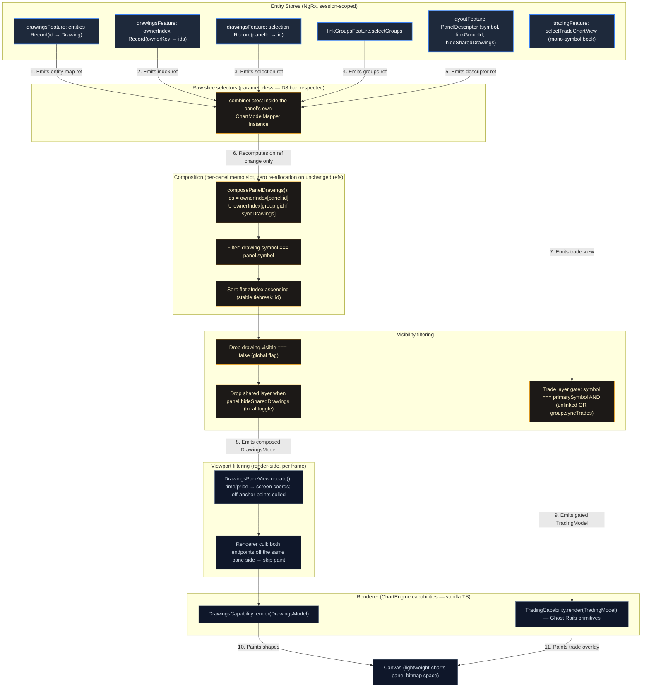

# RFC-017 — Compositional Panel Sync & Layer Composition: Design Specification

| Field | Value |
| :--- | :--- |
| Status | Self-review passed — cleared for planning/implementation |
| Date | 2026-07-16 |
| Governing docs | `docs/architecture/rfcs/017-compositional-panel-sync.md` (approved design), `DOMAIN_MODEL.md`, `DESIGN_SYSTEM.md`, `docs/engineering/domain/workspace-panels.md`, frozen decisions in `008-012-multi-chart-panel-system-vision.md` |
| Companion docs | `2026-07-16-rfc-017-trade-visualization-concepts.md` (visual direction: Ghost Rails) |
| Decisions minted here | D17.A – D17.L |

This spec turns the approved RFC-017 design into an implementable technical
specification. Per the mission charter, the state representation and database
mapping of the approved design were challenged where evidence warranted;
every deviation is identified and justified inline. All four RFC-017
invariants (zero implicit copying, compositional rendering, LinkGroups as
resolvers, explicit ownership) are preserved, as are all repo invariants
(kernel §Invariants) and the 008-012 frozen non-goals.

> **Aclaración de alcance (2026-07-24).** (a) *Paneles secundarios de observación:*
> un panel secundario puede mostrar **cualquier activo descargado** (p. ej. NASDAQ)
> para observación de la acción del precio y trazado de dibujos — §1 ya lo describe
> como "a view-only panel on another symbol". La capa de trades se apaga donde
> `panel.symbol ≠ primarySymbol` (RFC §5.1); esos paneles son referencia read-only
> respecto a trades. El multi-símbolo es de **observación**, no operable (D1; no-goal
> 008-012). (b) *Estado de tasks:* Task 1 **completada** (preservada e integrada);
> Tasks 7–8 **superseded por TEDS** (fuera de alcance); este run ejecuta
> **Tasks 2–6 + 9**.

---

## 1. Current state (evidence, not assumption)

Verified against live code on `origin/develop`:

- `DrawingsState` is a flat `items: Drawing[]` holding ONLY the active
  symbol's drawings; symbol switches swap the whole slice
  (`restoreDrawingsForSymbol`, `workspaceRestored`). `Drawing` is
  `{id, kind, p1, p2}` — no symbol, owner, zIndex, locked, or visible.
- Every `ChartComponent` (one per panel) subscribes to the SAME global
  drawings slice and pushes it unfiltered → all panels render identical
  drawings regardless of their own symbol. There is no per-panel scoping.
- The trade overlay (`tradeChartView$`) is pushed to every panel
  unconditionally — a view-only panel on another symbol paints the primary
  symbol's trades at meaningless coordinates.
- Selection (`selectedId`) and active tool are global singletons.
- No undo/redo and no clipboard exist anywhere in the app.
- Sync: `ChartSyncBus` → `ChartSyncRouter` fan-out gated by
  `LinkGroup.syncCrosshair` / `syncTimeRange` with origin exclusion +
  idempotent apply. `syncPriceScale` is reserved-unimplemented (R3).
- Persistence: `SessionPayloadV2.drawings: Record<symbol, DrawingCollection>`;
  IndexedDB `Workspace.drawings: Drawing[]` (flat, per-symbol record).
  Migration machinery (`parseSessionPayload`, `migrateV1ToV2`) exists with
  shape guards and round-trip tests.

## 2. Domain model and state representation

### 2.1 Entities (schema per approved design §3.1)

```typescript
export interface DrawingOwner {
  type: 'panel' | 'group';
  id: string; // panelId | linkGroupId
}

export interface Drawing {
  id: string;
  symbol: string;
  owner: DrawingOwner;
  kind: DrawingType;
  p1: DrawingPoint;
  p2: DrawingPoint;
  zIndex: number;
  locked: boolean;
  visible: boolean;
}
```

The persisted schema is exactly the approved one. Runtime-only bookkeeping
(revisions, undo stacks, selection) lives OUTSIDE the entity so the wire
shape stays minimal.

### 2.2 Store shape — D17.A (entity map + incremental owner index)

The approved design authorizes optimizing the internal store structure
provided ownership identity stays primary. The store becomes:

```typescript
export interface DrawingsState {
  entities: Record<string, Drawing>;        // all session drawings, all symbols
  ownerIndex: Record<string, readonly string[]>; // 'panel:<id>' | 'group:<id>' → drawing ids
  revisions: Record<string, number>;        // runtime-only, monotonic per drawing
  history: Record<string, PanelHistory>;    // runtime-only, panelId → undo/redo stacks
  clipboard: ClipboardEntry | null;         // runtime-only, session-wide
  selection: Record<string, string | null>; // panelId → selected drawing id
  activeTool: DrawingTool;                  // global tool palette (unchanged UX)
  nextZ: number;                            // monotonic zIndex counter
}
```

- **The store holds the whole session's drawings** (all symbols, all owners)
  instead of swapping per symbol. Symbol switching becomes a pure filter
  change (approved design §7), and group/panel composition can resolve any
  panel without hydration races.
- **`ownerIndex` is maintained incrementally by the reducer** (add: append;
  delete: splice; ownership never mutates post-creation except via the
  explicit paste/create paths — there is no "transfer owner" action). This is
  the O(1) owner lookup the design demands: composition reads
  `ownerIndex['panel:p1']` and `ownerIndex['group:g1']` directly, never
  scanning `entities`.
- **`revisions` deliberately lives outside `Drawing`** so the persisted
  schema stays exactly §2.1. Undo stacks are runtime-only, so their guard
  counters are too (D17.F).
- **`selection` is per-panel** (challenge to the implicit global
  `selectedId`): with N panels editing a shared layer, one global selection
  causes action-at-a-distance (deleting in panel B what the trader selected
  in panel A). Selection semantics: selecting a drawing in a panel clears
  that drawing from any other panel's selection (one drawing → at most one
  selecting panel; keeps drag/handle interactions unambiguous), and panels
  keep independent selections of different drawings.
- `nextZ` seeds from `max(zIndex)+1` on hydration; every new drawing takes
  `nextZ++`. Flat ordering across composed layers (§8.4 of the approved
  design) falls out of a single counter — no per-layer offsets.

### 2.3 Actions (ownership-aware surface)

All mutating actions carry the acting panel's context; owner resolution for
creation happens in ONE pure function used by every creation path:

```typescript
resolveDrawingTarget(panel: PanelDescriptor, groups: Record<string, LinkGroup>): DrawingOwner
// → { type: 'group', id } when panel.linkGroupId resolves AND group.syncDrawings
// → { type: 'panel', id: panel.id } otherwise
```

| Action | Props | Notes |
| :--- | :--- | :--- |
| `addDrawing` | `{ panelId, drawing }` | `drawing.owner` pre-resolved by the dispatching panel via `resolveDrawingTarget`; reducer assigns zIndex |
| `moveDrawing` | `{ panelId, id, p1, p2 }` | Rejected (identity return) when `locked` |
| `deleteSelected` | `{ panelId }` | Acts on that panel's selection only; rejected when locked |
| `selectDrawing` | `{ panelId, id \| null }` | Steals selection from other panels for that id |
| `setDrawingLocked` / `setDrawingVisible` | `{ id, value }` | Any panel; metadata, not history-tracked |
| `undo` / `redo` | `{ panelId }` | §5 |
| `copySelected` / `pasteClipboard` | `{ panelId }` | §6 |
| `restoreDrawings` | `{ drawings }` | Full replacement (hydration/import); rebuilds index, revisions reset |

`clearDrawings` and `restoreDrawingsForSymbol` are retired (the store is no
longer symbol-swapped); hydration paths converge on `restoreDrawings`.

## 3. Synchronization architecture — D17.K (two sync families)

A load-bearing clarification the approved design leaves implicit: the four
channels of §5 split into two mechanically different families, and drawings
must NOT ride the event bus.

1. **Event-channel sync** (`syncCrosshair`, `syncTimeRange`): transient
   gestures routed panel→panels through `ChartSyncBus` → `ChartSyncRouter`
   (origin exclusion + idempotent apply). Unchanged by this RFC.
2. **Composition sync** (`syncDrawings`, `syncTrades`): durable state shared
   by construction — two panels resolving the same group compose the same
   shared layer from the same store snapshot. There is no event to route,
   no echo to suppress, and nothing for the router to do. The router's
   `GATE` map is untouched.

This keeps Invariant 3 honest: the LinkGroup resolves a namespace
(`group:<id>` in the owner index); it never stores or forwards drawing data.

`LinkGroup` gains two REAL flags (unlike R3's reserved `syncPriceScale`,
which stays reserved and unread):

```typescript
export interface LinkGroup {
  id: string;
  color: string;
  syncCrosshair: boolean;
  syncTimeRange: boolean;
  syncPriceScale?: boolean; // (R3) still reserved, still unread
  syncDrawings: boolean;    // new: resolves the shared drawings namespace
  syncTrades: boolean;      // new: gates the trade layer on member panels
}
```

Hydration of V2 payloads and defaults (behavior-preservation principle —
migration must not change what an existing session shows):

| Flag | Migrated V2 group | Newly created group |
| :--- | :--- | :--- |
| `syncDrawings` | `false` (V2 groups never shared drawings) | `true` (sharing is why you link) |
| `syncTrades` | `true` (trade overlay was previously always-on) | `true` |

### 3.1 Trade layer gating

The trade layer renders on a panel iff **`panel.symbol === primarySymbol`**
(the mono-symbol book, D1 — this newly kills the wrong-symbol ghost overlay,
a disclosed behavior fix) **AND** (panel unlinked **OR** its group's
`syncTrades`). The per-panel data is identical (one `TradingBook`); only
layer visibility is per-panel. `syncTrades` is therefore a visibility
resolver, not a data channel — consistent with family 2.

## 4. Rendering pipeline (Step 2 diagram)

Per-panel composition happens inside each panel's own `ChartModelMapper`
instance (D8: the factory-selector ban is load-bearing here; store-level
selectors stay parameterless and per-panel derivation memoizes in the
mapper's private slot). The implementation must follow this structure; task
briefs reference this diagram as the pipeline contract.



Diagram review checklist (per `.agents/skills/architecture-diagrams/SKILL.md`
§4): parses as `flowchart TD`; special characters quoted; no HTML in labels;
top-to-bottom data hierarchy; core stores vs derivation vs render layers
color-separated; node tokens match the planned code names (§2.2, §2.3).

### 4.1 Performance contract

- **Zero allocations on the no-change path:** the mapper's composition memo
  keys on the tuple of input REFERENCES (entities, ownerIndex, selection,
  groups, descriptor). Unchanged refs → the previously composed array is
  returned by reference; the engine's own reference short-circuits then skip
  repaint. Allocation happens only when an input actually changed (a real
  edit), never per frame or per replay tick.
- **O(1) owner lookup:** `ownerIndex` (§2.2). Composition is O(k) in the
  panel's own drawing count, never O(N-session).
- **Sort cost:** O(k log k) at recompute only; k is per-panel composed count.
- **Viewport filtering stays render-side** (in the primitive): pan/zoom
  changes coordinates without store emissions, so store-side viewport
  filtering would be both wasteful and insufficient. This matches the
  existing audited split (`DrawingsPaneView.update()` + renderer cull).
- The 16 ms/frame budget is respected by construction: replay ticks change
  only `selectCurrentTime`/series refs, which the drawings composition does
  not depend on.

## 5. Undo / Redo — D17.F (panel-scoped stacks, revision-guarded, stale-drop)

New subsystem (none exists today). Scope: drawing lifecycle commands only
(`add`, `move`, `delete`). Metadata toggles (lock/visibility), trading
actions, and layout are NOT undoable — the money path stays untouched.

```typescript
interface DrawingCommand {
  kind: 'add' | 'move' | 'delete';
  drawingId: string;
  before: Drawing | null; // null for add
  after: Drawing | null;  // null for delete
  resultRev: number;      // revisions[drawingId] AFTER this command applied
}
interface PanelHistory { undo: DrawingCommand[]; redo: DrawingCommand[] } // capped at 50
```

Mechanics:

- Every applied mutation bumps `revisions[id]` by 1 (undo/redo applications
  included) and records `resultRev` on the command it pushes.
- **Undo(panelId):** pop the panel's undo stack. The command applies iff
  `revisions[id] === resultRev` (this panel made the LAST change to that
  drawing) AND the drawing is not currently `locked`. If it applies, the
  inverse lands (restore `before`, or delete for `add`), revision bumps, and
  a mirrored entry goes to the redo stack with the new `resultRev`. If it is
  **stale** (another panel — or a lock — touched the drawing since), the
  command is DROPPED and the pop continues to the next older command within
  the same gesture, until one applies or the stack empties.
- **Redo** is symmetric with the same guard; any fresh command from the
  panel clears its redo stack.

**Determinism argument (the required conflict-resolution strategy):** the
outcome of any undo/redo depends exclusively on the totally-ordered sequence
of reducer-applied mutations (NgRx serializes dispatches), never on timing,
async interleaving, or which panel's UI event fired first at the OS level.
Concurrent editing of one shared shape from two panels resolves as: the
panel that mutated LAST can undo; the other panel's stale entries are
discarded on contact. No merge, no clobber, no "undo undid someone else's
edit" — the invariant-1 failure mode (implicit overwrite of another
context's work) is structurally impossible.

Edge rulings (all reducer-tested):

| Case | Ruling |
| :--- | :--- |
| Undo `add` after another panel moved the drawing | Stale → dropped (the move proves the other panel adopted it) |
| Undo `move` after the drawing was deleted elsewhere | Entity absent → stale → dropped |
| Undo `delete` (recreate) when id no longer exists | Applies: restores `before` verbatim (same id), revision continues |
| Undo on a drawing that is now `locked` | Blocked, command retained (lock wins; unlock → undo works again) |
| Undo a shared-drawing command after the panel LEFT the group | Applies (history is about authorship, not current visibility); result may be invisible to the acting panel — documented behavior |
| Keyboard | Ctrl+Z / Ctrl+Y captured by the FOCUSED panel (layout's `focusedPanelId`), dispatched with that `panelId` |

## 6. Clipboard — D17.G (copy geometry, paste is creation)

- `copySelected(panelId)` captures `{kind, p1, p2}` — geometry and shape
  only. Identity, ownership, lock, and visibility are NOT captured.
- `pasteClipboard(panelId)` creates a NEW drawing: fresh id, fresh zIndex,
  `symbol` = destination panel's symbol, `locked:false`, `visible:true`,
  and **owner = the destination panel's active target layer** via the same
  `resolveDrawingTarget` used for drawing with the mouse (§2.3).

**Policy ruling (required by approved design §8.2):** paste adopts the
active target layer, not unconditionally the local layer. Rationale: paste
is an act of creation in the destination context; one resolution rule for
every creation path (draw, paste, and nothing else) is the only version the
trader can predict — "whatever I create on this panel goes where this panel
draws." A local-always default would make paste the single creation path
that ignores the panel's sharing mode, and would force a manual re-share
(which does not exist as an operation — ownership is immutable
post-creation). Pasting into a lock-free copy also gives the pragmatic
escape hatch for "I want my own editable copy of a locked shared shape" —
explicitly user-initiated, so Invariant 1 (no IMPLICIT copying) holds.

Clipboard is runtime-only state (not persisted, not synced) and one slot
deep, matching platform conventions.

## 7. Persistence — D17.J (SessionPayloadV3 + fidelity-preserving migration)

```typescript
export const SESSION_PAYLOAD_VERSION_3 = 3;

export interface SessionPayloadV3 extends Omit<SessionPayloadV2, 'schemaVersion' | 'drawings'> {
  schemaVersion: 3;
  /** Flat, owner-tagged set — the per-symbol record dissolves into Drawing.symbol. */
  drawings: { version: 2; items: Drawing[] };
}
```

Everything else in V2 is preserved verbatim (same D9 atomic-payload rule,
same `assertNoCandles` gate, same LWW cycle). `PanelDescriptor` gains
optional `hideSharedDrawings?: boolean` (additive; absent = `false`),
persisted inside the existing `panels` record — D17.H.

**Migration V2→V3** (`migrateV2ToV3`, chained after `migrateV1ToV2` inside
`parseSessionPayload` so V1 payloads flow V1→V2→V3):

For each `(symbol, collection)` entry, each drawing becomes: `symbol` from
its record key; `zIndex` = its array position offset by a running counter
(paint order preserved exactly); `locked:false`; `visible:true`; and
`owner = { type: 'panel', id: target }`.

**Challenge to the approved §10 (authorized, state-mapping scope):** the
approved text assigns everything to the literal primary panel id. Applied
verbatim to a multi-panel V2 session, drawings whose symbol is shown only by
ANOTHER panel would migrate into invisibility (owner shows symbol A, drawing
is symbol B → composed nowhere). The migration instead resolves, per symbol:
**owner = the first panel in layout order whose `descriptor.symbol` matches
the drawing's symbol; fallback = the layout's first panel** (which for
single-panel V2 sessions — the overwhelmingly common case — IS `panel-1`,
reducing exactly to the approved rule). Deterministic (layout order is an
ordered list), copy-free (each drawing gets exactly one owner), and
preserves what the trader could see in V2. Disclosed residual limitation:
when several V2 panels showed the same symbol, all of them used to display
those drawings; post-migration only the first does (duplication is banned by
Invariant 1; the shared-group mechanism is the forward-looking fix the
trader opts into).

The same shape migration applies to the IndexedDB `Workspace.drawings`
records at read time (parse-don't-trust shape guard; legacy `{id, kind, p1,
p2}` items are lifted with the workspace's own symbol and its layout's
matching panel). No IndexedDB `DB_VERSION` bump and no new object store —
record VALUES are schemaless; the STOP-protected object-store-count spec
stays untouched (lesson of RFC-014 deviation 5).

Round-trip obligations (tests): V3 → store → V3 lossless; V2 → V3 → store
renders the V2-visible set on the resolved panels; V1 → V3 chained; malformed
payloads keep the existing defensive single-panel fallback.

## 8. Operational rules (consolidated semantics)

| Operation | Semantics |
| :--- | :--- |
| Delete shared drawing | Removed from the group namespace → disappears from ALL member panels on the same store emission. Local delete affects only the owning panel. |
| Global visibility (`Drawing.visible`) | One flag on the entity, honored by every composing panel. |
| Local layer toggle (`hideSharedDrawings`) | Per-panel, persisted on the descriptor; drops the shared layer at visibility-filter stage for that panel only. |
| Panel switches group | Only `panel.linkGroupId` changes → composition re-resolves. Zero data movement, zero copies (Invariant 1). |
| Symbol switch | Only the symbol filter changes; drawings of the previous symbol stay owned and stored, hidden by composition. |
| Lock | `locked:true` blocks move/delete from EVERY panel at the reducer (identity return, same idiom as I-14 rejections). Any panel may unlock (approved §8.3). Lock also freezes undo application on that drawing (§5). |
| Group deletion — D17.L | Cascade: `removeGroup` also deletes the group's owned drawings (its namespace dies with it) and the existing `setPanelLinkGroup(null)` cascade proceeds. Explicit, atomic (one action), user-initiated; UI copy must disclose it ("Eliminar grupo y sus dibujos compartidos"). Auto-reassignment is rejected — it would be exactly the implicit ownership mutation Invariant 1 bans. |
| zIndex | Flat ascending across the composed set; single `nextZ` counter; no per-layer offsets (approved §8.4). |

## 9. Architectural self-review (Step 3) — executed before any code

### 9.1 Breaking the composition model (edge cases)

1. **Rapid group transitions.** Composition is a pure synchronous derivation
   from ONE store snapshot per emission; NgRx emits post-reducer, so a
   half-applied transition is unobservable. The mapper's `combineLatest` can
   interleave per-slice emissions within a microtask (descriptor updated,
   groups not yet) — transiently composing with the OLD group before the
   next synchronous emission corrects it inside the same task, before any
   paint. Verdict: no stale FRAME is possible; a spec pins this with a
   marble-style test (descriptor flip + group flip in one dispatch → exactly
   one final composed emission).
2. **Group deleted while panels point at it.** Dangling `linkGroupId` is
   already tolerated (RFC-010/013). Composition of a dangling group id
   yields an empty shared layer (`ownerIndex['group:gone']` absent → `[]`),
   and D17.L makes the orphan window atomic anyway. No throw, no leak.
3. **Selection vs composition drift.** A selected drawing can leave a
   panel's composed set (symbol switch, group switch, deletion elsewhere,
   visibility off). Rule: render-side selection resolves against the
   COMPOSED set (absent → renders unselected); reducer-side, `deleteSelected`
   re-validates that the selected id is still composed for that panel before
   acting — a stale selection is a no-op, never a blind delete.
4. **Two panels drag the same shared shape simultaneously.** Physically
   impossible with one pointer, but interleaved `moveDrawing` dispatches are
   serialized by the reducer; last write wins on geometry, and §5's revision
   guard keeps both panels' histories honest afterwards.
5. **Hydration ordering.** `restoreDrawings` rebuilds `entities`,
   `ownerIndex`, and `nextZ` in one action; histories/revisions/clipboard
   reset. No path exists where the index and entity map disagree (single
   reducer owns both — one sovereign, PHILOSOPHY §2.3).
6. **Undo across a group transition** — ruled in §5's table (applies;
   authorship over visibility).

### 9.2 Performance budget re-verification

O(1) owner resolution (indexed), O(k) composition on real changes only,
zero-allocation no-change path (reference-keyed memo per panel instance),
render-side viewport pruning per frame — all documented in §4.1 and
enforceable by the existing profile-spec idiom
(`chart-model-mapper.eight-panel-profile.spec.ts` gets sibling coverage for
composed drawings at 8 panels).

### 9.3 Sync routing lifecycle

Family split (§3) means the router's lifecycle is UNCHANGED — drawings/trades
never enter `ChartSyncBus`. The only new lifecycle is store-driven:
`descriptor/group flag change → mapper recompose → capability render`, which
is the same lifecycle every other store-fed model already follows. No new
feedback-loop surface exists (no emission back from render).

### 9.4 Stop-rule verdict

**No fatal flaw found; no architectural invariant requires change → PROCEED.**

- Kernel invariants: engine imports nothing new (capabilities stay vanilla
  TS fed by DTOs); engine core unmodified (existing capabilities evolve
  their primitives; no core edits); domain separation intact; payload stays
  candle-free; D8 respected (composition lives in per-panel mapper
  instances, store selectors stay parameterless); no `spec-util` leakage; no
  new runtime dependencies.
- 008-012 frozen non-goals: mono-symbol session preserved (trade layer only
  ever renders the one book, gated to `primarySymbol` panels); single-level
  grid, no floating panels, no workers untouched; `syncPriceScale` REMAINS
  reserved-unimplemented (new flags are new scope, not a revocation);
  drawings stay session-scoped (V3 payload is session-local).
- RFC-017 invariants: ownership immutable post-creation, no merge/copy on
  any transition (§8); rendering is composition (§4); LinkGroups resolve,
  never store (§3); every drawing has exactly one owner (§2.1).

## 10. Definition of Done (implementation gate)

1. All four verification gates green from `emulador/` (tsc app+spec,
   `ng test`, lint) + `npm run build` at branch finalization.
2. Invariant detectors added: grep-able zero factory-selectors for drawings
   composition; `assertNoCandles` still guarding every payload write; an
   ownership-immutability reducer spec (no action mutates `owner` of an
   existing drawing); revision-guard determinism specs (§5 table, every row).
3. Migration round-trips (§7) green, including V1→V3 chain and malformed
   fallbacks.
4. Ghost Rails visual layer implemented per the companion visual spec, with
   tokens registered in `DESIGN_SYSTEM.md` and mirrored at the ACL boundary.
5. Pre-existing specs untouched except via the STOP protocol (escalate,
   never accommodate).
