# TEDS Phase 2 + Conversation Layer — Implementation Plan

> **For agentic workers:** REQUIRED SUB-SKILL: Use superpowers:subagent-driven-development
> (recommended) or superpowers:executing-plans to implement this plan task-by-task.
> Steps use checkbox (`- [ ]`) syntax for tracking. Repo protocol:
> `docs/engineering/sdd-orchestration.md`.

**Goal:** Give the Conversation Experience Domain a first-class, ephemeral NgRx
home (hover + selection of Trade Objects, INV-11/INV-12), and replace the legacy
"Trade Box" render path (filled TP/SL zone rectangles, full-width price lines,
series markers) with the six TEDS primitives — Node, Tick, Stem, Filament, Veil,
Chip — rendered by the chart engine from immutable DTOs only.

**Architecture:** A new `state/conversation/` feature slice holds ephemeral
interaction intent (zero or one selected trade anchor per workspace, one hovered
anchor). It is pure (no effects, no I/O) and **never persisted** (X-1 / INV-12).
Per panel, the panel-local `ChartModelMapper` (D8) composes trading slices +
conversation slice + live valuation into `TradeObjectModel[]` DTOs; all TEDS
*politics* (tier resolution, chip budget, veil derivation, notch placement) live
in a pure projection module inside `domain/chart`, while all *fact formatting*
(prices, R-multiples, age, rule tags) lives Angular-side in a builder, so the
engine receives ready-to-draw data. The engine's `TradingCapability` renders the
objects through a new `TradeObjectPrimitive`; the legacy box/line/marker path is
dismantled in Phase 4.

**Tech Stack:** Angular 21 standalone + NgRx (`createFeature`/`createActionGroup`),
lightweight-charts v5 primitives (vanilla TS), Vitest via `ng test` ONLY.

**Spec of record:** `docs/architecture/TEDS_GRAMMAR.md` (six primitives, seven
laws, INV-01..12, TEDS-D6..D13) and `docs/architecture/EXPERIENCE_DOMAINS.md`
(X-1..X-6, TEDS-D11/D12). Vocabulary: `UBIQUITOUS_LANGUAGE.md` §7.1. On conflict:
TEDS_GRAMMAR > EXPERIENCE_DOMAINS > this plan. This plan IS the re-planning of
the RFC-017 implementation plan's Task 7 (visual geometry) and Task 8 demanded by
its own 2026-07-19 supersession note; the architectural parts of that plan
(gating `syncTrades` §5.1, composition) are untouched.

## Gap Analysis (validated 2026-07-19, phase-gate review)

| Gap | Evidence (verified in code) | Closed by |
| :--- | :--- | :--- |
| **A — Conversation has no state home.** Hover/selection of trades does not exist as first-class state; pointer interaction with trades is limited to delete (`hitTestDelete`), drag (`hitTestTradeLine`/`hitTestEdge`) and context menu on closed boxes (`hitTestBox`). No NgRx slice, no selection verb, no hover tier. | `chart.component.ts:1260-1362` (the only trade hit paths) | Phase 1 + Phase 3 |
| **B — The pane speaks Trade Box, not TEDS.** `TradingCapability` renders filled zone rectangles (`TradeBoxesPrimitive`), full-width `IPriceLine`s with axis labels, and `createSeriesMarkers` — all retired by TEDS §10 (violates L5/PR-5, AG-07, L4, PR-1). | `trading-capability.ts:42-201`, `trade-boxes-primitive.ts` | Phase 2 + Phase 4 |
| **C — Diagnostics have no event-anchored render path.** MAE/MFE/tMAE/tMFE exist in the domain model (RFC-014 §3) but the mapper's `mapPositions` drops them; nothing renders at their price-time coordinates; there is no P/L rider (E8). | `chart-model-mapper.service.ts:262-272`, `trading.models.ts:54-63,122-125` | Phase 3 |
| **D — No selection interaction, no veils, no chip budget.** No cardinality-one selection (INV-11), no conversational veils (L5), no ≤2-chips enforcement (PR-6), no distributed reveal at events (§8.1). | absent from the whole render path | Phases 1–4 |

## Global Constraints

- **Branch:** `feature/teds-phase2-conversation-layer` from `origin/develop`; PR to
  `develop` (architectural work: new state domain + engine capability internals).
  Owner may re-rule as product work at kickoff; then rebase onto `origin/main`.
- **Gates per task**, from `emulador/` (all four, fresh output only):
  `npx tsc -p tsconfig.app.json --noEmit` · `npx tsc -p tsconfig.spec.json --noEmit` ·
  `npx ng test --watch=false` (NEVER bare `npx vitest run`) · `npm run lint` (0
  problems). `npm run build` additionally at finalization (watch NEW chunk types,
  not the known ~609 kB warning).
- **STOP rule with ONE declared exception class:** pre-existing spec files are
  authority and are NEVER touched — EXCEPT specs that assert the legacy trade-box
  render path this plan dismantles by design: `trade-boxes-primitive.spec.ts`,
  `trading-capability.spec.ts`, `trading-capability-rule-tag.spec.ts`, the
  `selectTradeBoxes`/`selectTradeMarkers`/`selectTradeChartView` sections of
  `selectors.spec.ts` and `selectors.base.spec.ts`, `chart-model-mapper` specs
  asserting `boxes`/`markers`/`opacity`, `chart.component` specs using
  `hitTestBox`/`hitTestTradeLine`/`hitTestEdge`, and settings specs covering
  `tradeBoxOpacity`. Each such edit MUST preserve the spec's intent (adapt
  fixtures/API, never weaken assertions) and be enumerated in the ledger (D14.E
  precedent). Any OTHER failing pre-existing spec → STOP/BLOCKED.
- **D8:** no shared parameterized factory selectors, ever. Store selectors stay
  parameterless; per-panel derivation lives in the panel's `ChartModelMapper`
  instance with per-instance memoization (reference-in, reference-out).
- **INV-11:** selection cardinality is enforced structurally — the slice holds ONE
  `selected` slot; replacing is the only transition. A spec proves it.
- **INV-12 / X-1:** the conversation slice has NO effects, NO persistence adapter,
  NO field in any payload; cleared on `workspaceRestored`. Detectors: reducer
  shape-guard spec (Task 1) + persistence-surface grep (Task 7).
- **Engine boundary:** everything under `domain/chart/**` imports NOTHING from
  Angular/NgRx/`state/**`; data crosses only as `RenderModel` DTOs. Chip TEXTS are
  preformatted Angular-side (TPL-D2) so the engine never formats finance values.
- **PR-6:** `CHIP_BUDGET = 2` is a single named constant consumed by one pure
  function (`assignChips`); a spec feeds adversarial candidate lists and proves
  the budget can never be exceeded.
- **PR-5 strict clauses:** veils carry NO text, NO layout; their price edges are
  exactly the trade's own Tick/Stem prices (a spec asserts edge ownership); alpha
  ≤ 0.08 (`VEIL_ALPHA`); never rendered at idle (L5); time-bounded (INV-08).
- **INV-07:** closed-trade render is immutable: H-tier alpha, same geometry
  forever, no chips at idle; `boxHidden`/`boxDeleted` semantics preserved
  (filtered in the builder, toggleable from the existing context menu).
- **L3/L4:** strokes stay 1–2px; hue (`upColor`/`downColor`) appears ONLY via
  `tone` on Nodes/Ticks (points); areas (veils) are always the accent at ≤8%.
- **No new runtime dependencies.** No web workers. No core `ChartEngine` edits —
  all work is capability/primitive-internal (RFC-003 closure intact).
- **Comments:** explain domain logic only — no task/plan names in NEW comments.
- **UI copy Spanish; identifiers/comments English.**
- **Commits:** conventional, task-scoped, pathspec only, trailer
  `Co-Authored-By: Kimi <noreply@moonshot.cn>`.

## Plan Decisions (minted here; deviations logged in the ledger, never silent)

| Id | Decision |
| :--- | :--- |
| TPL-D1 | The conversation slice stores *intent* (`TradeAnchor`s). An anchor whose `tradeId` no longer exists (trade closed while selected, history purged) is dropped **at derivation time** in the builder; the reducer stays pure and total. No effects. |
| TPL-D2 | Chip texts are preformatted Angular-side (`trade-object-builder.ts`); the engine receives ready strings. Formatting/finance logic never crosses into `domain/chart`. |
| TPL-D3 | Notch and tick price coordinates live in the **trade's price domain** (entry-relative excursions, same domain as the SL/TP ticks). The Bid pane is display-only; Ask-derived excursion values (shorts) render trade-relative, not snapped to Bid candle extremes. |
| TPL-D4 | `TradingModel.objects?: TradeObjectModel[] \| null` — `undefined`/`null` = legacy mode (Phases 1–2 default, suite stays green); an array = TEDS mode. Narrows to required non-null in Phase 4. |
| TPL-D5 | `TradeButtonsPrimitive` (× cancel/close affordance) survives this plan; its TEDS-conformant replacement is Phase 3 interaction-matrix scope (TEDS-D8 territory). |
| TPL-D6 | Only the **Completa** zoom form ships here; Estándar/Glifo forms are Phase 3 scope under TEDS-D13 constraint 2 (named, not silently dropped). **Flexibility proof (owner condition, ruled 2026-07-20):** the zoom form is a render-side function of `barSpacing`, already present in `TradeObjectsSource` via `TimeAnchor` — the Estándar/Glifo glyph sets switch inside `TradeObjectPrimitive` with NO DTO or `ChartModelMapper` change. `TradeObjectModel` already carries everything Glifo needs (id, side, status, entry/exit/notch nodes, tone; E2's waypoint constellation is a subset of `nodes`). |
| TPL-D7 | The default chip-assignment table (Task 2's `buildChipCandidates`) is the placeholder for the Phase-3 progressive-reveal strategy: the *mechanism* (budget + anchors + priorities + hover-notch swap) is final; the *assignment table* is evolvable. |
| TPL-D8 | **Read-only keyboard reachability (E16 ruling, 2026-07-20):** `Tab`/`Shift+Tab` cycles the focused panel's Trade Objects in chronological `entryTime` order as *focus* (dispatches `tradeHovered` with the canonical `stem` anchor), `Enter` promotes focus to selection (`tradeSelected`), `Escape` dismisses selection first, then focus. No new actions, NO keyboard manipulation (SL/TP drag stays pointer-only), zero writes to the business domain. |

## Non-Goals (this plan)

- Ghost Rails drag conversation (E9; pending TEDS-D8) — the existing SL/TP/pending-entry drag pipeline is preserved as-is.
- "Modo enfoque" P/L toggle (pending TEDS-D7); conviction shading (pending TEDS-D9).
- The Dock DOM projection surface (X-2): aspatial judgments render as the DG chip only; no DOM surface is built here.
- Semantic zoom forms Estándar/Glifo (TPL-D6), multi-trade comparison (INV-11 future RFC), animation choreography (Phase 4 design: veils emerge-from-owner etc. — this plan renders static state pairs), keyboard **manipulation** (E16 ruling, 2026-07-20: keyboard is read-only reachability — Tab/Enter/Escape only, per TPL-D8; SL/TP drag stays pointer-only).

---

## Phase 1 — Conversation Layer (NgRx)

The Conversation domain (`EXPERIENCE_DOMAINS.md` §3) gets its state home. Pure,
ephemeral, recomputable; never persisted, never synced (X-1/INV-12).

> **Scaffolding status (verified 2026-07-19):** `conversation.models.ts`,
> `conversation.actions.ts`, `conversation.reducer.ts` do **not** exist anywhere
> in the working tree (glob + git status clean of them). This task creates them
> from scratch with the exact content below — there is no prior scaffolding to
> review; compliance with Superpowers and the four-domain separation is enforced
> by this task's own specs.

### Task 1: `state/conversation/` feature slice

**Files:**
- Modify: `emulador/src/app/domain/chart/render-model.ts` (add `TradeAnchorKind` +
  `TradeAnchor` — pane-geometry facet vocabulary shared by the DTO layer and the
  conversation slice; `state/**` importing DTO types is the approved direction,
  `domain/chart` never imports `state/**`)
- Create: `emulador/src/app/state/conversation/conversation.models.ts`
- Create: `emulador/src/app/state/conversation/conversation.actions.ts`
- Create: `emulador/src/app/state/conversation/conversation.reducer.ts`
- Test: `emulador/src/app/state/conversation/conversation.reducer.spec.ts`
- Modify: `emulador/src/app/app.config.ts` (register the feature; NO effects)

**Interfaces:**
- Consumes: `WorkspacesActions.workspaceRestored` (existing action, imported for
  the clear-on-restore case — same cross-slice idiom as `drawings.reducer.ts`).
- Produces: `TradeAnchor`, `TradeAnchorKind`, `ConversationState`,
  `initialConversationState`, `sameAnchor`, `ConversationActions`,
  `conversationFeature` (with generated `selectHovered` / `selectSelected`).
  Task 4's builder and Task 5's wiring consume exactly these names.

- [x] **Step 1: Write the failing spec** ✅ 2026-07-20

`emulador/src/app/state/conversation/conversation.reducer.spec.ts`:

```ts
import { conversationFeature } from './conversation.reducer';
import { ConversationActions } from './conversation.actions';
import { ConversationState, initialConversationState, TradeAnchor } from './conversation.models';
import { WorkspacesActions } from '../workspaces/workspaces.actions';

const reducer = conversationFeature.reducer;
const anchorA: TradeAnchor = { tradeId: 'a', kind: 'stem' };
const anchorB: TradeAnchor = { tradeId: 'b', kind: 'filament' };

describe('conversation.reducer', () => {
  it('hover sets the hovered anchor', () => {
    const s = reducer(initialConversationState, ConversationActions.tradeHovered({ anchor: anchorA }));
    expect(s.hovered).toEqual(anchorA);
    expect(s.selected).toBeNull();
  });

  it('hover with the identical anchor is a referential no-op (referential-stability discipline)', () => {
    const s1 = reducer(initialConversationState, ConversationActions.tradeHovered({ anchor: anchorA }));
    const s2 = reducer(s1, ConversationActions.tradeHovered({ anchor: { ...anchorA } }));
    expect(s2).toBe(s1);
  });

  it('hover cleared nulls the anchor and is a no-op when already null', () => {
    const s1 = reducer(initialConversationState, ConversationActions.tradeHovered({ anchor: anchorA }));
    const s2 = reducer(s1, ConversationActions.tradeHoverCleared());
    expect(s2.hovered).toBeNull();
    expect(reducer(s2, ConversationActions.tradeHoverCleared())).toBe(s2);
  });

  it('INV-11: selecting B while A is selected REPLACES A — cardinality one, structurally', () => {
    const s1 = reducer(initialConversationState, ConversationActions.tradeSelected({ anchor: anchorA }));
    const s2 = reducer(s1, ConversationActions.tradeSelected({ anchor: anchorB }));
    expect(s2.selected).toEqual(anchorB);
    expect(Object.keys(s2)).toEqual(['selected', 'hovered']); // there is no slot for a second selection
  });

  it('selecting the already-selected anchor is a referential no-op', () => {
    const s1 = reducer(initialConversationState, ConversationActions.tradeSelected({ anchor: anchorA }));
    expect(reducer(s1, ConversationActions.tradeSelected({ anchor: { ...anchorA } }))).toBe(s1);
  });

  it('selection cleared nulls and is a no-op when already null', () => {
    const s1 = reducer(initialConversationState, ConversationActions.tradeSelected({ anchor: anchorA }));
    const s2 = reducer(s1, ConversationActions.selectionCleared());
    expect(s2.selected).toBeNull();
    expect(reducer(s2, ConversationActions.selectionCleared())).toBe(s2);
  });

  it('INV-12 guard: the feature state shape is exactly the two ephemeral fields (no persistence creep)', () => {
    expect(Object.keys(initialConversationState).sort()).toEqual(['hovered', 'selected']);
    for (const key of Object.keys(initialConversationState)) {
      expect(['hovered', 'selected']).toContain(key);
    }
  });

  it('workspace restore resets the whole conversation (ephemeral; never survives a reload)', () => {
    const s1 = reducer(initialConversationState, ConversationActions.tradeSelected({ anchor: anchorA }));
    const restored = reducer(s1, WorkspacesActions.workspaceRestored({ workspace: null as never }));
    expect(restored).toEqual(initialConversationState);
  });
});
```

(The `workspaceRestored` payload is irrelevant to this reducer case — pass a
minimal cast fixture; the case only asserts the reset.)

- [x] **Step 2: Run it, verify it fails** ✅ 2026-07-20

Run: `npx ng test --watch=false` (execution note: the `-- <filter>` suffix used
in older plans is rejected by the `@angular/build:unit-test` builder here — the
canonical full-suite command is the RED/GREEN check for every task).
Observed: FAIL — esbuild "Could not resolve ./conversation.reducer /
./conversation.actions / ./conversation.models" (feature missing = correct RED).

- [x] **Step 3: Write the models** ✅ 2026-07-20 (with one landed correction:
`isolatedModules` requires `export type` for the anchor re-exports — applied in
both this document and the code)

First, add the anchor vocabulary to `emulador/src/app/domain/chart/render-model.ts`
(append at the end — the DTO layer owns pane-geometry vocabulary so both the
engine and the slice may import it without crossing the boundary):

```ts
// ───────── Conversation anchors (Experience Domain facet vocabulary) ─────────

/** Facet of a Trade Object under the pointer/focus (TEDS grammar marks). */
export type TradeAnchorKind =
  | 'stem'
  | 'entry-node'
  | 'exit-node'
  | 'entry-tick'
  | 'sl-tick'
  | 'tp-tick'
  | 'filament'
  | 'mae-notch'
  | 'mfe-notch';

export interface TradeAnchor {
  /** Trade identity — one id across the order → position → closed-trade chain. */
  tradeId: string;
  kind: TradeAnchorKind;
}
```

`emulador/src/app/state/conversation/conversation.models.ts`:

```ts
/**
 * Conversation domain (EXPERIENCE_DOMAINS.md §3): ephemeral interaction state
 * that exists because the trader is currently asking. Derived, recomputable,
 * NEVER persisted (X-1 / TEDS INV-12): no effects, no storage adapter, no
 * payload field may ever reference this slice.
 */
import type { TradeAnchor } from '../../domain/chart/render-model';

export type { TradeAnchor, TradeAnchorKind } from '../../domain/chart/render-model';

export interface ConversationState {
  /** INV-11: exactly zero or one selected Trade Object per workspace. */
  selected: TradeAnchor | null;
  /** Pointer hover; null when the pointer is not over a Trade Object. */
  hovered: TradeAnchor | null;
}

export const initialConversationState: ConversationState = {
  selected: null,
  hovered: null,
};

/** Structural anchor equality — the no-op guard that keeps emissions referential. */
export function sameAnchor(a: TradeAnchor | null, b: TradeAnchor | null): boolean {
  if (a === b) return true;
  if (!a || !b) return false;
  return a.tradeId === b.tradeId && a.kind === b.kind;
}
```

`emulador/src/app/state/conversation/conversation.actions.ts`:

```ts
import { createActionGroup, emptyProps, props } from '@ngrx/store';
import { TradeAnchor } from './conversation.models';

export const ConversationActions = createActionGroup({
  source: 'Conversation',
  events: {
    'Trade Hovered': props<{ anchor: TradeAnchor }>(),
    'Trade Hover Cleared': emptyProps(),
    'Trade Selected': props<{ anchor: TradeAnchor }>(),
    'Selection Cleared': emptyProps(),
  },
});
```

`emulador/src/app/state/conversation/conversation.reducer.ts`:

```ts
import { createFeature, createReducer, on } from '@ngrx/store';
import { ConversationActions } from './conversation.actions';
import { ConversationState, initialConversationState, sameAnchor } from './conversation.models';
import { WorkspacesActions } from '../workspaces/workspaces.actions';

export const conversationFeature = createFeature({
  name: 'conversation',
  reducer: createReducer(
    initialConversationState,
    on(ConversationActions.tradeHovered, (state, { anchor }): ConversationState =>
      sameAnchor(state.hovered, anchor) ? state : { ...state, hovered: anchor },
    ),
    on(ConversationActions.tradeHoverCleared, (state): ConversationState =>
      state.hovered === null ? state : { ...state, hovered: null },
    ),
    on(ConversationActions.tradeSelected, (state, { anchor }): ConversationState =>
      sameAnchor(state.selected, anchor) ? state : { ...state, selected: anchor },
    ),
    on(ConversationActions.selectionCleared, (state): ConversationState =>
      state.selected === null ? state : { ...state, selected: null },
    ),
    // Ephemeral by definition: a workspace switch/reload ends every conversation.
    on(WorkspacesActions.workspaceRestored, (): ConversationState => initialConversationState),
  ),
});
```

- [x] **Step 4: Register the feature and run the spec** ✅ 2026-07-20 —
suite GREEN: 147 files / 1795 tests passed (8 new conversation specs included)

In `emulador/src/app/app.config.ts`: import `conversationFeature` from
`./state/conversation/conversation.reducer` and add
`[conversationFeature.name]: conversationFeature.reducer,` to the `provideStore`
map (after `lessonsFeature`). **Do NOT add it to `provideEffects` — the slice is
pure by definition (X-1).**

Run: `npx ng test --watch=false -- conversation.reducer`
Expected: PASS (8 specs).

- [ ] **Step 5: Gates + commit** — gates ✅ 2026-07-20 (tsc app ✅, tsc spec ✅,
ng test ✅, lint ✅ 0 problems); **commit pending owner confirmation**

---

## Phase 2 — TEDS render path (engine side, dormant)

Everything here is additive and defaults to legacy mode (TPL-D4): the whole
pre-existing suite must stay green without touching a single legacy spec.

### Task 2: Trade Object DTOs + pure TEDS projection

**Files:**
- Modify: `emulador/src/app/domain/chart/render-model.ts` (add DTO block; extend
  `TradingModel` additively)
- Create: `emulador/src/app/domain/chart/capabilities/trade-object-projection.ts`
- Test: `emulador/src/app/domain/chart/capabilities/trade-object-projection.spec.ts`

**Interfaces:**
- Consumes: nothing new (types only).
- Produces (Task 3 and Task 4 rely on these exact names): `TradeObjectStatus`,
  `TedsRevealTier`, `TradeNodeModel`, `TradeTickModel`, `TradeChipModel`,
  `TradeVeilModel`, `TradeObjectModel`; `CHIP_BUDGET`, `VEIL_ALPHA`,
  `DIMMED_ALPHA`, `HISTORICAL_ALPHA`, `ChipCandidate`, `TradeChipFacts`,
  `assignChips`, `tierForTrade`, `veilsForTrade`, `notchNodes`,
  `buildChipCandidates`, `markAlpha`.

- [ ] **Step 1: Write the failing spec (the TEDS law proofs)**

`emulador/src/app/domain/chart/capabilities/trade-object-projection.spec.ts`:

```ts
import {
  assignChips,
  buildChipCandidates,
  CHIP_BUDGET,
  DIMMED_ALPHA,
  HISTORICAL_ALPHA,
  markAlpha,
  notchNodes,
  tierForTrade,
  VEIL_ALPHA,
  veilsForTrade,
} from './trade-object-projection';

describe('assignChips (PR-6 budget)', () => {
  it('never exceeds the budget under an adversarial candidate list', () => {
    const many = Array.from({ length: 12 }, (_, i) => ({
      anchor: 'entry' as const,
      text: `c${i}`,
      priority: i,
    }));
    const chips = assignChips(many);
    expect(chips.length).toBeLessThanOrEqual(CHIP_BUDGET);
    expect(chips.map((c) => c.text)).toEqual(['c0', 'c1']); // priority order
  });

  it('returns fewer than the budget when candidates are scarce and drops priority/text', () => {
    expect(assignChips([{ anchor: 'sl', text: 'x', priority: 1 }])).toEqual([
      { anchor: 'sl', text: 'x' },
    ]);
    expect(assignChips([])).toEqual([]);
  });
});

describe('tierForTrade (reveal politics E3)', () => {
  it('resolves selected > hover > idle for the addressed trade only', () => {
    expect(tierForTrade('a', null, null)).toBe('idle');
    expect(tierForTrade('a', 'a', null)).toBe('hover');
    expect(tierForTrade('a', 'a', 'a')).toBe('selected');
    expect(tierForTrade('a', 'b', 'b')).toBe('idle'); // another trade's conversation is not ours
  });
});

describe('veilsForTrade (PR-5 strict clauses + L5)', () => {
  const obj = { entryTime: 100, entryPrice: 2000, sl: 1990, tp: 2020, filamentTo: 160, live: false };

  it('idle renders NO veils (L5: conversational only)', () => {
    expect(veilsForTrade(obj, 'idle')).toEqual([]);
  });

  it('veil price edges are EXACTLY the trade-owned tick/stem prices (never content-driven)', () => {
    const veils = veilsForTrade(obj, 'hover');
    expect(veils).toHaveLength(2);
    expect(veils[0]).toEqual({ fromTime: 100, toTime: 160, priceA: 2000, priceB: 1990 }); // risk
    expect(veils[1]).toEqual({ fromTime: 100, toTime: 160, priceA: 2000, priceB: 2020 }); // reward
  });

  it('no TP means a single risk veil; live trades keep an open (growing) time edge', () => {
    expect(veilsForTrade({ ...obj, tp: null }, 'selected')).toHaveLength(1);
    expect(veilsForTrade({ ...obj, live: true }, 'hover')[0].toTime).toBeNull();
  });

  it('VEIL_ALPHA respects the ≤8% ceiling (PR-5)', () => {
    expect(VEIL_ALPHA).toBeLessThanOrEqual(0.08);
  });
});

describe('notchNodes (PR-1 amendment: MAE/MFE notches are Nodes at their events)', () => {
  it('long: mae below entry, mfe above, at their first-reach timestamps', () => {
    const nodes = notchNodes({ side: 'buy', entryPrice: 100, mae: 5, mfe: 9, tMae: 110, tMfe: 120 });
    expect(nodes).toEqual([
      { kind: 'mae', time: 110, price: 95, filled: true, tone: 'loss' },
      { kind: 'mfe', time: 120, price: 109, filled: true, tone: 'win' },
    ]);
  });

  it('short: mirrored around entry (trade price domain, TPL-D3); missing data yields no nodes', () => {
    const nodes = notchNodes({ side: 'sell', entryPrice: 100, mae: 5, mfe: 9, tMae: 110, tMfe: 120 });
    expect(nodes.map((n) => n.price)).toEqual([105, 91]);
    expect(notchNodes({ side: 'buy', entryPrice: 100 })).toEqual([]);
  });
});

describe('buildChipCandidates (TPL-D7 default assignment + hover-notch swap)', () => {
  const facts = {
    status: 'open' as const,
    riderText: '+1.24R',
    rrText: '1:2.4',
    metaText: '0.50 · 2h14m [R3]',
    maeText: '−0.62R',
    mfeText: '+1.90R',
    hasMae: true,
    hasMfe: true,
  };

  it('idle shows at most the rider (FP-4: ≤1 label at idle)', () => {
    expect(assignChips(buildChipCandidates(facts, 'idle', null))).toEqual([
      { anchor: 'filament-edge', text: '+1.24R' },
    ]);
  });

  it('selected distributes diagnostics to their notch anchors (§8.1)', () => {
    const chips = assignChips(buildChipCandidates(facts, 'selected', null));
    expect(chips).toEqual([
      { anchor: 'mae', text: '−0.62R' },
      { anchor: 'mfe', text: '+1.90R' },
    ]);
  });

  it('hovering the mfe notch swaps the diagnostic slot toward it without breaking the budget', () => {
    const chips = assignChips(buildChipCandidates(facts, 'selected', 'mfe-notch'));
    expect(chips.length).toBeLessThanOrEqual(CHIP_BUDGET);
    expect(chips[0]).toEqual({ anchor: 'mfe', text: '+1.90R' });
  });

  it('without excursion data, selection falls back to rider + metadata', () => {
    const chips = assignChips(
      buildChipCandidates({ ...facts, hasMae: false, hasMfe: false }, 'selected', null),
    );
    expect(chips).toEqual([
      { anchor: 'filament-edge', text: '+1.24R' },
      { anchor: 'stem', text: '0.50 · 2h14m [R3]' },
    ]);
  });
});

describe('markAlpha (ink ladder + E7 subtraction + INV-07)', () => {
  const open = { status: 'open' as const, tier: 'idle' as const, dimmed: false };

  it('dimmed objects drop to 18% regardless of mark (world goes quiet)', () => {
    expect(markAlpha('p1', { ...open, dimmed: true })).toBe(DIMMED_ALPHA);
    expect(markAlpha('dg', { ...open, dimmed: true })).toBe(DIMMED_ALPHA);
  });

  it('idle renders P1 only; P2/P3/DG ink is zero (E3 silence by default)', () => {
    expect(markAlpha('p1', open)).toBe(1);
    expect(markAlpha('p2', open)).toBe(0);
    expect(markAlpha('dg', open)).toBe(0);
  });

  it('closed trades are H-tier ink forever (INV-07), DG opens only when selected', () => {
    const closed = { status: 'closed' as const, tier: 'selected' as const, dimmed: false };
    expect(markAlpha('p1', closed)).toBe(HISTORICAL_ALPHA);
    expect(markAlpha('dg', closed)).toBe(0.45);
  });
});
```

- [ ] **Step 2: Run it, verify it fails**

Run: `npx ng test --watch=false -- trade-object-projection`
Expected: FAIL — module not found.

- [ ] **Step 3: Add the DTOs to `render-model.ts`**

Append to `emulador/src/app/domain/chart/render-model.ts`:

```ts
// ───────── TEDS Trade Object (six primitives; TEDS_GRAMMAR.md §6) ─────────

export type TradeObjectStatus = 'pending' | 'open' | 'closed';
export type TedsRevealTier = 'idle' | 'hover' | 'selected';

/** PR-1 Node: a price-time event. MAE/MFE notches are the triangular variant. */
export interface TradeNodeModel {
  kind: 'entry' | 'exit' | 'mae' | 'mfe';
  time: number;
  price: number;
  /** filled = executed fact; hollow = pending level. */
  filled: boolean;
  /** L4: outcome hue lives only here (points, never areas). */
  tone: 'win' | 'loss' | 'neutral';
}

/** PR-2 Tick: a trade-owned price level on the Stem; never a full-width line. */
export interface TradeTickModel {
  field: 'entry' | 'sl' | 'tp';
  price: number;
  draggable: boolean;
}

/** PR-6 Chip: the only text on the pane; one line, anchored to a grammar mark. */
export interface TradeChipModel {
  anchor: 'entry' | 'exit' | 'sl' | 'tp' | 'mae' | 'mfe' | 'stem' | 'filament-edge';
  text: string;
}

/** PR-5 Veil: conversational ≤8% price zone; edges owned by the trade's marks. */
export interface TradeVeilModel {
  fromTime: number;
  /** null = live trade, growing edge (INV-08 open form). */
  toTime: number | null;
  priceA: number;
  priceB: number;
}

/**
 * The Trade Object: everything a single trade paints on a pane, pre-resolved by
 * the mapper (tier, dimming, budgeted chips, veils, notches) so the engine only
 * draws. Times are raw UTC seconds (the source carries the time anchor).
 */
export interface TradeObjectModel {
  id: string;
  status: TradeObjectStatus;
  side: 'buy' | 'sell';
  tier: TedsRevealTier;
  /** E7 subtraction: another Trade Object is selected — this one drops to 18%. */
  dimmed: boolean;
  entryTime: number;
  entryPrice: number;
  sl: number;
  tp: number | null;
  /** PR-4 Filament: entry → exit (closed) or live edge (open: exitPrice = live valuation). */
  filament: { fromTime: number; toTime: number; exitPrice: number | null };
  ticks: TradeTickModel[];
  nodes: TradeNodeModel[];
  /** Already budgeted by the mapper: ≤ CHIP_BUDGET entries, always (PR-6). */
  chips: TradeChipModel[];
  /** Empty at idle (L5). */
  veils: TradeVeilModel[];
}
```

And extend `TradingModel` additively (TPL-D4):

```ts
export interface TradingModel {
  // ...existing fields unchanged...
  /**
   * TEDS render path. undefined/null = legacy mode (boxes/lines/markers render);
   * an array (possibly empty) = TEDS mode: the capability renders ONLY these
   * objects. Narrows to required when the legacy path is deleted (Phase 4).
   */
  objects?: TradeObjectModel[] | null;
}
```

- [ ] **Step 4: Write the projection module**

`emulador/src/app/domain/chart/capabilities/trade-object-projection.ts`:

```ts
import {
  TradeChipModel,
  TradeNodeModel,
  TradeObjectStatus,
  TradeVeilModel,
  TedsRevealTier,
} from '../render-model';

/** PR-6: max chips visible simultaneously per trade. Single source of truth. */
export const CHIP_BUDGET = 2;
/** PR-5: veil fill alpha ceiling (areas are always the accent at ≤8%, L4). */
export const VEIL_ALPHA = 0.08;
/** E7 subtraction: non-selected objects while another is selected. */
export const DIMMED_ALPHA = 0.18;
/** H tier: the immutable closed-trade record (INV-07). */
export const HISTORICAL_ALPHA = 0.3;
const P2_INK = 0.7;
const P3_DG_INK = 0.45;

export interface ChipCandidate {
  anchor: TradeChipModel['anchor'];
  text: string;
  /** Lower wins a budget slot; encodes the reveal priority (TPL-D7). */
  priority: number;
}

/** PR-6 enforcement: priority-ordered, budget-capped, strips the priority field. */
export function assignChips(
  candidates: readonly ChipCandidate[],
  budget: number = CHIP_BUDGET,
): TradeChipModel[] {
  return [...candidates]
    .sort((a, b) => a.priority - b.priority)
    .slice(0, Math.max(0, budget))
    .map(({ anchor, text }) => ({ anchor, text }));
}

/** E3 reveal politics, resolved per trade: selected > hover > idle. */
export function tierForTrade(
  tradeId: string,
  hoveredId: string | null,
  selectedId: string | null,
): TedsRevealTier {
  if (selectedId === tradeId) return 'selected';
  if (hoveredId === tradeId) return 'hover';
  return 'idle';
}

/**
 * PR-5: veils are the spatial projection of relations the grammar already owns
 * (entry→SL risk, entry→TP reward). Edges are EXACTLY the trade's tick prices;
 * time spans the trade's lifetime (INV-08). Never at idle (L5).
 */
export function veilsForTrade(
  obj: {
    entryTime: number;
    entryPrice: number;
    sl: number;
    tp: number | null;
    filamentTo: number;
    live: boolean;
  },
  tier: TedsRevealTier,
): TradeVeilModel[] {
  if (tier === 'idle') return [];
  const toTime = obj.live ? null : obj.filamentTo;
  const veils: TradeVeilModel[] = [
    { fromTime: obj.entryTime, toTime, priceA: obj.entryPrice, priceB: obj.sl },
  ];
  if (obj.tp !== null) {
    veils.push({ fromTime: obj.entryTime, toTime, priceA: obj.entryPrice, priceB: obj.tp });
  }
  return veils;
}

/**
 * PR-1 amendment (TEDS-D10.b): MAE/MFE notches are Nodes at their first-reach
 * price-time events, in the trade's price domain (entry-relative, TPL-D3).
 */
export function notchNodes(f: {
  side: 'buy' | 'sell';
  entryPrice: number;
  mae?: number;
  mfe?: number;
  tMae?: number;
  tMfe?: number;
}): TradeNodeModel[] {
  const dir = f.side === 'buy' ? 1 : -1;
  const nodes: TradeNodeModel[] = [];
  if (f.mae !== undefined && f.tMae !== undefined) {
    nodes.push({
      kind: 'mae',
      time: f.tMae,
      price: f.entryPrice - dir * f.mae,
      filled: true,
      tone: 'loss',
    });
  }
  if (f.mfe !== undefined && f.tMfe !== undefined) {
    nodes.push({
      kind: 'mfe',
      time: f.tMfe,
      price: f.entryPrice + dir * f.mfe,
      filled: true,
      tone: 'win',
    });
  }
  return nodes;
}

/** Facts the chip layer can speak, texts preformatted Angular-side (TPL-D2). */
export interface TradeChipFacts {
  status: TradeObjectStatus;
  riderText?: string;
  rrText?: string;
  riskText?: string;
  metaText?: string;
  resultText?: string;
  maeText?: string;
  mfeText?: string;
  hasMae: boolean;
  hasMfe: boolean;
}

/**
 * TPL-D7 default chip assignment (Phase-3-evolvable table; the mechanism is
 * final): idle = rider only (FP-4); hover = + risk geometry; selected =
 * diagnostics distributed to their notch anchors (§8.1), rider as P1 fallback;
 * hovering a notch swaps the diagnostic slot toward it (progressive, budget-safe).
 */
export function buildChipCandidates(
  f: TradeChipFacts,
  tier: TedsRevealTier,
  hoveredKind: string | null,
): ChipCandidate[] {
  const out: ChipCandidate[] = [];
  const closed = f.status === 'closed';

  if (tier === 'idle') {
    if (!closed && f.riderText) out.push({ anchor: 'filament-edge', text: f.riderText, priority: 10 });
    return out;
  }

  if (tier === 'hover') {
    if (!closed && f.riderText) out.push({ anchor: 'filament-edge', text: f.riderText, priority: 10 });
    if (closed && f.resultText) out.push({ anchor: 'exit', text: f.resultText, priority: 10 });
    if (f.rrText) out.push({ anchor: 'tp', text: f.rrText, priority: 20 });
    else if (f.riskText) out.push({ anchor: 'sl', text: f.riskText, priority: 21 });
    return out;
  }

  // selected
  const maePrio = hoveredKind === 'mae-notch' ? 9 : 10;
  const mfePrio = hoveredKind === 'mfe-notch' ? 9 : 11;
  if (f.hasMae && f.maeText) out.push({ anchor: 'mae', text: f.maeText, priority: maePrio });
  if (f.hasMfe && f.mfeText) out.push({ anchor: 'mfe', text: f.mfeText, priority: mfePrio });
  if (!closed && f.riderText) out.push({ anchor: 'filament-edge', text: f.riderText, priority: 20 });
  if (closed && f.resultText) out.push({ anchor: 'exit', text: f.resultText, priority: 20 });
  if (f.metaText) out.push({ anchor: 'stem', text: f.metaText, priority: 30 });
  return out;
}

export type MarkTier = 'p1' | 'p2' | 'p3' | 'dg' | 'h';

/**
 * The ink ladder as a function (FP-4/E3): 0 means "do not render". P1 is always
 * full ink; P2 needs hover; P3/DG need selection; H is immutable; a dimmed
 * object (another is selected, E7) drops everything to 18% — candles untouched.
 */
export function markAlpha(
  mark: MarkTier,
  obj: { status: TradeObjectStatus; tier: TedsRevealTier; dimmed: boolean },
): number {
  if (obj.dimmed) return DIMMED_ALPHA;
  if (obj.status === 'closed' && mark !== 'dg') return HISTORICAL_ALPHA;
  switch (mark) {
    case 'p1':
      return 1;
    case 'h':
      return HISTORICAL_ALPHA;
    case 'p2':
      return obj.tier === 'idle' ? 0 : P2_INK;
    case 'p3':
    case 'dg':
      return obj.tier === 'selected' ? P3_DG_INK : 0;
  }
}
```

- [ ] **Step 5: Run the spec, verify it passes; gates**

Run: `npx ng test --watch=false -- trade-object-projection`
Expected: PASS. Then the four gates.

- [ ] **Step 6: Commit**

```bash
git add emulador/src/app/domain/chart/render-model.ts emulador/src/app/domain/chart/capabilities/trade-object-projection.ts emulador/src/app/domain/chart/capabilities/trade-object-projection.spec.ts
git commit -m "feat(teds): Trade Object DTOs + pure TEDS projection (tiers, chip budget, veils, notches)"
```

### Task 3: `TradeObjectPrimitive` + dormant TEDS branch in `TradingCapability`

**Files:**
- Create: `emulador/src/app/domain/chart/capabilities/trade-object-primitive.ts`
- Test: `emulador/src/app/domain/chart/capabilities/trade-object-primitive.spec.ts`
- Modify: `emulador/src/app/domain/chart/capabilities/trading-capability.ts`
  (attach the new primitive; render TEDS objects ONLY when
  `model.trading.objects != null`; add `hitTestAnchor`/`hitTestTick` bridges;
  legacy paths untouched — TPL-D4)

**Interfaces:**
- Consumes: Task 2's DTOs + constants; `TradeAnchor`/`TradeAnchorKind` from
  `render-model.ts` (Task 1 — the engine imports the DTO layer, never the slice);
  existing `TimeAnchor`/`xForTime` (`../time-coordinates`) and `hexToRgba`
  (`../color-utils`) — same anchor mechanics as `TradeBoxesPrimitive`.
- Produces: `TradeObjectsSource`, `TradeObjectPrimitive.setSource`,
  `TradeObjectPrimitive.hitTestAnchor(x, y): TradeAnchor | null`,
  `TradeObjectPrimitive.hitTestTick(y): { id; target: 'position' | 'order';
  field: 'entry' | 'sl' | 'tp' } | null`; capability bridges
  `hitTestAnchor(x, y)` and `hitTestTick(y)` (Task 5 wires them).

- [ ] **Step 1: Write the failing primitive spec**

`trade-object-primitive.spec.ts` follows the audited
`trade-boxes-primitive.spec.ts` pattern (mock `priceToCoordinate`/`xForTime`,
drive `setSource`, assert cached projection + hit-testing WITHOUT re-invoking
coordinate conversions). Required cases:

```ts
// skeleton — mirror the trade-boxes-primitive.spec.ts harness
describe('TradeObjectPrimitive', () => {
  it('hitTestAnchor prefers nodes over ticks over stem/filament', () => { /* … */ });
  it('hitTestAnchor returns mae-notch/mfe-notch anchors on notch nodes', () => { /* … */ });
  it('hitTestTick matches only draggable ticks within 4px (closed trades are never draggable)', () => { /* … */ });
  it('hitTestAnchor on empty space returns null', () => { /* … */ });
  it('projection is cached: repeated hit tests do not re-invoke priceToCoordinate', () => { /* … */ });
});
```

Fill each body using the same mock series helpers the existing box spec uses
(5–9 compact cases; tolerances below are normative).

- [ ] **Step 2: Run it, verify it fails**

Run: `npx ng test --watch=false -- trade-object-primitive`
Expected: FAIL — module not found.

- [ ] **Step 3: Write the primitive**

`emulador/src/app/domain/chart/capabilities/trade-object-primitive.ts` — complete
file. Draw order is law: **veils (accent at `VEIL_ALPHA`, behind the candles) →
halo (selected only) → stem → filament → ticks → nodes → chips**; every mark is
scaled by `markAlpha` and skipped at 0. The two pane views exist because veils
must sit at `zOrder: 'bottom'` (PR-5 context, never over price) while grammar
marks ride the default layer.

```ts
import type {
  IChartApi,
  ISeriesApi,
  ISeriesPrimitive,
  IPrimitivePaneRenderer,
  IPrimitivePaneView,
  PrimitivePaneViewZOrder,
  SeriesAttachedParameter,
  Time,
} from 'lightweight-charts';
import type { CanvasRenderingTarget2D } from 'fancy-canvas';
import {
  TradeAnchor,
  TradeAnchorKind,
  TradeChipModel,
  TradeNodeModel,
  TradeObjectModel,
} from '../render-model';
import { TimeAnchor, xForTime } from '../time-coordinates';
import { hexToRgba } from '../color-utils';
import { markAlpha, VEIL_ALPHA, DIMMED_ALPHA } from './trade-object-projection';

/** Hit tolerances (CSS px): nodes win over ticks, ticks over stem, stem over filament. */
const NODE_GRAB_PX = 5;
const TICK_GRAB_PX = 4;
const STEM_GRAB_PX = 3;
/** PR-1: node radius inside the 2.4–4.5px band; L3: strokes stay 1–2px forever. */
const NODE_R = 3;
const NOTCH_R = 3.5;
const TICK_HALF_W = 5; // 8–10 px total
const CHIP_PAD_X = 4;
const CHIP_H = 14;
const CHIP_OFFSET = 4;

export interface TradeObjectsSource extends TimeAnchor {
  items: TradeObjectModel[];
  /** Neutral ink for stems/ticks/filaments/chip text (greyscale-first, FP-5). */
  inkColor: string;
  upColor: string;
  downColor: string;
  /** Veils + selection halo: always the accent (L4 areas). */
  accent: string;
  background: string;
}

interface ScreenNode {
  kind: TradeNodeModel['kind'];
  x: number;
  y: number;
  filled: boolean;
  tone: TradeNodeModel['tone'];
}
interface ScreenTick {
  field: 'entry' | 'sl' | 'tp';
  y: number;
  draggable: boolean;
}
interface ScreenChip {
  x: number;
  y: number;
  text: string;
}
interface ScreenVeil {
  x1: number;
  x2: number;
  y1: number;
  y2: number;
}
interface ScreenObject {
  id: string;
  status: TradeObjectModel['status'];
  tier: TradeObjectModel['tier'];
  dimmed: boolean;
  stemX: number;
  yEntry: number;
  ySl: number;
  yTp: number | null;
  filament: { x1: number; y1: number; x2: number; y2: number } | null;
  nodes: ScreenNode[];
  ticks: ScreenTick[];
  chips: ScreenChip[];
  veils: ScreenVeil[];
}

export class TradeObjectPrimitive implements ISeriesPrimitive<Time> {
  chart: IChartApi | null = null;
  series: ISeriesApi<'Candlestick'> | null = null;
  source: TradeObjectsSource | null = null;
  /** Screen projection computed once per render frame (same cache discipline as the box primitive). */
  cachedObjects: ScreenObject[] = [];
  paneWidth = 0;
  private readonly veilView = new TradeObjectPaneView(this, 'veils');
  private readonly markView = new TradeObjectPaneView(this, 'marks');
  private requestUpdate: (() => void) | null = null;

  attached(param: SeriesAttachedParameter<Time>): void {
    this.chart = param.chart;
    this.series = param.series as ISeriesApi<'Candlestick'>;
    this.requestUpdate = param.requestUpdate;
  }
  detached(): void {
    this.chart = null;
    this.series = null;
    this.requestUpdate = null;
  }
  setSource(source: TradeObjectsSource): void {
    this.source = source;
    this.requestUpdate?.();
  }
  updateAllViews(): void {
    this.cachedObjects = this.computeScreenObjects();
    this.veilView.update();
    this.markView.update();
  }
  paneViews(): readonly IPrimitivePaneView[] {
    return [this.veilView, this.markView];
  }

  private computeScreenObjects(): ScreenObject[] {
    const { chart, series, source } = this;
    if (!chart || !series || !source) return [];
    const paneWidth = chart.timeScale().width();
    this.paneWidth = paneWidth;
    const lastRenderedUtc = source.times.length ? source.times[source.times.length - 1] : 0;
    const out: ScreenObject[] = [];
    for (const item of source.items) {
      const stemX = xForTime(chart, source, item.entryTime);
      const yEntry = series.priceToCoordinate(item.entryPrice);
      const ySl = series.priceToCoordinate(item.sl);
      if (stemX === null || yEntry === null || ySl === null) continue;
      const yTp = item.tp !== null ? series.priceToCoordinate(item.tp) : null;

      // PR-4: pending orders have no journey yet (degenerate filament = absent).
      let filament: ScreenObject['filament'] = null;
      if (item.filament.exitPrice !== null) {
        const x2 = xForTime(chart, source, item.filament.toTime);
        const y2 = series.priceToCoordinate(item.filament.exitPrice);
        if (x2 !== null && y2 !== null) filament = { x1: stemX, y1: yEntry, x2, y2 };
      }

      const nodes: ScreenNode[] = [];
      for (const n of item.nodes) {
        const x = xForTime(chart, source, n.time);
        const y = series.priceToCoordinate(n.price);
        if (x === null || y === null) continue;
        nodes.push({ kind: n.kind, x, y, filled: n.filled, tone: n.tone });
      }
      const ticks: ScreenTick[] = [];
      for (const t of item.ticks) {
        const y = series.priceToCoordinate(t.price);
        if (y === null) continue;
        ticks.push({ field: t.field, y, draggable: t.draggable });
      }
      // PR-5: veils live in data-space; the live edge resolves like the legacy
      // live-box idiom (last rendered candle + one bar) — never viewport-anchored.
      const veils: ScreenVeil[] = [];
      for (const v of item.veils) {
        const x1 = xForTime(chart, source, v.fromTime);
        const x2 = xForTime(chart, source, v.toTime ?? lastRenderedUtc + source.barSpacing);
        const y1 = series.priceToCoordinate(v.priceA);
        const y2 = series.priceToCoordinate(v.priceB);
        if (x1 === null || x2 === null || y1 === null || y2 === null) continue;
        veils.push({ x1: Math.min(x1, x2), x2: Math.max(x1, x2), y1, y2 });
      }
      const partial = { stemX, yEntry, ySl, yTp, filament, nodes };
      const chips: ScreenChip[] = [];
      for (const c of item.chips) {
        const p = this.anchorPoint(partial, c.anchor);
        if (p) chips.push({ x: p.x, y: p.y, text: c.text });
      }
      // cull objects entirely off one side of the pane
      const xs = [stemX, ...(filament ? [filament.x2] : []), ...veils.map((v) => v.x2)];
      if (Math.max(...xs) < -10 || Math.min(...xs) > paneWidth + 10) continue;
      out.push({
        id: item.id,
        status: item.status,
        tier: item.tier,
        dimmed: item.dimmed,
        stemX,
        yEntry,
        ySl,
        yTp,
        filament,
        nodes,
        ticks,
        chips,
        veils,
      });
    }
    return out;
  }

  /** L2 ownership chain: a chip anchors to one of the trade's OWN marks, never free space. */
  private anchorPoint(
    s: {
      stemX: number;
      yEntry: number;
      ySl: number;
      yTp: number | null;
      filament: { x1: number; y1: number; x2: number; y2: number } | null;
      nodes: ScreenNode[];
    },
    anchor: TradeChipModel['anchor'],
  ): { x: number; y: number } | null {
    switch (anchor) {
      case 'entry': {
        const n = s.nodes.find((n) => n.kind === 'entry');
        return n ? { x: n.x, y: n.y } : { x: s.stemX, y: s.yEntry };
      }
      case 'exit': {
        const n = s.nodes.find((n) => n.kind === 'exit');
        if (n) return { x: n.x, y: n.y };
        return s.filament ? { x: s.filament.x2, y: s.filament.y2 } : null;
      }
      case 'sl':
        return { x: s.stemX, y: s.ySl };
      case 'tp':
        return s.yTp !== null ? { x: s.stemX, y: s.yTp } : null;
      case 'mae': {
        const n = s.nodes.find((n) => n.kind === 'mae');
        return n ? { x: n.x, y: n.y } : null;
      }
      case 'mfe': {
        const n = s.nodes.find((n) => n.kind === 'mfe');
        return n ? { x: n.x, y: n.y } : null;
      }
      case 'stem':
        return { x: s.stemX, y: s.yEntry };
      case 'filament-edge':
        return s.filament ? { x: s.filament.x2, y: s.filament.y2 } : null;
    }
  }

  hitTestAnchor(x: number, y: number): TradeAnchor | null {
    for (const o of this.cachedObjects) {
      for (const n of o.nodes) {
        if (Math.hypot(n.x - x, n.y - y) <= NODE_GRAB_PX) {
          const kind: TradeAnchorKind =
            n.kind === 'entry'
              ? 'entry-node'
              : n.kind === 'exit'
                ? 'exit-node'
                : n.kind === 'mae'
                  ? 'mae-notch'
                  : 'mfe-notch';
          return { tradeId: o.id, kind };
        }
      }
      for (const t of o.ticks) {
        if (Math.abs(t.y - y) <= TICK_GRAB_PX && Math.abs(o.stemX - x) <= TICK_HALF_W + STEM_GRAB_PX) {
          return { tradeId: o.id, kind: `${t.field}-tick` as TradeAnchorKind };
        }
      }
      const stemTop = Math.min(o.ySl, o.yTp ?? o.yEntry);
      const stemBottom = Math.max(o.ySl, o.yTp ?? o.yEntry);
      if (Math.abs(o.stemX - x) <= STEM_GRAB_PX && y >= stemTop && y <= stemBottom) {
        return { tradeId: o.id, kind: 'stem' };
      }
      if (o.filament && distToSegment(o.filament, x, y) <= STEM_GRAB_PX) {
        return { tradeId: o.id, kind: 'filament' };
      }
    }
    return null;
  }

  /** Draggable ticks only; the closed record is immutable (INV-07) and never matches. */
  hitTestTick(y: number): { id: string; target: 'position' | 'order'; field: 'entry' | 'sl' | 'tp' } | null {
    for (const o of this.cachedObjects) {
      if (o.status === 'closed') continue;
      for (const t of o.ticks) {
        if (t.draggable && Math.abs(t.y - y) <= TICK_GRAB_PX) {
          return { id: o.id, target: o.status === 'pending' ? 'order' : 'position', field: t.field };
        }
      }
    }
    return null;
  }
}

function distToSegment(f: { x1: number; y1: number; x2: number; y2: number }, x: number, y: number): number {
  const dx = f.x2 - f.x1;
  const dy = f.y2 - f.y1;
  const len2 = dx * dx + dy * dy;
  if (len2 === 0) return Math.hypot(x - f.x1, y - f.y1);
  const t = Math.max(0, Math.min(1, ((x - f.x1) * dx + (y - f.y1) * dy) / len2));
  return Math.hypot(x - (f.x1 + t * dx), y - (f.y1 + t * dy));
}

class TradeObjectPaneView implements IPrimitivePaneView {
  private objects: ScreenObject[] = [];
  constructor(
    private owner: TradeObjectPrimitive,
    private layer: 'veils' | 'marks',
  ) {}
  update(): void {
    this.objects = this.owner.cachedObjects;
  }
  zOrder(): PrimitivePaneViewZOrder {
    // Veils sit behind the candles (PR-5: conversational context, never over
    // price); grammar marks ride the default layer above the series.
    return this.layer === 'veils' ? 'bottom' : 'normal';
  }
  renderer(): IPrimitivePaneRenderer {
    return new TradeObjectRenderer(this.objects, this.layer, this.owner.source, this.owner.paneWidth);
  }
}

class TradeObjectRenderer implements IPrimitivePaneRenderer {
  constructor(
    private objects: ScreenObject[],
    private layer: 'veils' | 'marks',
    private src: TradeObjectsSource | null,
    private paneWidth: number,
  ) {}

  draw(target: CanvasRenderingTarget2D): void {
    const src = this.src;
    if (!src) return;
    target.useBitmapCoordinateSpace((scope) => {
      const ctx = scope.context;
      const hr = scope.horizontalPixelRatio;
      const vr = scope.verticalPixelRatio;
      for (const o of this.objects) {
        if (this.layer === 'veils') this.drawVeils(ctx, o, src, hr, vr);
        else this.drawMarks(ctx, o, src, hr, vr);
      }
    });
  }

  private drawVeils(
    ctx: CanvasRenderingContext2D,
    o: ScreenObject,
    src: TradeObjectsSource,
    hr: number,
    vr: number,
  ): void {
    // The builder guarantees empty veils at idle (L5); a dimmed object's veils
    // quiet with the world (E7). Areas are ALWAYS the accent (L4).
    const k = o.dimmed ? DIMMED_ALPHA : 1;
    ctx.fillStyle = hexToRgba(src.accent, VEIL_ALPHA * k);
    for (const v of o.veils) {
      const top = Math.min(v.y1, v.y2) * vr;
      ctx.fillRect(v.x1 * hr, top, (v.x2 - v.x1) * hr, Math.abs(v.y2 - v.y1) * vr);
    }
  }

  private drawMarks(
    ctx: CanvasRenderingContext2D,
    o: ScreenObject,
    src: TradeObjectsSource,
    hr: number,
    vr: number,
  ): void {
    const stemTop = Math.min(o.ySl, o.yTp ?? o.yEntry);
    const stemBottom = Math.max(o.ySl, o.yTp ?? o.yEntry);
    // Halo (E7 embodiment; PR-3): accent luminance behind the stem — the stem
    // itself never thickens (L3).
    if (o.tier === 'selected' && !o.dimmed) {
      ctx.strokeStyle = hexToRgba(src.accent, 0.5);
      ctx.lineWidth = 2 * hr;
      strokeV(ctx, o.stemX, stemTop, stemBottom, hr, vr);
    }
    // Stem (PR-3, P1)
    const p1 = markAlpha('p1', o);
    if (p1 > 0) {
      ctx.strokeStyle = hexToRgba(src.inkColor, p1);
      ctx.lineWidth = 1 * hr;
      strokeV(ctx, o.stemX, stemTop, stemBottom, hr, vr);
      // Filament (PR-4, P1): sole owner of trade time
      if (o.filament) {
        ctx.lineWidth = 1.5 * hr;
        ctx.beginPath();
        ctx.moveTo(o.filament.x1 * hr, o.filament.y1 * vr);
        ctx.lineTo(o.filament.x2 * hr, o.filament.y2 * vr);
        ctx.stroke();
      }
    }
    // Ticks (PR-2, P2): 8–10px on the stem, never full-width; SL/TP may carry
    // risk hue as points (L4), entry stays neutral.
    const p2 = markAlpha('p2', o);
    if (p2 > 0) {
      ctx.lineWidth = 1 * hr;
      for (const t of o.ticks) {
        const color = t.field === 'sl' ? src.downColor : t.field === 'tp' ? src.upColor : src.inkColor;
        ctx.strokeStyle = hexToRgba(color, p2);
        ctx.beginPath();
        ctx.moveTo((o.stemX - TICK_HALF_W) * hr, t.y * vr);
        ctx.lineTo((o.stemX + TICK_HALF_W) * hr, t.y * vr);
        ctx.stroke();
      }
    }
    // Nodes (PR-1): the only hue carriers — points, never areas (L4). Notches
    // (MAE/MFE) are the triangular glyph variant (TEDS-D10.b).
    for (const n of o.nodes) {
      const notch = n.kind === 'mae' || n.kind === 'mfe';
      const alpha = markAlpha(notch ? 'dg' : 'p1', o);
      if (alpha <= 0) continue;
      const color = n.tone === 'win' ? src.upColor : n.tone === 'loss' ? src.downColor : src.inkColor;
      if (notch) {
        fillTriangle(ctx, n.x, n.y, NOTCH_R, n.kind === 'mfe' ? 'up' : 'down', hexToRgba(color, alpha), hr, vr);
      } else {
        ctx.beginPath();
        ctx.arc(n.x * hr, n.y * vr, NODE_R * hr, 0, Math.PI * 2);
        if (n.filled) {
          ctx.fillStyle = hexToRgba(color, alpha);
          ctx.fill();
        } else {
          ctx.strokeStyle = hexToRgba(color, alpha);
          ctx.lineWidth = 1 * hr;
          ctx.stroke();
        }
      }
    }
    // Chips (PR-6, L6): the ONLY text on the pane. Monospace, one line, anchored;
    // flips to the empty side on pane-edge collision.
    const chipAlpha = markAlpha(o.tier === 'selected' ? 'dg' : o.tier === 'hover' ? 'p2' : 'p1', o);
    if (chipAlpha <= 0 || o.chips.length === 0) return;
    ctx.font = `${10 * vr}px "Roboto Mono", monospace`; // token pending DESIGN_SYSTEM §6.4
    ctx.textBaseline = 'middle';
    for (const c of o.chips) {
      const w = ctx.measureText(c.text).width + 2 * CHIP_PAD_X * hr;
      const h = CHIP_H * vr;
      const overflowRight = c.x * hr + CHIP_OFFSET * hr + w > this.paneWidth * hr;
      const bx = overflowRight ? c.x * hr - CHIP_OFFSET * hr - w : c.x * hr + CHIP_OFFSET * hr;
      const by = c.y * vr - h / 2;
      ctx.fillStyle = hexToRgba(src.background, 0.6);
      ctx.fillRect(bx, by, w, h);
      ctx.strokeStyle = hexToRgba(src.inkColor, chipAlpha * 0.6);
      ctx.lineWidth = 1 * hr;
      ctx.strokeRect(bx, by, w, h);
      ctx.fillStyle = hexToRgba(src.inkColor, chipAlpha);
      ctx.fillText(c.text, bx + CHIP_PAD_X * hr, c.y * vr);
    }
  }
}

function strokeV(
  ctx: CanvasRenderingContext2D,
  x: number,
  y1: number,
  y2: number,
  hr: number,
  vr: number,
): void {
  ctx.beginPath();
  ctx.moveTo(x * hr, y1 * vr);
  ctx.lineTo(x * hr, y2 * vr);
  ctx.stroke();
}

function fillTriangle(
  ctx: CanvasRenderingContext2D,
  x: number,
  y: number,
  r: number,
  point: 'up' | 'down',
  color: string,
  hr: number,
  vr: number,
): void {
  // 'up' apex toward higher price (smaller y); 'down' mirrors it.
  const s = point === 'up' ? -1 : 1;
  ctx.beginPath();
  ctx.moveTo(x * hr, (y + s * r) * vr);
  ctx.lineTo((x - r) * hr, (y - s * r) * vr);
  ctx.lineTo((x + r) * hr, (y - s * r) * vr);
  ctx.closePath();
  ctx.fillStyle = color;
  ctx.fill();
}
```

- [ ] **Step 4: Wire the dormant branch in `TradingCapability`**

- Attach `this.tradeObjectPrimitive` next to the existing two primitives in `init`.
- In `render(model)`: when `model.trading?.objects != null`, call
  `tradeObjectPrimitive.setSource({ items: objects, shift, times, barSpacing, …colors })`
  and **skip the legacy box/line/marker updates entirely** (TEDS mode); when
  `null`/`undefined`, behave exactly as today (legacy mode).
- Add public bridges `hitTestAnchor(x, y)` and `hitTestTick(y)` delegating to the
  primitive.
- Do NOT delete or alter any legacy member in this task.

- [ ] **Step 5: Run specs + gates**

Run: `npx ng test --watch=false -- trading-capability` and
`npx ng test --watch=false -- trade-object-primitive` — all PASS, legacy specs
untouched and green. Then the four gates.

- [ ] **Step 6: Commit**

```bash
git add emulador/src/app/domain/chart/capabilities/trade-object-primitive.ts emulador/src/app/domain/chart/capabilities/trade-object-primitive.spec.ts emulador/src/app/domain/chart/capabilities/trading-capability.ts emulador/src/app/domain/chart/render-model.ts
git commit -m "feat(teds): TradeObjectPrimitive + dormant TEDS branch in TradingCapability"
```

---

## Phase 3 — Derivation + interaction wiring

### Task 4: `trade-object-builder.ts` + `ChartModelMapper.tradeObjects$` (D8)

**Files:**
- Create: `emulador/src/app/components/chart/trade-object-builder.ts`
- Test: `emulador/src/app/components/chart/trade-object-builder.spec.ts`
- Modify: `emulador/src/app/components/chart/chart-model-mapper.service.ts`
  (add `tradeObjects$`; extend `buildTradingModel` with `objects`)
- Test: existing `chart-model-mapper` specs stay green; add coverage for the new
  stream in the builder spec (the stream itself is thin composition).

**Interfaces:**
- Consumes: `tradingFeature.selectPositions/selectOrders/selectHistory/
  selectExecutionCosts`, `selectTradeBoxesVisible` (existing),
  `conversationFeature.selectHovered/selectSelected` (Task 1),
  `selectRuleSlotMap` (`state/playbook/playbook.selectors`), the instance's own
  `panelChartView$` (candles+idx for live valuation), `toAsk`
  (`state/trading/fill-engine`), `contractSizeFor` (`state/trading/trading.models`),
  Task 2's projection functions.
- Produces: `buildTradeObjects(args): TradeObjectModel[]` (pure) and
  `ChartModelMapper.tradeObjects$: Observable<TradeObjectModel[]>`
  (reference-stable on unchanged inputs).

- [ ] **Step 1: Write the failing builder spec**

`trade-object-builder.spec.ts` — normative cases:

```ts
describe('buildTradeObjects', () => {
  it('open position: stem/ticks/filament geometry + rider chip with live floating R', () => { /* … */ });
  it('floating R for a SHORT values the close at the derived Ask (toAsk, RFC-014 §2)', () => { /* … */ });
  it('pending order: hollow entry node, draggable entry/sl/tp ticks, no filament', () => { /* … */ });
  it('closed trade: H-tier geometry, immutable, exit node tone by rMultiple sign; no idle chips', () => { /* … */ });
  it('boxHidden/boxDeleted closed trades are excluded (INV-07 flags preserved); global eye off excludes all', () => { /* … */ });
  it('INV-11 derivation: with a selection, every other object is dimmed; exactly one is not', () => { /* … */ });
  it('TPL-D1: a selected anchor whose tradeId no longer exists drops — nothing dimmed, nothing selected', () => { /* … */ });
  it('selected object: MAE/MFE notches appear with R-normalized chip texts (÷ |entry−sl|)', () => { /* … */ });
  it('rule tag composes into the P3 meta chip text ([R3] via selectRuleSlotMap), never at idle', () => { /* … */ });
});
```

Plus ONE case in the existing `chart-model-mapper.service.spec.ts` (the harness
already exists): `tradeObjects$` re-emits the SAME array reference when its
inputs are unchanged by reference (per-instance memo, D8).

- [ ] **Step 2: Run it, verify it fails**

Run: `npx ng test --watch=false -- trade-object-builder`
Expected: FAIL — module not found.

- [ ] **Step 3: Write the builder**

`emulador/src/app/components/chart/trade-object-builder.ts`:

```ts
import { ClosedTrade, ExecutionCosts, PendingOrder, Position, contractSizeFor } from '../../state/trading/trading.models';
import { toAsk } from '../../state/trading/fill-engine';
import { TradeAnchor, TradeNodeModel, TradeObjectModel } from '../../domain/chart/render-model';
import {
  assignChips,
  buildChipCandidates,
  notchNodes,
  tierForTrade,
  veilsForTrade,
} from '../../domain/chart/capabilities/trade-object-projection';

export interface BuildTradeObjectsArgs {
  positions: Position[];
  orders: PendingOrder[];
  history: ClosedTrade[];
  boxesVisible: boolean;
  hovered: TradeAnchor | null;
  selected: TradeAnchor | null;
  /** Live valuation inputs (panel-local). */
  currentTime: number;
  currentClose: number | null;
  costs: ExecutionCosts | null;
  symbol: string;
  ruleSlotMap?: Record<string, number | null>;
}

/** Floating R of an open position, valued SIDED at the current close (long: Bid; short: derived Ask). */
export function floatingR(p: Position, close: number, costs: ExecutionCosts | null, contractSize: number): number {
  if (!(p.riskUsd > 0)) return 0;
  const valuation = p.side === 'buy' ? close : toAsk(close, costs ?? undefined);
  const profit = (valuation - p.entryPrice) * (p.side === 'buy' ? 1 : -1) * p.lots * contractSize;
  return profit / p.riskUsd;
}

export function formatSignedR(r: number): string {
  return `${r >= 0 ? '+' : '−'}${Math.abs(r).toFixed(2)}R`;
}

export function buildTradeObjects(args: BuildTradeObjectsArgs): TradeObjectModel[] {
  if (!args.boxesVisible) return []; // global eye toggle: the whole layer empties
  const { positions, orders, history, currentTime, currentClose, costs, symbol, ruleSlotMap } = args;
  const contractSize = contractSizeFor(symbol);

  // TPL-D1: conversation anchors whose trade no longer exists drop at derivation.
  const alive = new Set([
    ...positions.map((p) => p.id),
    ...orders.map((o) => o.id),
    ...history.filter((t) => !t.boxDeleted).map((t) => t.id),
  ]);
  const selectedId = args.selected && alive.has(args.selected.tradeId) ? args.selected.tradeId : null;
  const hoveredId = args.hovered && alive.has(args.hovered.tradeId) ? args.hovered.tradeId : null;
  const hoveredKind = hoveredId ? args.hovered!.kind : null;

  const metaText = (lots: number, fromTime: number, ruleId: string | null | undefined): string =>
    `${lots.toFixed(2)} · ${formatAge(currentTime - fromTime)}${ruleTag(ruleId, ruleSlotMap)}`;

  const out: TradeObjectModel[] = [];

  for (const p of positions) {
    const tier = tierForTrade(p.id, hoveredId, selectedId);
    const slDist = Math.abs(p.entryPrice - p.sl);
    const hasMae = p.mae !== undefined && p.tMae !== undefined;
    const hasMfe = p.mfe !== undefined && p.tMfe !== undefined;
    const nodes: TradeNodeModel[] = [
      { kind: 'entry', time: p.openTime, price: p.entryPrice, filled: true, tone: 'neutral' },
      // DG tier opens on selection only (E3): notches appear WITH the trade selected.
      ...(tier === 'selected'
        ? notchNodes({ side: p.side, entryPrice: p.entryPrice, mae: p.mae, mfe: p.mfe, tMae: p.tMae, tMfe: p.tMfe })
        : []),
    ];
    out.push({
      id: p.id,
      status: 'open',
      side: p.side,
      tier,
      dimmed: selectedId !== null && selectedId !== p.id,
      entryTime: p.openTime,
      entryPrice: p.entryPrice,
      sl: p.sl,
      tp: p.tp,
      filament: { fromTime: p.openTime, toTime: currentTime, exitPrice: currentClose },
      ticks: [
        { field: 'entry', price: p.entryPrice, draggable: false },
        { field: 'sl', price: p.sl, draggable: true },
        ...(p.tp !== null ? [{ field: 'tp' as const, price: p.tp, draggable: true }] : []),
      ],
      nodes,
      chips: assignChips(
        buildChipCandidates(
          {
            status: 'open',
            riderText:
              currentClose !== null
                ? formatSignedR(floatingR(p, currentClose, costs, contractSize))
                : undefined,
            rrText:
              p.tp !== null && slDist > 0
                ? `1:${(Math.abs(p.tp - p.entryPrice) / slDist).toFixed(1)}`
                : undefined,
            metaText: metaText(p.lots, p.openTime, p.declaredRuleId),
            maeText: hasMae && slDist > 0 ? `−${(p.mae! / slDist).toFixed(2)}R` : undefined,
            mfeText: hasMfe && slDist > 0 ? `+${(p.mfe! / slDist).toFixed(2)}R` : undefined,
            hasMae,
            hasMfe,
          },
          tier,
          hoveredKind,
        ),
      ),
      veils: veilsForTrade(
        {
          entryTime: p.openTime,
          entryPrice: p.entryPrice,
          sl: p.sl,
          tp: p.tp,
          filamentTo: currentTime,
          live: true,
        },
        tier,
      ),
    });
  }

  for (const o of orders) {
    const tier = tierForTrade(o.id, hoveredId, selectedId);
    const slDist = Math.abs(o.entryPrice - o.sl);
    out.push({
      id: o.id,
      status: 'pending',
      side: o.side,
      tier,
      dimmed: selectedId !== null && selectedId !== o.id,
      entryTime: o.createdAt,
      entryPrice: o.entryPrice,
      sl: o.sl,
      tp: o.tp,
      // PR-4: a pending order has no journey yet — the filament is absent, not zero-length.
      filament: { fromTime: o.createdAt, toTime: o.createdAt, exitPrice: null },
      ticks: [
        { field: 'entry', price: o.entryPrice, draggable: true },
        { field: 'sl', price: o.sl, draggable: true },
        ...(o.tp !== null ? [{ field: 'tp' as const, price: o.tp, draggable: true }] : []),
      ],
      nodes: [{ kind: 'entry', time: o.createdAt, price: o.entryPrice, filled: false, tone: 'neutral' }],
      chips: assignChips(
        buildChipCandidates(
          {
            status: 'pending',
            rrText:
              o.tp !== null && slDist > 0
                ? `1:${(Math.abs(o.tp - o.entryPrice) / slDist).toFixed(1)}`
                : undefined,
            riskText: `1R $${Math.round(o.riskUsd)}`,
            metaText: metaText(o.lots, o.createdAt, o.declaredRuleId),
            hasMae: false,
            hasMfe: false,
          },
          tier,
          hoveredKind,
        ),
      ),
      veils: veilsForTrade(
        {
          entryTime: o.createdAt,
          entryPrice: o.entryPrice,
          sl: o.sl,
          tp: o.tp,
          filamentTo: currentTime,
          live: true,
        },
        tier,
      ),
    });
  }

  for (const t of history) {
    if (t.boxDeleted || t.boxHidden) continue; // INV-07 flags: record visibility toggles
    const tier = tierForTrade(t.id, hoveredId, selectedId);
    const slDist = Math.abs(t.entryPrice - t.sl);
    const hasMae = t.mae !== undefined && t.tMae !== undefined;
    const hasMfe = t.mfe !== undefined && t.tMfe !== undefined;
    const nodes: TradeNodeModel[] = [
      { kind: 'entry', time: t.openTime, price: t.entryPrice, filled: true, tone: 'neutral' },
      {
        kind: 'exit',
        time: t.closeTime,
        price: t.exitPrice,
        filled: true,
        tone: t.profit > 0 ? 'win' : 'loss', // I-11: a zero-profit decided trade counts as a loss
      },
      ...(tier === 'selected'
        ? notchNodes({ side: t.side, entryPrice: t.entryPrice, mae: t.mae, mfe: t.mfe, tMae: t.tMae, tMfe: t.tMfe })
        : []),
    ];
    out.push({
      id: t.id,
      status: 'closed',
      side: t.side,
      tier,
      dimmed: selectedId !== null && selectedId !== t.id,
      entryTime: t.openTime,
      entryPrice: t.entryPrice,
      sl: t.sl,
      tp: t.tp,
      filament: { fromTime: t.openTime, toTime: t.closeTime, exitPrice: t.exitPrice },
      ticks: [
        { field: 'entry', price: t.entryPrice, draggable: false },
        { field: 'sl', price: t.sl, draggable: false },
        ...(t.tp !== null ? [{ field: 'tp' as const, price: t.tp, draggable: false }] : []),
      ],
      nodes,
      chips: assignChips(
        buildChipCandidates(
          {
            status: 'closed',
            resultText: formatSignedR(t.rMultiple),
            metaText: metaText(t.lots, t.openTime, t.declaredRuleId),
            maeText: hasMae && slDist > 0 ? `−${(t.mae! / slDist).toFixed(2)}R` : undefined,
            mfeText: hasMfe && slDist > 0 ? `+${(t.mfe! / slDist).toFixed(2)}R` : undefined,
            hasMae,
            hasMfe,
          },
          tier,
          hoveredKind,
        ),
      ),
      veils: veilsForTrade(
        {
          entryTime: t.openTime,
          entryPrice: t.entryPrice,
          sl: t.sl,
          tp: t.tp,
          filamentTo: t.closeTime,
          live: false,
        },
        tier,
      ),
    });
  }

  return out;
}
```

Every branch above is pinned by a Step-1 spec case; the chip *politics* stay in
the projection module (Task 2), this builder only formats facts (TPL-D2).

- [ ] **Step 4: Add `tradeObjects$` to the mapper (per-instance, D8)**

Compose `combineLatest([selectTradeChartView (positions/orders only), selectHistory,
selectExecutionCosts, selectTradeBoxesVisible, conversationFeature.selectHovered,
conversationFeature.selectSelected, this.panelChartView$, selectRuleSlotMap])` →
`map` through a per-instance memoized call of `buildTradeObjects` (same
`lastPanelInputs` idiom as `panelChartView$`: rebuild only when an INPUT
REFERENCE changed; return the previous array reference otherwise) → `this.gated()`.
Extend `buildTradingModel(...)` with an additive trailing param
`objects?: TradeObjectModel[] | null` copied into the DTO.

- [ ] **Step 5: Run specs + gates**

Run: `npx ng test --watch=false -- trade-object-builder` and
`npx ng test --watch=false -- chart-model-mapper` — PASS. Then the four gates.

- [ ] **Step 6: Commit**

```bash
git add emulador/src/app/components/chart/trade-object-builder.ts emulador/src/app/components/chart/trade-object-builder.spec.ts emulador/src/app/components/chart/chart-model-mapper.service.ts
git commit -m "feat(teds): per-panel Trade Object derivation in ChartModelMapper (D8)"
```

### Task 5: `ChartComponent` interaction wiring (hover / selection / Esc)

**Files:**
- Create: `emulador/src/app/components/chart/conversation-dispatch.ts` (pure
  pointer→action mapping — `chart.component.ts` has NO spec harness in this repo
  and building one for a 1470-line component is not this task; the testable seam
  is extracted pure, the component stays a dumb shell)
- Test: `emulador/src/app/components/chart/conversation-dispatch.spec.ts`
- Modify: `emulador/src/app/components/chart/chart.component.ts`

**Interfaces:**
- Consumes: Task 3's `hitTestAnchor`/`hitTestTick`, Task 1's
  `ConversationActions`/`sameAnchor`, Task 4's `tradeObjects$`.
- Produces: TEDS mode ON for every panel (mapper emits arrays, never null);
  pointer → conversation dispatch flow.

- [ ] **Step 1: Write the failing spec**

`emulador/src/app/components/chart/conversation-dispatch.spec.ts`:

```ts
import { clickDispatch, hoverDispatch } from './conversation-dispatch';
import { ConversationActions } from '../../state/conversation/conversation.actions';
import { TradeAnchor } from '../../state/conversation/conversation.models';

const a: TradeAnchor = { tradeId: 'a', kind: 'stem' };
const b: TradeAnchor = { tradeId: 'b', kind: 'filament' };

describe('hoverDispatch', () => {
  it('same anchor → null (no dispatch, referential-stability discipline)', () => {
    expect(hoverDispatch({ ...a }, a)).toBeNull();
    expect(hoverDispatch(null, null)).toBeNull();
  });
  it('new anchor → tradeHovered; leaving the object → tradeHoverCleared', () => {
    expect(hoverDispatch(b, a)).toEqual(ConversationActions.tradeHovered({ anchor: b }));
    expect(hoverDispatch(null, a)).toEqual(ConversationActions.tradeHoverCleared());
  });
});

describe('clickDispatch', () => {
  it('anchor → tradeSelected; empty pane → selectionCleared', () => {
    expect(clickDispatch(a)).toEqual(ConversationActions.tradeSelected({ anchor: a }));
    expect(clickDispatch(null)).toEqual(ConversationActions.selectionCleared());
  });
});

describe('nextInRoster (E16 read-only keyboard reachability)', () => {
  const roster = ['t1', 't2', 't3'];

  it('Tab from nothing focuses the first; Shift+Tab from nothing focuses the last', () => {
    expect(nextInRoster(roster, null, 1)).toBe('t1');
    expect(nextInRoster(roster, null, -1)).toBe('t3');
  });

  it('cycles forward and backward with wrap-around; unknown id behaves like no focus', () => {
    expect(nextInRoster(roster, 't1', 1)).toBe('t2');
    expect(nextInRoster(roster, 't3', 1)).toBe('t1');
    expect(nextInRoster(roster, 't1', -1)).toBe('t3');
    expect(nextInRoster(roster, 'zz', 1)).toBe('t1');
  });

  it('empty roster → null', () => {
    expect(nextInRoster([], null, 1)).toBeNull();
  });
});

describe('escapeDispatch (E16 two-stage dismissal)', () => {
  it('clears selection first, then focus, then does nothing', () => {
    expect(escapeDispatch({ selected: a, hovered: b })).toEqual(ConversationActions.selectionCleared());
    expect(escapeDispatch({ selected: null, hovered: b })).toEqual(ConversationActions.tradeHoverCleared());
    expect(escapeDispatch({ selected: null, hovered: null })).toBeNull();
  });
});
```

- [ ] **Step 2: Run it, verify it fails**

Run: `npx ng test --watch=false -- conversation-dispatch`
Expected: FAIL — module not found.

- [ ] **Step 3: Write the dispatcher and wire the component**

`emulador/src/app/components/chart/conversation-dispatch.ts`:

```ts
import { Action } from '@ngrx/store';
import { ConversationActions } from '../../state/conversation/conversation.actions';
import { ConversationState, TradeAnchor, sameAnchor } from '../../state/conversation/conversation.models';

/** Hover transition → action, or null when nothing changed (INV-06: same input, same result). */
export function hoverDispatch(anchor: TradeAnchor | null, current: TradeAnchor | null): Action | null {
  if (sameAnchor(anchor, current)) return null;
  return anchor ? ConversationActions.tradeHovered({ anchor }) : ConversationActions.tradeHoverCleared();
}

/** Click on a Trade Object → select it; click on empty pane → clear the selection. */
export function clickDispatch(anchor: TradeAnchor | null): Action {
  return anchor ? ConversationActions.tradeSelected({ anchor }) : ConversationActions.selectionCleared();
}

/** E16: Tab/Shift+Tab focus roster — chronological, wrap-around, read-only. */
export function nextInRoster(ids: readonly string[], currentId: string | null, dir: 1 | -1): string | null {
  if (ids.length === 0) return null;
  const i = currentId === null ? -1 : ids.indexOf(currentId);
  if (i === -1) return dir === 1 ? ids[0] : ids[ids.length - 1];
  return ids[(i + dir + ids.length) % ids.length];
}

/** E16: Escape dismisses the selection first, then the focus; null when nothing to dismiss. */
export function escapeDispatch(state: ConversationState): Action | null {
  if (state.selected) return ConversationActions.selectionCleared();
  if (state.hovered) return ConversationActions.tradeHoverCleared();
  return null;
}
```

**E16 keyboard flow (read-only; the business domain is never written):**

```mermaid
flowchart LR
  DOM["ChartContainer tabindex=0: keydown Tab / Shift+Tab / Enter / Escape"] -->|"1. preventDefault"| CMP["ChartComponent"]
  CMP -->|"2. nextInRoster / clickDispatch / escapeDispatch (pure)"| DSP["conversation-dispatch.ts"]
  DSP -->|"3. returns Action or null"| CMP
  CMP -->|"4. store.dispatch"| ACT["ConversationActions (tradeHovered / tradeSelected / selectionCleared)"]
  ACT -->|"5. reduce (referential no-op when sameAnchor)"| RED["conversationFeature.reducer"]
  RED -->|"6. selected / hovered"| SEL["conversationFeature.selectors"]
  SEL -->|"7. combineLatest"| MAP["ChartModelMapper.tradeObjects$ (per panel, D8)"]
  MAP -->|"8. TradingModel.objects"| ENG["ChartEngine → TradeObjectPrimitive"]
  ENG -->|"9. tier reveal: focus=P2, selected=P3+DG"| PANE["Pane render (six primitives)"]
  classDef ui fill:#0f172a,stroke:#64748b,stroke-width:1px,color:#cbd5e1;
  classDef core fill:#1e293b,stroke:#3b82f6,stroke-width:2px,color:#f8fafc;
  classDef event fill:#1c1917,stroke:#f59e0b,stroke-width:1px,color:#fef3c7;
  class DOM,CMP,PANE ui;
  class DSP,ACT,RED event;
  class SEL,MAP,ENG core;
```



The roster is the FOCUSED panel's `tradeObjects` sorted by `entryTime`
(chronological, deterministic — the record's own order); hover/selection is
workspace-global conversation state (INV-11), so the reveal echoes on every
panel rendering that trade. No `tradingFeature`/`replayFeature` action is ever
dispatched by this flow.

In `chart.component.ts`:

- Feed `mapper.tradeObjects$` into the existing `buildTradingModel(...)` call site
  (combine with the streams already feeding the trading model; pass as the new
  trailing `objects` argument).
- Keep a component-local `hoveredAnchor: TradeAnchor | null` (mirror of the last
  dispatched hover — the input to `hoverDispatch`; the slice remains the source
  of truth for rendering, this local only dedupes dispatch).
- `handleHoverFeedback`: after the existing cursor logic —
  `const hit = tradingCap?.hitTestAnchor(x, y) ?? null;`
  `const action = hoverDispatch(hit, this.hoveredAnchor);`
  `if (action) { this.hoveredAnchor = hit; this.zone.run(() => this.store.dispatch(action)); }`
- `handleMouseDown` priority chain: delete button → `hitTestTick(y)` drag
  (REPLACES both `hitTestTradeLine` and `hitTestEdge` — same `lineDrag`
  pipeline, same `{id, target, field}` shape, entry/sl/tp fields) →
  `hitTestAnchor(x, y)` → `clickDispatch` → else `clickDispatch(null)`,
  alongside the existing drawing deselect.
- `handleContextMenu`: closed-object resolution swaps `hitTestBox(x, y)` for
  `hitTestAnchor(x, y)` filtered to closed trades (check the anchor maps to a
  closed object via the trading state). `menuHideBox`/`menuDeleteBox` dispatches
  (`setTradeBoxHidden`/`deleteTradeBox`) stay byte-identical; only the dialog
  copy changes — "Ocultar trade del gráfico" / "Eliminar trade del gráfico"
  (the word "caja" dies with the Trade Box).
- Keyboard (E16, read-only — TPL-D8): the chart container gets `tabindex="0"`
  and a `keydown` host listener — `Tab`/`Shift+Tab` → `preventDefault`, roster =
  the panel's current `tradeObjects` ids sorted by `entryTime`, `nextInRoster`
  with the hovered id, dispatch `tradeHovered({ tradeId, kind: 'stem' })` (null
  result → no dispatch); `Enter` → when a hover anchor exists, dispatch
  `tradeSelected` with it; `Escape` → `escapeDispatch(conversationState)` (state
  read via `selectSignal(conversationFeature.selectConversationState)`),
  composed with any existing Esc behavior (locate by grep `Escape`).

- [ ] **Step 4: Run specs + gates**

Run: `npx ng test --watch=false -- conversation-dispatch` → PASS; the full suite
via `npx ng test --watch=false` stays green (no component harness exists to
break; mapper/capability specs cover their seams). Then the four gates.

- [ ] **Step 5: Commit**

```bash
git add emulador/src/app/components/chart/conversation-dispatch.ts emulador/src/app/components/chart/conversation-dispatch.spec.ts emulador/src/app/components/chart/chart.component.ts
git commit -m "feat(teds): wire hover/selection through the Conversation slice (INV-11)"
```

---

## Phase 4 — Legacy dismantling + audits

### Task 6: Dismantle the Trade Box render path

**Files:**
- Delete: `emulador/src/app/domain/chart/capabilities/trade-boxes-primitive.ts`,
  `trade-boxes-primitive.spec.ts`
- Modify: `trading-capability.ts` — remove `TradeBoxesPrimitive`, the entire
  `IPriceLine` machinery (`TradeLine`, `addPriceLine`, `tradeLines`,
  `ruleTagSuffix` — price-line labels die; the rule tag lives on as the P3 meta
  chip), `createSeriesMarkers`, `hitTestBox`/`hitTestEdge`/`hitTestTradeLine`;
  keep `TradeButtonsPrimitive` + `hitTestDelete` (TPL-D5).
- Modify: `render-model.ts` — remove `TradeBoxItem`, `TradeMarker`,
  `TradeBoxOpacity`; `TradingModel` drops `boxes`, `markers`, `opacity`,
  `ruleSlotMap` and `objects` narrows to **required** `objects: TradeObjectModel[]`.
- Modify: `state/selectors.ts` — delete `selectTradeMarkers`, `selectTradeBoxes`,
  `selectTradeChartView` (mapper now selects `tradingFeature` slices directly);
  KEEP `selectClosedTradeBoxes` (eye dropdown) and `selectTradeBoxesVisible`.
- Modify: settings — remove `tradeBoxOpacity` (model field, any action/reducer
  case, `selectChartStyle` plumbing, any UI slider — locate by grep
  `tradeBoxOpacity` at execution and remove every read site).
- Modify: mapper — drop `mapMarkers`/`mapBoxes`/`mapTradeBoxOpacity` and the
  `tradeChartView$` stream (superseded by `tradeObjects$` + direct slices).
- Specs: adapt the exception-class list named in Global Constraints; each edit
  preserves intent and is enumerated in the ledger.

**Interfaces:**
- Consumes: everything above; Produces: the final, single render path.

- [ ] **Step 1: Delete + prune in one pass, then fix compile errors mechanically**

Run: `npx tsc -p tsconfig.app.json --noEmit` after each file wave; the compiler
IS the checklist of remaining read sites. Do not silence errors by re-adding
legacy API — remove the read site.

- [ ] **Step 2: Adapt the exception-class specs (intent-preserving)**

For each adapted spec, record: file, what it asserted, how the assertion maps to
the TEDS path. `trading-capability-rule-tag.spec.ts`'s intent ("the declared
rule tag renders attached to its trade and never elsewhere") is preserved by the
builder spec's meta-chip case (Task 4) — note the mapping in the ledger.

- [ ] **Step 3: Gates (all four) — the whole suite green again**

- [ ] **Step 4: Commit**

```bash
git commit -m "refactor(teds): dismantle the Trade Box legacy render path" -- emulador/src/app
```

### Task 7: Invariant audits, domain-doc sync, final gates

- [ ] **Step 1: INV-12 / X-1 detector** — persistence-surface grep MUST return zero:
  `grep -rn "conversation" emulador/src/app/state/sync emulador/src/app/state/workspaces emulador/src/app/services --include=*.ts`
  (payloads, DB services, sync mapping). Plus the Task-1 shape-guard spec.
- [ ] **Step 2: INV-11 proof** — reducer spec (Task 1) + builder dimming spec
  (Task 4) cited in the ledger as the two-sided detector (state + derivation).
- [ ] **Step 3: PR-5/PR-6/L3/L4/L6 proofs** — `VEIL_ALPHA ≤ 0.08` (Task 2 spec);
  `assignChips` budget spec; `fillText` appears in EXACTLY one place in
  `trade-object-primitive.ts` (the chip renderer — L6); `upColor`/`downColor`
  referenced only inside the node/tick tone path (L4); all `lineWidth` values
  ∈ {1, 1.5, 2} (L3). Record grep outputs in the ledger.
- [ ] **Step 4: Engine purity grep** — zero Angular/NgRx/`state/` imports under
  `emulador/src/app/domain/chart/**`.
- [ ] **Step 5: Domain-doc sync** — grep `docs/engineering/domain/` for
  `trade box|TradeBox|price line|TradeMarker` and update the affected prose
  (expected: `replay-trading.md`, possibly `workspace-panels.md`) to the TEDS
  vocabulary (Trade Object, six primitives, Conversation slice) per
  `UBIQUITOUS_LANGUAGE.md` §7.1. Doc edits ride this task's commit.
- [ ] **Step 6: Full gates + build** — the four gates plus `npm run build`
  (no NEW chunk types; the ~609 kB warning is known-accepted). Update the SDD
  ledger (`.superpowers/sdd/`, `progress.md` tracked) with task records,
  exception-class spec adaptations, deviations, and audit outputs.
- [ ] **Step 7: Commit**

```bash
git commit -m "chore(teds): invariant audits + domain-doc sync (TEDS Phase 2 closure)" -- docs emulador .superpowers
```

---

## Verification Matrix (plan-level acceptance)

| Law / invariant | Detector | Task |
| :--- | :--- | :--- |
| INV-11 (selection cardinality one) | reducer spec + builder dimming spec | 1, 4 |
| INV-12 / X-1 (never persisted) | shape-guard spec + persistence grep = 0 | 1, 7 |
| INV-03 / FP-4 (reveal order; ≤1 idle label) | `buildChipCandidates`/`markAlpha` specs | 2 |
| INV-07 (immutable closed record) | markAlpha H-tier spec + closed-tick drag guard | 2, 3 |
| INV-08 (time-bounded geometry) | veil/filament `toTime` derivation specs | 2, 4 |
| PR-5 strict clauses | edge-ownership spec + alpha ceiling spec | 2 |
| PR-6 (≤2 chips) | adversarial budget spec | 2 |
| L4 (hue at points only) | tone-path grep + veil accent constant | 7 |
| L5 (veils conversational) | `veilsForTrade(idle) = []` spec | 2 |
| L6 (text is chipped) | single `fillText` site grep | 7 |
| D8 (no factory selectors) | per-instance memo spec + code review | 4 |
| Engine boundary (no Angular/NgRx in `domain/chart`) | purity grep = 0 | 7 |
| E7 (subtract + embody) | dimmed-alpha spec + halo draw (selected) | 2, 3 |
| E8 (P/L rider) | rider chip spec (floating R, sided valuation) | 4 |
| E16 (read-only keyboard reachability) | `nextInRoster`/`escapeDispatch` specs | 5 |
| §8.1 (diagnostics at their events) | notch-node + anchored-chip specs | 2, 4 |
